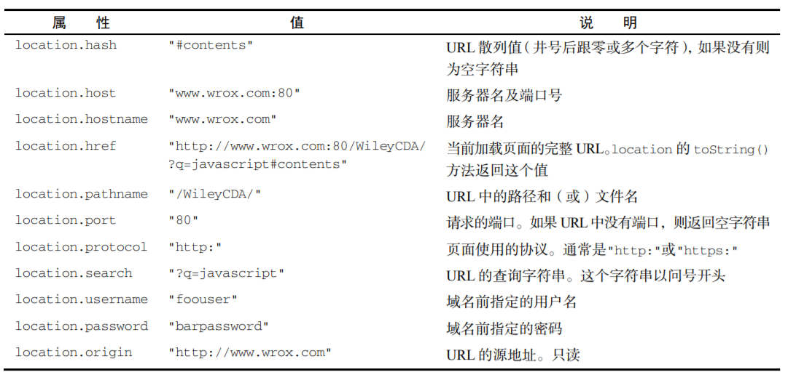

# BOM
> 虽然 ECMAScript 把浏览器对象模型（BOM，Browser Object Model）描述为 JavaScript 的核心，但实际上 BOM 是使用 JavaScript 开发 Web 应用程序的核心。BOM 提供了与网页无关的浏览器功能对象。
> 
> 多年来，BOM 是在缺乏规范的背景下发展起来的，因此既充满乐趣又问题多多。毕竟，浏览器开发商都按照自己的意愿来为它添砖加瓦。最终，浏览器实现之间共通的部分成为了事实标准，为 Web 开发提供了浏览器间互操作的基础。HTML5 规范中有一部分涵盖了 BOM 的主要内容，因为 W3C 希望将JavaScript 在浏览器中最基础的部分标准化。

<br>

---

<br>

## 12.1 window对象
> BOM的核心是window对象，表示浏览器的实例。window对象在浏览器中有两重身份，
> - 一个是ECMAScript中 Global 对象，
> - 另一个就是浏览器窗口的JavaScript接口。
> 这意味着网页中定义的所有对象，变量和函数都以window作为 Global对象，都可以访问其上定义的 parentInt() 等全局方法。

**注意：因为 window 对象的属性在全局作用域中有效，所以很多浏览器 API 及相关构造函数都以 window 对象属性的形式暴露出来。
另外，由于实现不同，某些 window 对象的属性在不同浏览器间可能差异很大。**

<br>
<br>

### 12.1.1 Global作用域
> 因为window对象被复用为ECMAScript 的 Global 对象，所以所以通过 var 声明的所有全局变量和函数都会变成 window 对象的属性和方法。比如：

```javascript
      var age = 29;
      var sayAge = () => alert(this.age);
      alert(window.age); // 29
      sayAge(); // 29
      window.sayAge(); // 29
```

这里，变量 age 和函数 sayAge()被定义在全局作用域中，它们自动成为了 window 对象的成员。因此，变量 age 可以通过 window.age 来访问，而函数 sayAge()也可以通过 window.sayAge()来访问。因为 sayAge()存在于全局作用域，this.age 映射到 window.age，所以就可以显示正确的结果了。

**记住，JavaScript 中有很多对象都暴露在全局作用域中，比如 location 和 navigator，因而它们也是 window 对象的属性。**

<br>
<br>

### 12.1.2 窗口关系
> - top 对象始终指向 **最上层（最外层）**窗口，即浏览器窗口本身。
> - 而 parent 对象则始终指向当前窗口的父窗口。如果当前处理是最上层窗口， 则 parent等于 top (都等于 window)。
> - 最上层的window如果不是通过window.open() 打开的，那么其name属性就不会包含值。
> - 还有一个 self 对象，它是终极window属性，始终指向window。实际上， self 和 window就是同一个对象。之所以还要暴露self， 就是为了和top, parent 保持一致。

这些属性都是window对象的属性，因此访问 window.parent, window.top, window.self 都可以。这意味着可以把访问多个窗口的 window 对象串联起来，比如 window.parent.parent。

<br>
<br>

### 12.1.3 窗口位置与像素比

> window 对象的位置可以通过不同的属性和方法来确定。现代浏览器提佛那个了screenLeft 和 secreenTop 属性， 用于表示窗口相对于屏幕左侧和顶部的位置，返回值的单位是CSS像素。

可以使用moveTo() 和 moveBy() 方法移动窗口。这两个方法都接收两个参数，
- 其中moveTo()接收要移动到的新位置的绝对坐标 x和y；
- 而moveBy()则接收相对当前位置在两个方向上移动的像素数：
如：
```javascript
   // 把窗口移动到左上角
   window.moveTo(0, 0);

   // 把窗口向下移动100像素
   window.moveBy(0, 100);

   // 把窗口移动到坐标(200,300)位置
   window.moveTo(200, 300);

   // 把窗口向左移动50像素
   window.moveTo(-50, 0);
```

依浏览器而定，以上方法可能会被部分或全部禁用。

<font color=#0984e3>

**像素比**
CSS 像素是 Web 开发中使用的统一像素单位。这个单位的背后其实是一个角度：0.0213°。如果屏幕距离人眼是一臂长，则以这个角度计算的 CSS 像素大小约为 1/96 英寸。这样定义像素大小是为了在不同设备上统一标准。

比如，低分辨率平板设备上 12 像素（CSS 像素）的文字应该与高清 4K 屏幕下12 像素（CSS 像素）的文字具有相同大小。这就带来了一个问题，不同像素密度的屏幕下就会有不同的缩放系数，以便把物理像素（屏幕实际的分辨率）转换为 CSS 像素（浏览器报告的虚拟分辨率）。

举个例子，手机屏幕的物理分辨率可能是 1920×1080，但因为其像素可能非常小，所以浏览器就需要将其分辨率降为较低的逻辑分辨率，比如 640×320。这个物理像素与 CSS 像素之间的转换比率由window.devicePixelRatio 属性提供。对于分辨率从 1920×1080 转换为 640×320 的设备，window.

devicePixelRatio 的值就是 3。这样一来，12 像素（CSS 像素）的文字实际上就会用 36 像素物理像素来显示。

window.devicePixelRatio 实际上与每英寸像素数（DPI，dots per inch）是对应的。DPI 表示单位像素密度，而 window.devicePixelRatio 表示物理像素与逻辑像素之间的缩放系数。

</font>

<br>
<br>

### 12.1.4 窗口大小
在不同浏览器中确定浏览器窗口大小没有想象中那么容易。所有现代浏览器都支持 4 个属性：
- innerWidth、
- innerHeight、
- outerWidth 和
- outerHeight。

> outerWidth 和 outerHeight 返回浏览器窗口自身的大小（不管是在最外层 window 上使用，还是在窗格<frame>中使用）。

> innerWidth和 innerHeight 返回浏览器窗口中页面视口的大小（不包含浏览器边框和工具栏）。

> document.documentElement.clientWidth 和 document.documentElement.clientHeight返回页面视口的宽度和高度。

**基本介绍**
> $(window).width()与$(window).height()
> $(window).width()与$(window).height()：获得的是屏幕可视区域的宽高，不包括滚动条与工具条
```javascript
   $(window).width() = width + padding
   $(window).height() = height + padding
```

> document.documentElement.clientWidth与document.documentElement.clientHeight
> document.documentElement.clientWidth与document.documentElement.clientHeight：获得的是屏幕可视区域的宽高，不包括滚动条与工具条，跟jquery的(window).width()与(window).height()获得的结果是一样的。
```javascript
   document.documentElement.clientWidth = width + padding
   document.documentElement.clientHeight = height + padding
```

> window.innerWidth与window.innerHeight
> window.innerWidth与window.innerHeight：获得的是可视区域的宽高，但是window.innerWidth宽度包含了纵向滚动条的宽度，window.innerHeight高度包含了横向滚动条的高度(IE8以及低版本浏览器不支持)。
> 
```javascript
   window.innerWidth = width + padding + border + 纵向滚动条宽度
   window.innerHeight = height + padding + border + 横向滚动条高度
```

> window.outerWidth与window.outerHeight
> window.outerWidth与window.outerHeight：获得的是加上工具条与滚动条窗口的宽度与高度。

```javascript
   window.outerWidth = width + padding + border + 纵向滚动条宽度
   window.outerHeight = height + padding + border + 横向滚动条高度 + 工具条高度
```

> document.body.clientWidth与document.body.clientHeight
> document.body.clientWidth与document.body.clientHeight：document.body.clientWidth获得的也是可视区域的宽度，但是document.body.clientHeight获得的是body内容的高度，如果内容只有200px，那么这个高度也是200px,如果想通过它得到屏幕可视区域的宽高，需要样式设置，如下：

```javascript
   body {
      height: 100%;
      overflow: hidden;
   }
   body, div, p, ul {
      margin: 0;
      padding: 0;
   }
```

最关键的是：body的height:100%影响document.body.clientHeight的值。
body的margin:0,padding:0影响document.body.clientWidth的值。


<br>
<br>

### 12.1.5 视口位置
> 浏览器窗口尺寸通常无法满足完整显示整个页面，为此用户可以通过滚动在有限的视口中查看文
档。度量文档相对于视口滚动距离的属性有两对，返回相等的值：window.pageXoffset/window.
scrollX 和 window.pageYoffset/window.scrollY。

可以使用 scroll()、scrollTo()和 scrollBy()方法滚动页面。这 3 个方法都接收表示相对视口距离的 x 和 y 坐标，这两个参数在前两个方法中表示要滚动到的坐标，在最后一个方法中表示滚动的距离。
```javascript
   // 相对于当前视口向下滚动 100 像素
   window.scrollBy(0, 100);
   // 相对于当前视口向右滚动 40 像素
   window.scrollBy(40, 0);
   // 滚动到页面左上角
   window.scrollTo(0, 0);
   // 滚动到距离屏幕左边及顶边各 100 像素的位置
   window.scrollTo(100, 100); 
```

这几个方法也都接收一个 ScrollToOptions 字典，除了提供偏移值，还可以通过 behavior 属性
告诉浏览器是否平滑滚动。

```javascript
// 正常滚动
   window.scrollTo({
      left: 100,
      top: 100,
      behavior: "auto",
   });
   // 平滑滚动
   window.scrollTo({
      left: 100,
      top: 100,
      behavior: "smooth",
   });
```

<br>
<br>

### 12.1.6 导航与打开新窗口

<font color=#22a6b3>
window.open()方法可以用于导航到指定URL, 也可以用于打开新浏览器窗口。

这个方法接收4个参数：
- 要加载URL,
- 目标窗口，
- 特性字符串
- 和表示新窗口在浏览器历史记录中是否替代当前加载页面的布尔值。

通常，调用这个方法时只传前 3 个参数，最后一个参数只有在不打开新窗口时才会使用。

如果 window.open()的第二个参数是一个已经存在的窗口或窗格（frame）的名字，则会在对应的
窗口或窗格中打开 URL。下面是一个例子：

```javascript
   // 与<a href="http://www.wrox.com" target="topFrame"/>相同
   window.open("http://www.wrox.com/", "topFrame"); 
```
</font>

#### 1. 弹出窗口

#### 2. 安全限制

#### 3. 弹窗屏蔽程序

<br>
<br>

### 12.1.7 定时器
> JavaScript 在浏览器中是单线程执行的，但允许使用定时器指定在某个时间之后或每隔一段时间就执行相应的代码。
> - setTimeout()用于指定在一定时间后执行某些代码，
> - 而 setInterval()用于指定每隔一段时间执行某些代码。

**setTimeout()方法通常接收两个参数：要执行的代码和在执行回调函数前等待的时间（毫秒）。**

第一个参数可以是包含 JavaScript 代码的字符串（类似于传给 eval()的字符串）或者一个函数，比如：

```javascript
   // 在 1 秒后显示警告框
   setTimeout(() => alert("Hello world!"), 1000);
```

第二个参数是要等待的毫秒数，而不是要执行代码的确切时间。

**JavaScript 是单线程的，所以每次只能执行一段代码。为了调度不同代码的执行，JavaScript 维护了一个任务队列。其中的任务会按照添加到队列的先后顺序执行。setTimeout()的第二个参数只是告诉 JavaScript 引擎在指定的毫秒数过后把任务添加到这个队列。**

如果队列是空的，则会立即执行该代码。如果队列不是空的，则代码必须等待前面的任务执行完才能执行。

调用 setTimeout()时，会返回一个表示该超时排期的数值 ID。这个超时 ID 是被排期执行代码的唯一标识符，可用于取消该任务。要取消等待中的排期任务，可以调用 clearTimeout()方法并传入超时 ID，如下面的例子所示：

```javascript
   // 设置超时任务
   let timeoutId = setTimeout(() => alert("Hello world!"), 1000);
   // 取消超时任务
   clearTimeout(timeoutId); 
```
**只要是在指定时间到达之前调用 clearTimeout()，就可以取消超时任务。在任务执行后再调用
clearTimeout()没有效果。**

setInterval()与 setTimeout()的使用方法类似，只不过指定的任务会每隔指定时间就执行一次，直到取消循环定时或者页面卸载。setInterval()同样可以接收两个参数：要执行的代码（字符串或函数），以及把下一次执行定时代码的任务添加到队列要等待的时间（毫秒）。

```javascript
   setInterval(() => alert("Hello world!"), 10000); 
```

**注意 这里的关键点是，第二个参数，也就是间隔时间，指的是向队列添加新任务之前等待的时间。**
**比如，调用 setInterval()的时间为 01:00:00，间隔时间为 3000 毫秒。这意味着 01:00:03 时，浏览器会把任务添加到执行队列。**

setInterval()方法也会返回一个循环定时 ID，可以用于在未来某个时间点上取消循环定时。

<br>
<br>

### 12.1.8 系统对话框
> 使用 alert()、confirm()和 prompt()方法，可以让浏览器调用系统对话框向用户显示消息。
> 这些对话框与浏览器中显示的网页无关，而且也不包含 HTML。它们的外观由操作系统或者浏览器决定，无法使用 CSS 设置。
> **此外，这些对话框都是同步的模态对话框，即在它们显示的时候，代码会停止执行，在它们消失以后，代码才会恢复执行。**

**alert()**
它接收一个要显示给用户的字符串。alert()只接收一个参数。调用 alert()时，传入的字符串会显示在一个系统对话框中。对话框只有一个“OK”（确定）按钮。**如果传给 alert()的参数不是一个原始字符串，则会调用这个值的 toString()方法将其转换为字符串。**

<br>

**confirm()**
确认框跟警告框类似，都会向用户显示消息。但不同之处在于，确认框有两个按钮：“Cancel”（取消）和“OK”（确定）。
要知道用户单击了 OK 按钮还是 Cancel 按钮，可以判断 confirm()方法的返回值：true 表示单击
了 OK 按钮，false 表示单击了 Cancel 按钮或者通过单击某一角上的 X 图标关闭了确认框。

确认框的典型用法如下所示：
```javascript
   if (confirm("Are you sure?")) {
      alert("I'm so glad you're sure!");
   } else {
      alert("I'm sorry to hear you're not sure.");
   }
```

<br>

**prompt()**
提示框的用途是提示用户输入消息。
除了 OK 和 Cancel 按钮，提示框还会显示一个文本框，让用户输入内容。prompt()方法接收两个参数：要显示给用户的文本，以及文本框的默认值（可以是空字符串）。

如果用户单击了 OK 按钮，则 prompt()会返回文本框中的值。如果用户单击了 Cancel 按钮，或者
对话框被关闭，则 prompt()会返回 null。下面是一个例子：

```javascript
   let result = prompt("What is your name? ", "");
   if (result !== null) {
      alert("Welcome, " + result);
   }
```

这些系统对话框可以向用户显示消息、确认操作和获取输入。由于不需要 HTML 和 CSS，所以系
统对话框是 Web 应用程序最简单快捷的沟通手段。

<br>

---

<br>

## 12.2 location 对象
> location 是最有用的BOM对象之一，提供了当前窗口中加载文档的信息，以及通常的导航功能。
> 这个对象独特的地方在于，它既是window的属性，也是document的属性。**也就是说，window.location 和 document.location 指向同一个对象。**
> location对象不仅保存着当前加载文档的信息，也保存着把URL解析为离散片段后通过属性访问的信息。这些解析后的属性在下表中有详细说明（location 前缀是必需的）。



<br>
<br>

### 12.2.1 查询字符串
> location 的多数信息都可以通过上面的属性获取。但是 URL 中的查询字符串并不容易使用。虽然location.search 返回了从问号开始直到 URL 末尾的所有内容，但没有办法逐个访问每个查询参数。下面的函数解析了查询字符串，并返回一个以每个查询参数为属性的对象：

```javascript
   let getQueryStringArgs = function () {
      // 取得没有开头问号的查询字符串
      let qs = location.search.length > 0 ? location.search.substring(1) : "",
         // 保存数据的对象
         args = {};
      // 把每个参数添加到 args 对象
      for (let item of qs.split("&").map(kv => kv.split("="))) {
         let name = decodeURIComponent(item[0]),
            value = decodeURIComponent(item[1]);
         if (name.length) {
            args[name] = value;
         }
      }
      return args;
   };
```
这个函数首先删除了查询字符串开头的问号，当然前提是 location.search 必须有内容。解析后的参数将被保存到 args 对象，这个对象以字面量形式创建。接着，先把查询字符串按照&分割成数组，每个元素的形式为 name=value。for 循环迭代这个数组，将每一个元素按照=分割成数组，这个数组第一项是参数名，第二项是参数值。参数名和参数值在使用 decodeURIComponent()解码后（这是因为查询字符串通常是被编码后的格式）分别保存在 name 和 value 变量中。最后，name 作为属性而 value作为该属性的值被添加到 args 对象。

<font color=#00b894>

**URLSearchParams**
URLSearchParams 提供了一组标准 API 方法，通过它们可以检查和修改查询字符串。给URLSearchParams 构造函数传入一个查询字符串，就可以创建一个实例。这个实例上暴露了 get()、set()和 delete()等方法，可以对查询字符串执行相应操作。

```javascript
   let qs = "?q=javascript&num=10";
   let searchParams = new URLSearchParams(qs);
   alert(searchParams.toString()); // " q=javascript&num=10"
   searchParams.has("num"); // true
   searchParams.get("num"); // 10
   searchParams.set("page", "3");
   alert(searchParams.toString()); // " q=javascript&num=10&page=3"
   searchParams.delete("q");
   alert(searchParams.toString()); // " num=10&page=3"
```
大多数支持 URLSearchParams 的浏览器也支持将 URLSearchParams 的实例用作可迭代对象：

```javascript
   let qs = "?q=javascript&num=10";
   let searchParams = new URLSearchParams(qs);
   for (let param of searchParams) {
   console.log(param);
   }
   // ["q", "javascript"]
   // ["num", "10"]
```
</font>

<br>
<br>

### 12.2.2 操作地址
可以通过修改 location 对象修改浏览器的地址。首先，最常见的是使用 assign()方法并传入一个 URL，如下所示：

```javascript
   location.assign("http://www.wrox.com");
```

**这行代码会立即启动导航到新 URL 的操作，同时在浏览器历史记录中增加一条记录。**

如果给location.href 或 window.location 设置一个 URL，也会以同一个 URL 值调用 assign()方法。比如，下面两行代码都会执行与显式调用 assign()一样的操作：

```javascript
   window.location = "http://www.wrox.com";
   location.href = "http://www.wrox.com"; 
```
在这 3 种修改浏览器地址的方法中，设置 location.href 是最常见的。
**修改 location 对象的属性也会修改当前加载的页面。**其中，hash、search、hostname、pathname
和 port 属性被设置为新值之后都会修改当前 URL，如下面的例子所示：
```javascript
   // 假设当前 URL 为 http://www.wrox.com/WileyCDA/
   // 把 URL 修改为 http://www.wrox.com/WileyCDA/#section1
   location.hash = "#section1";
   // 把 URL 修改为 http://www.wrox.com/WileyCDA/?q=javascript
   location.search = "?q=javascript";
   // 把 URL 修改为 http://www.somewhere.com/WileyCDA/
   location.hostname = "www.somewhere.com";
   // 把 URL 修改为 http://www.somewhere.com/mydir/
   location.pathname = "mydir";
   // 把 URL 修改为 http://www.somewhere.com:8080/WileyCDA/
   location.port = 8080;
```
**除了 hash 之外，只要修改 location 的一个属性，就会导致页面重新加载新 URL。**

最后一个修改地址的方法是 reload()，它能重新加载当前显示的页面。调用 reload()而不传参数，页面会以最有效的方式重新加载。也就是说，如果页面自上次请求以来没有修改过，浏览器可能会从缓存中加载页面。如果想强制从服务器重新加载，可以像下面这样给 reload()传个 true：

```javascript
   location.reload(); // 重新加载，可能是从缓存加载
   location.reload(true); // 重新加载，从服务器加载
```

<br>

---

<br>

## 12.3 navigator 对象
> navigator 是由 Netscape Navigator 2 最早引入浏览器的，现在已经成为客户端标识浏览器的标准。只要浏览器启用 JavaScript，navigator 对象就一定存在。但是与其他 BOM 对象一样，每个浏览器都支持自己的属性。

下表列出了这些接口定义的属性和方法：


<br>

---

<br>

## 12.4 screen 对象
> window 的另一个属性 screen 对象，是为数不多的几个在编程中很少用的 JavaScript 对象。这个对
象中保存的纯粹是客户端能力信息，也就是浏览器窗口外面的客户端显示器的信息，比如像素宽度和像
素高度。每个浏览器都会在 screen 对象上暴露不同的属性。下表总结了这些属性。


<br>

---

<br>

## 12.5 history 对象
> history 对象表示当前窗口首次使用以来用户的导航历史记录。因为 history 是 window 的属性，所以每个 window 都有自己的 history 对象。出于安全考虑，这个对象不会暴露用户访问过的 URL，但可以通过它在不知道实际 URL 的情况下前进和后退。

### 12.5.1 导航
> go()方法可以在用户历史记录中沿任何方向导航，可以前进也可以后退。这个方法只接收一个参数，这个参数可以是一个整数，表示前进或后退多少步。负值表示在历史记录中后退（类似点击浏览器的“后退”按钮），而正值表示在历史记录中前进（类似点击浏览器的“前进”按钮）。下面来看几个例子：

```javascript
   // 后退一页
   history.go(-1);
   // 前进一页
   history.go(1);
   // 前进两页
   history.go(2);
```

go()有两个简写方法：back()和 forward()。顾名思义，这两个方法模拟了浏览器的后退按钮和前进按钮：

```javascript
   // 后退一页
   history.back();
   // 前进一页
   history.forward(); 
```
history 对象还有一个 length 属性，表示历史记录中有多个条目。这个属性反映了历史记录的数量，包括可以前进和后退的页面。对于窗口或标签页中加载的第一个页面，history.length 等于 1。通过以下方法测试这个值，可以确定用户浏览器的起点是不是你的页面：

```javascript
   if (history.length == 1){
   // 这是用户窗口中的第一个页面
   } 
```
```javascript
```
<br>

