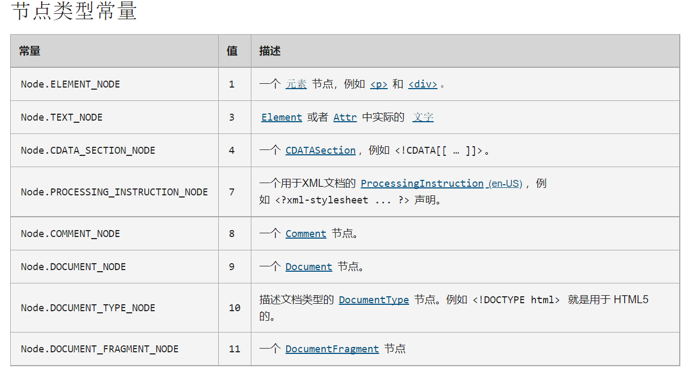
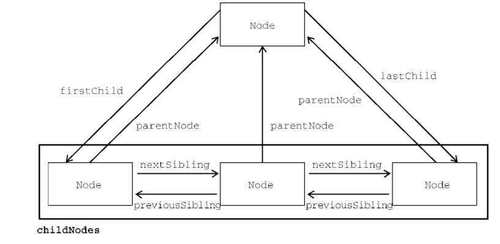

目录：

[TOC]

# DOM
> 文档对象模型（DOM, Document Object Model）是 HTML 和 XML文档的编程接口。 DOM 表示由多层节点构成的文档， 通过它开发者可以添加，删除和修改页面的各个部分。脱胎于网景和微软早期的动态 HTML（DHTML，Dynamic HTML），DOM 现在是真正跨平台、语言无关的表示和操作网页的方式。


<br>

---

<br>

## 14.1 节点层级
>  任何HTML 和 XML 文档都可以用 DOM 表示为一个由节点构成的层级结构。节点分很多类型，每种类型对应者文档中不同的特性，数据和方法， 而且与其他类型由某种关系。这些关系构成了层级，让标记可以表示为下一个以特定节点为根的树形结构。以下面的HTML 为例：
 
```javascript
   <html>
      <head>
         <title>Sample Page</title>
      </head>
      <body>
         <p>Hello World!</p>
      </body>
   </html>
```


> 其中，document节点表示每个文档的根节点。在这里， 根节点的唯一子节点是 《html》元素， 我们称之为 **文档元素（documentElement）**. 文档元素是文档最外层的元素，所有其他元素都存在于这个元素之内。

> 每个文档只能有一个文档元素。在HTML页面中，文档元素始终 是《html》元素。 在 XML 文档中，则没有这样预定义的元素，任何元素都可能成为文档元素。

html 中的每段标记都可以表示为这个树形结构中的一个节点。元素节点表示 HTML元素， 属性节点表示属性，文档类型节点表示文档类型，注释节点表示注释。 DOM 中总共有12种节点类型， 这些类型都继承一种基本类型。


<br>
<br>

### 14.1.1 Node 类型
> Node 接口在 JavaScript中被实现为 Node 类型，在除 IE之外的所有浏览器中都可以直接访问这个类型。在 JavaScript中，所有节点类型都继承 Node 类型，因此所有类型都共享相同的基本属性和方法。

<font color=#fab1a0>了解即可</font>



<br>
<br>

#### 01. nodeName 与 nodeValue
> nodeName 与 nodeValue 保存着有关节点的信息。着两个属性的值完全取决于节点类型。在使用者两个属性前，最好先检测节点类型，如下：

```javascript
   if (someNode.nodeType == 1) {
      value = someNode.nodeName; // 会显示元素的标签名
   }
```
这个例子中，先检查了节点是不是元素。如果是，则将其nodeName的值赋给一个变量。对元素而言，nodeName 始终等于元素的标签名， 而nodeValue 则始终为 null。


<br>
<br>

<font color= #6c5ce7>

# DOM：节点类型

## Node 类型

**所有节点类型都继承于 Node 类型，** 因此所有节点类型都 **共享** 这相同的 **基本属性和方法。**

### 基本属性和方法

- **nodeName**: **节点名。** 对于元素类型，则是元素的标签名（均为大写）。 如 “SPAN”、“DIV”; 对于其他类型会有不同的值，下面类型会分别指出。 
- **nodeValue**: **节点值。** 对于元素类型为 `null`  ; 对于其他类型会有不同的值。
- **hasChildNodes()**: 布尔值，**是否含有子节点。** 
- **childNodes**: **NodeList 对象的集合**，是一个 **类数组**，实际是基于 DOM 结构动态查询的结果。
- firstChild ：等效于 childNodes[0] ；
- lastChild ：等效于 childNodes[childNodes.length - 1] 。 
- **parentNode**: 指向 **父节点**
- **previousSibling**: 前一个同胞节点; 
- **nextSibling**: 后一个同胞节点; 
- **ownerDocument**:  指向节点所在的整个文档节点

</font>


<br>
<br>

#### 02. 节点关系
> 文档中的所有节点都与其他节点有关系。这些关系可以形容为家族关系，相当于把文档树比作家谱。在 HTML 中，《body》元素是《html》元素的子元素，而《html》元素则是《body》元素的父元素。《head》元素是《body》元素的同胞元素，因为它们有共同的父元素《html》。

<br>

> **每个节点都有一个childNodes属性，其中包含一个 NodeList的实例。** NodeList 是一个类数组对象，用于储存可以按位置存取的有序节点。

**注意，NodeList 并不是 Array 的实例，但可以使用中括号访问它的值，而且它也有 length 属性。**

NodeList 对象独特的地方在于，它其实是一个对 DOM 结构的查询，因此 DOM 结构的变化会自动地在 NodeList 中反映出来。

下面的例子展示了如何使用中括号或使用 item()方法访问 NodeList 中的元素：

```javascript
   let firstChild = someNode.childNodes[0];
   let secondChild = someNode.childNodes.item(1);
   let count = someNode.childNodes.length; 
```

<br>

> **每个节点都有一个 parentNode 属性，指向其 DOM 树中的父元素。**
> **childNodes 中的所有节点都有同一个父元素，因此它们的 parentNode 属性都指向同一个节点。**
> **此外，childNodes 列表中的每个节点都是同一列表中其他节点的同胞节点。**
> **而使用 previousSibling 和 nextSibling 可以在这个列表的节点间导航。**
> 这个列表中第一个节点的 previousSibling 属性是 null，最后一个节点的nextSibling 属性也是 null，如下所示:

```javascript
   if (someNode.nextSibling === null) {
      alert("Last node in the parent's childNodes list.");
   } else if (someNode.previousSibling === null) {
      alert("First node in the parent's childNodes list.");
   }
```
**注意，如果 childNodes 中只有一个节点，则它的 previousSibling 和 nextSibling 属性都是null。**

<br>

> 父节点和它的第一个及最后一个子节点也有专门属性：firstChild 和 lastChild 分别指向childNodes 中的第一个和最后一个子节点。



**最后还有一个所有节点都共享的关系。ownerDocument 属性是一个指向代表整个文档的文档节点的指针。**


<br>
<br>

#### 03. 操纵节点
> 因为所有关系指针都是只读的，所以 DOM 又提供了一些操纵节点的方法。

- appendChild()
最常用的方法是appendChild()，用于在 childNodes 列表末尾添加节点。添加新节点会更新相关的关系指针，包括父节点和之前的最后一个子节点。appendChild()方法返回新添加的节点，如下所示：

```javascript
   let returnedNode = someNode.appendChild(newNode);
   alert(returnedNode == newNode); // true
   alert(someNode.lastChild == newNode); // true 
```
如果把文档中已经存在的节点传给 appendChild()，则这个节点会从之前的位置被转移到新位置。即使 DOM 树通过各种关系指针维系，一个节点也不会在文档中同时出现在两个或更多个地方。
因此，如果调用 appendChild()传入父元素的第一个子节点，则这个节点会成为父元素的最后一个子节点，如下所示：
```javascript
   // 假设 someNode 有多个子节点
   let returnedNode = someNode.appendChild(someNode.firstChild);
   alert(returnedNode == someNode.firstChild); // false
   alert(returnedNode == someNode.lastChild); // true
```

- insertBefore()
如果想把节点放到 childNodes 中的特定位置而不是末尾，则可以使用 insertBefore()方法。
这个方法接收两个参数：要插入的节点和参照节点。
调用这个方法后，要插入的节点会变成参照节点的前一个同胞节点，并被返回。
```javascript
// 作为最后一个子节点插入
returnedNode = someNode.insertBefore(newNode, null);
alert(newNode == someNode.lastChild); // true
// 作为新的第一个子节点插入
returnedNode = someNode.insertBefore(newNode, someNode.firstChild);
alert(returnedNode == newNode); // true
alert(newNode == someNode.firstChild); // true
// 插入最后一个子节点前面
returnedNode = someNode.insertBefore(newNode, someNode.lastChild);
alert(newNode == someNode.childNodes[someNode.childNodes.length - 2]); // true
```

**appendChild() 和 insertBefore() 在插入节点时不会删除任何已有节点。**

- replaceChild()
replaceChild()方法接收两个参数：要插入的节点和要替换的节点。要替换的节点会被返回并从文档树中完全移除，要插入的节点会取而代之。下面看一个例子：

```javascript
// 替换第一个子节点
let returnedNode = someNode.replaceChild(newNode, someNode.firstChild);
// 替换最后一个子节点
returnedNode = someNode.replaceChild(newNode, someNode.lastChild); 
```

- removeChild()
- 要移除节点而不是替换节点，可以使用 removeChild()方法。这个方法接收一个参数，即要移除的节点。被移除的节点会被返回，如下面的例子所示：

```javascript
// 删除第一个子节点
let formerFirstChild = someNode.removeChild(someNode.firstChild);
// 删除最后一个子节点
let formerLastChild = someNode.removeChild(someNode.lastChild);
```


<br>
<br>


#### 04. 其他方法
所有节点类型还共享了两个方法。
- cloneNode()
  - 会返回与调用它的节点一模一样的节点。
  - cloneNode()方法接收一个布尔值参数，表示是否深复制。
  - 在传入 true 参数时，会进行深复制，即复制节点及其整个子 DOM 树。如果传入 false，则只会复制调用该方法的节点。
- normalize()
  - 在节点上调用 normalize()方法会检测这个节点的所有后代，从中搜索上述两种情形。 
    - 如果发现空文本节点，则将其删除；
    - 如果两个同胞节点是相邻的，则将其合并为一个文本节点。


<br>
<br>

### 14.1.2 Document 类型
> Document 类型是 JavaScript 中表示文档节点的类型。在浏览器中，文档对象 document 是HTMLDocument 的实例（HTMLDocument 继承 Document），表示整个 HTML 页面。document 是 window对象的属性，因此是一个全局对象。

Document 类型的节点有以下特征：
- nodeType 等于 9；
- nodeName 值为"#document"；
- nodeValue 值为 null；
- parentNode 值为 null；
- ownerDocument 值为 null；
- 子节点可以是 DocumentType（最多一个）、Element（最多一个）、ProcessingInstruction或 Comment 类型。

Document 类型可以表示 HTML 页面或其他 XML 文档，但最常用的还是通过 HTMLDocument 的实例取得 document 对象。document 对象可用于获取关于页面的信息以及操纵其外观和底层结构。


<br>
<br>

#### 01. 文档子节点
> 虽然 DOM 规范规定 Document 节点的子节点可以是 DocumentType、Element、ProcessingInstruction 或 Comment，但也提供了两个访问子节点的快捷方式。
- 第一个是 documentElement 属性，始终指向 HTML 页面中的《html》元素。虽然 document.childNodes 中始终有《html》元素，但使用 documentElement 属性可以更快更直接地访问该元素。
 
```javascript
let html = document.documentElement; // 取得对<html>的引用
alert(html === document.childNodes[0]); // true
alert(html === document.firstChild); // true
```
- document 对象还有一个 body 属性，直接指向《body》元素。

```javascript
let body = document.body; // 取得对<body>的引用
```
**所有主流浏览器都支持 document.documentElement 和 document.body。**


<br>
<br>


#### 02. 文档信息
> document 作为 HTMLDocument 的实例，还有一些标准 Document 对象上所没有的属性。这些属性提供浏览器所加载网页的信息。

- title属性
  - 包含《title》元素中的文本，通常显示在浏览器窗口或标签页的标题栏。通过这个属性可以读写页面的标题，修改后的标题也会反映在浏览器标题栏上。
  - 不过，修改 title 属性并不会改变《title》元素。
- URL
  - URL 包含当前页面的完整 URL（地址栏中的 URL），
- domain
  - 包含页面的域名，
- referrer
  - 包含空字符串
  
所有这些信息都可以在请求的 HTTP 头部信息中获取，只是在 JavaScript 中通过这几个属性暴露出来而已

```javascript
// 取得完整的 URL
let url = document.URL;
// 取得域名
let domain = document.domain;
// 取得来源
let referrer = document.referrer;
```

<br>
<br>


#### 03. 定位元素
> 使用 DOM 最常见的情形可能就是获取某个或某组元素的引用，然后对它们执行某些操作。document 对象上暴露了一些方法，可以实现这些操作。

**getElementById()和 getElementsByTagName()就是 Document 类型提供的两个方法。**

- **getElementById()**
  - getElementById()方法接收一个参数，即要获取元素的 ID，如果找到了则返回这个元素，如果没找到则返回 null。
  - **参数 ID 必须跟元素在页面中的 id 属性值完全匹配，包括大小写。**

```javascript
<div id="myDiv">Some text</div>
可以使用如下代码取得这个元素：
let div = document.getElementById("myDiv"); // 取得对这个<div>元素的引用
但参数大小写不匹配会返回 null：
let div = document.getElementById("mydiv"); // null 
```

**如果页面中存在多个具有相同 ID 的元素，则 getElementById()返回在文档中出现的第一个元素。**

- **getElementsByTagName()**
  - getElementsByTagName()是另一个常用来获取元素引用的方法。
  - 这个方法接收一个参数，即要获取元素的标签名，返回包含零个或多个元素的 NodeList。
  - 。在 HTML 文档中，这个方法返回一个HTMLCollection 对象。
```javascript
let images = document.getElementsByTagName("img");
```
这里把返回的 HTMLCollection 对象保存在了变量 images 中。与 NodeList 对象一样，也可以使用中括号或 item()方法从 HTMLCollection 取得特定的元素。而取得元素的数量同样可以通过length 属性

```javascript
alert(images.length); // 图片数量
alert(images[0].src); // 第一张图片的 src 属性
alert(images.item(0).src); // 同上
```

- **getElementsByName()**
  - 这个方法会返回具有给定 name 属性的所有元素。
  - getElementsByName()方法最常用于单选按钮，因为同一字段的单选按钮必须具有相同的 name 属性才能确保把正确的值发送给服务器，
  - 与 getElementsByTagName()一样，getElementsByName()方法也返回 HTMLCollection。不过在这种情况下，namedItem()方法只会取得第一项（因为所有项的 name 属性都一样）。


<br>
<br>


#### 04.特殊集合
document 对象上还暴露了几个特殊集合，这些集合也都是 HTMLCollection 的实例。这些集合是访问文档中公共部分的快捷方式，列举如下。

- document.anchors 包含文档中所有带 name 属性的`<a>`元素。
- document.forms 包含文档中所有`<form>`元素（与 document.getElementsByTagName ("form")返回的结果相同）。
- document.images 包含文档中所有``元素（与 document.getElementsByTagName ("img")返回的结果相同）。
- document.links 包含文档中所有带 href 属性的`<a>`元素。这些特殊集合始终存在于 HTMLDocument 对象上，而且与所有 HTMLCollection 对象一样，其内容也会实时更新以符合当前文档的内容。


<br>
<br>


#### 05. DOM 兼容性检测
> 由于 DOM 有多个 Level 和多个部分，因此确定浏览器实现了 DOM 的哪些部分是很必要的。
document.implementation 属性是一个对象，其中提供了与浏览器 DOM 实现相关的信息和能力。


<br>
<br>


##### 06. 文档写入
> document 对象有一个古老的能力，即向网页输出流中写入内容。这个能力对应 4 个方法：
> - write()
> - writeln()
> - open()
> - close()

write()和 writeln()方法都接收一个字符串参数，可以将这个字符串写入网页中。而 writeln()还会在字符串末尾追加一个换行符（\n）。这两个方法可以用来在页面加载期间向页面中动态添加内容，

open()和 close()方法分别用于打开和关闭网页输出流。在调用 write()和 writeln()时，这两个方法都不是必需的。


<br>
<br>


### 14.1.3 Element 类型
> 除了Document 类型，Element 类型就是Web开发中最常用的类型了。Element 表示XML或HTML元素，对外暴露出访问元素标签名、子节点和属性的能力。Element 类型的节点具有以下特征：
> - nodeType： Node.ELEMENT_NODE(1)
> - nodeName： 元素的标签名（与 tagName 的值相同）
> - nodeValue： null
> - parentNode： Document 或 Element
> - childNodes：可能是 Element、Text、Comment、ProcessingInstruction、CDATASection、EntityReference 。

可以通过 nodeName 或 tagName 属性来获取元素的标签名。

**注意，div.tagName 实际上返回的是"DIV"而不是"div"。在 HTML 中，元素标签名始终以全大写表示；在 XML（包括 XHTML）中，标签名始终与源代码中的大小写一致。如果不确定脚本是在 HTML 文档还是 XML 文档中运行，最好将标签名转换为小写形式**


<br>
<br>


#### 01. HTML元素
> 所有 HTML 元素都通过 HTMLElement 类型表示，包括其直接实例和间接实例。另外，HTMLElement直接继承 Element 并增加了一些属性。
> 每个属性都对应下列属性之一，它们是所有 HTML 元素上都有的标准属性.

以下是 HTML 元素都存在的**标准特性**，属性值均为**可读写**。标准特性**可以作为对象的属性直接访问**，而自定义特性需要用特定方法获取/修改。

- id： 元素在文档的唯一标识符
- title：有关元素的附加说明信息，一般通过工具提示条显示出来
- lang：元素内容的语言代码，很少使用
- dir：语言的方向，值为"ltr"(左到右)或"rtl"(右到左)，很少使用
- className：元素的 CSS 类名

所有这些都可以用来获取对应的属性值，也可以用来修改相应的值。比如有下面的 HTML 元素：

```javascript
<div id="myDiv" class="bd" title="Body text" lang="en" dir="ltr"></div>
这个元素中的所有属性都可以使用下列 JavaScript 代码读取：
let div = document.getElementById("myDiv");
alert(div.id); // "myDiv"
alert(div.className); // "bd"
alert(div.title); // "Body text"
alert(div.lang); // "en"
alert(div.dir); // "ltr"
而且，可以使用下列代码修改元素的属性：
div.id = "someOtherId";
div.className = "ft";
div.title = "Some other text";
div.lang = "fr";
div.dir ="rtl"; 
```

<br>
<br>


#### 02. 取得属性
> 每个元素都有零个或多个属性，通常用于为元素或其内容附加更多信息。与属性相关的 DOM 方法主要有 3 个：
> - **getAttribute()**、获取特性。
> - **setAttribute()** 修改特性，需要第二个参数：新的特性值。若特性不存在，则为其添加新特性并赋值
> - **removeAttribute()**。移除特性。

这些方法主要用于操纵属性，包括在 HTMLElement 类型上定义的属性。

```javascript
let div = document.getElementById("myDiv");
alert(div.getAttribute("id")); // "myDiv"
alert(div.getAttribute("class")); // "bd"
alert(div.getAttribute("title")); // "Body text"
alert(div.getAttribute("lang")); // "en"
alert(div.getAttribute("dir")); // "ltr" 
```
**注意传给 getAttribute()的属性名与它们实际的属性名是一样的，因此这里要传"class"而非"className"（className 是作为对象属性时才那么拼写的）。如果给定的属性不存在，则 getAttribute()返回 null。**

getAttribute()方法也能取得不是HTML语言正式属性的自定义属性的值。如：

```javascript
<div id="myDiv" my_special_attribute="hello"></div>
可以像其他属性一样使用getAttribute()取得这个属性的值
let value = div.getAttribute("my_special_attribute");
```

**注意： 
1.属性名不区分大小写，因此"ID" 和 "id" 被认为是同一个属性。
2.另外，根据 HTML5 规范的要求，自定义属性名应该前缀 data-以方便验证。**

元素的所有属性也可以通过相应 DOM 元素对象的属性来取得。当然，这包括 HTMLElement 上定义的直接映射对应属性的 5 个属性，还有所有公认（非自定义）的属性也会被添加为 DOM 对象的属性。
如： `<div id="myDiv" align="left" my_special_attribute="hello"></div>`

> 因为 id 和 align 在 HTML 中是`<div>`元素公认的属性，所以 DOM 对象上也会有这两个属性。但my_special_attribute 是自定义属性，因此不会成为 DOM 对象的属性。

> 1. 通过 DOM 对象访问的属性中有两个返回的值跟使用 getAttribute()取得的值不一样。首先是style 属性，这个属性用于为元素设定 CSS 样式。在使用 getAttribute()访问 style 属性时，返回的是 CSS 字符串。而在通过 DOM 对象的属性访问时，style 属性返回的是一个（CSSStyleDeclaration）对象。DOM 对象的 style 属性用于以编程方式读写元素样式，因此不会直接映射为元素中 style 属性的字符串值。

> 2. 第二个属性其实是一类，即事件处理程序（或者事件属性），比如 onclick。在元素上使用事件属性时（比如 onclick），属性的值是一段 JavaScript 代码。如果使用 getAttribute()访问事件属性，则返回的是字符串形式的源代码。而通过 DOM 对象的属性访问事件属性时返回的则是一个 JavaScript函数（未指定该属性则返回 null）。这是因为 onclick 及其他事件属性是可以接受函数作为值的。


<br>
<br>


#### 03. 设置属性
> 与 getAttribute()配套的方法是 setAttribute()，这个方法接收两个参数：
> - 要设置的属性名
> - 和属性的值
> 如果属性已经存在，则 setAttribute()会以指定的值替换原来的值；如果属性不存在，则 setAttribute()会以指定的值创建该属性。

```javascript
div.setAttribute("id", "someOtherId");
div.setAttribute("class", "ft");
div.setAttribute("title", "Some other text");
div.setAttribute("lang","fr");
div.setAttribute("dir", "rtl");
```
setAttribute()适用于 HTML 属性，也适用于自定义属性。另外，使用 setAttribute()方法设置的属性名会规范为小写形式，因此"ID"会变成"id"。

因为元素属性也是 DOM 对象属性，所以直接给 DOM 对象的属性赋值也可以设置元素属性的值，如下所示：

```javascript
div.id = "someOtherId";
div.align = "left";
```

**注意，在 DOM 对象上添加自定义属性，如下面的例子所示，不会自动让它变成元素的属性**


<br>
<br>


#### 03. 设置属性
> Element 类型是唯一使用 attributes 属性的 DOM 节点类型。attributes 属性包含一个NamedNodeMap 实例，是一个类似 NodeList 的“实时”集合。元素的每个属性都表示为一个 Attr 节点，并保存在这个 NamedNodeMap 对象中。NamedNodeMap 对象包含下列方法：

 getNamedItem(name)，返回 nodeName 属性等于 name 的节点；
 removeNamedItem(name)，删除 nodeName 属性等于 name 的节点；
 setNamedItem(node)，向列表中添加 node 节点，以其 nodeName 为索引；
 item(pos)，返回索引位置 pos 处的节点。


attributes 属性中的每个节点的 nodeName 是对应属性的名字，nodeValue 是属性的值。比如，要取得元素 id 属性的值，可以使用以下代码：

```javascript
let id = element.attributes.getNamedItem("id").nodeValue;
```
一般来说，因为使用起来更简便，通常开发者更喜欢使用 getAttribute()、removeAttribute()和 setAttribute()方法，而不是刚刚介绍的 NamedNodeMap 对象的方法。

<br>
<br>


#### 05. 创建元素
可以使用 **document.createElement()**方法创建新元素。这个方法接收一个参数，即要创建元素的标签名。

在 HTML 文档中，标签名是不区分大小写的，而 XML 文档（包括 XHTML）是区分大小写的。要创建`<div>`元素，可以使用下面的代码：
```javascript
let div = document.createElement("div");
```
使用 createElement()方法创建新元素的同时也会将其 ownerDocument 属性设置为 document。此时，可以再为其添加属性、添加更多子元素。比如：
```javascript
div.id = "myNewDiv";
div.className = "box"; 
```
在新元素上设置这些属性只会附加信息。因为这个元素还没有添加到文档树，所以不会影响浏览器显示。要把元素添加到文档树，可以使用 appendChild()、insertBefore()或 replaceChild()。

```javascript
document.body.appendChild(div);
```

<br>
<br>


### 14.1.4 Text 类型
> Text 节点由 Text 类型表示，包含按字面解释的纯文本，也可能包含转义后的 HTML 字符，但不含 HTML 代码。Text 类型的节点具有以下特征：
 nodeType 等于 3；
 nodeName 值为"#text"；
 nodeValue 值为节点中包含的文本；
 parentNode 值为 Element 对象；
 不支持子节点。

**Text 节点中包含的文本可以通过 nodeValue 属性访问，也可以通过 data 属性访问，这两个属性包含相同的值。修改 nodeValue 或 data 的值，也会在另一个属性反映出来。**

<br>

文本节点暴露了以下操作文本的方法：
 **data：该节点的文本内容，可读写，与"nodeValue"的值一致**。；
 appendData(text)，向节点末尾添加文本 text；
 deleteData(offset, count)，从位置 offset 开始删除 count 个字符；
 insertData(offset, text)，在位置 offset 插入 text；
 replaceData(offset, count, text)，用 text 替换从位置 offset 到 offset + count 的
文本；
 splitText(offset)，在位置 offset 将当前文本节点拆分为两个文本节点；
 substringData(offset, count)，提取从位置 offset 到 offset + count 的文本。

### 14.1.5 Comment 类型
DOM 中的注释通过 Comment 类型表示。Comment 类型的节点具有以下特征：
 nodeType 等于 8；
 nodeName 值为"#comment"；
 nodeValue 值为注释的内容；
 parentNode 值为 Document 或 Element 对象；
 不支持子节点。
Comment 类型与 Text 类型继承同一个基类（CharacterData），因此拥有除 splitText()之外
Text 节点所有的字符串操作方法。与 Text 类型相似，注释的实际内容可以通过 nodeValue 或 data
属性获得。
注释节点可以作为父节点的子节点来访问。比如下面的 HTML 代码：
<div id="myDiv"><!-- A comment --></div>
这里的注释是<div>元素的子节点，这意味着可以像下面这样访问它：
let div = document.getElementById("myDiv");
let comment = div.firstChild;
alert(comment.data); // "A comment"
可以使用 document.createComment()方法创建注释节点，参数为注释文本，如下所示：
let comment = document.createComment("A comment");
显然，注释节点很少通过 JavaScrpit 创建和访问，因为注释几乎不涉及算法逻辑。此外，浏览器不
承认结束的</html>标签之后的注释。如果要访问注释节点，则必须确定它们是<html>元素的后代。

### 14.1.6 CDATASection 类型
CDATASection 类型表示 XML 中特有的 CDATA 区块。CDATASection 类型继承 Text 类型，因
此拥有包括 splitText()在内的所有字符串操作方法。CDATASection 类型的节点具有以下特征：
 nodeType 等于 4；
 nodeName 值为"#cdata-section"；
 nodeValue 值为 CDATA 区块的内容；
 parentNode 值为 Document 或 Element 对象；
 不支持子节点。
CDATA 区块只在 XML 文档中有效，因此某些浏览器比较陈旧的版本会错误地将 CDATA 区块解析
为 Comment 或 Element。比如下面这行代码：
<div id="myDiv"><![CDATA[This is some content.]]></div>
这里<div>的第一个子节点应该是 CDATASection 节点。但主流的四大浏览器没有一个将其识别为
CDATASection。即使在有效的 XHTML 文档中，这些浏览器也不能恰当地支持嵌入的 CDATA 区块。
在真正的 XML 文档中，可以使用 document.createCDataSection()并传入节点内容来创建
CDATA 区块。


### 14.1.7 DocumentType 类型
DocumentType 类型的节点包含文档的文档类型（doctype）信息，具有以下特征：
 nodeType 等于 10；
 nodeName 值为文档类型的名称；
 nodeValue 值为 null；
 parentNode 值为 Document 对象；
 不支持子节点。
DocumentType 对象在 DOM Level 1 中不支持动态创建，只能在解析文档代码时创建。对于支持这
个类型的浏览器，DocumentType 对象保存在 document.doctype 属性中。DOM Level 1 规定了
DocumentType 对象的 3 个属性：name、entities 和 notations。其中，name 是文档类型的名称，
entities 是这个文档类型描述的实体的 NamedNodeMap，而 notations 是这个文档类型描述的表示
法的 NamedNodeMap。因为浏览器中的文档通常是 HTML 或 XHTML 文档类型，所以 entities 和
notations 列表为空。（这个对象只包含行内声明的文档类型。）无论如何，只有 name 属性是有用的。
这个属性包含文档类型的名称，即紧跟在<!DOCTYPE 后面的那串文本。比如下面的 HTML 4.01 严格文
档类型：
<!DOCTYPE HTML PUBLIC "-// W3C// DTD HTML 4.01// EN"
 "http:// www.w3.org/TR/html4/strict.dtd">
对于这个文档类型，name 属性的值是"html"：
alert(document.doctype.name); // "html"


### 14.1.8 DocumentFragment 类型
在所有节点类型中，DocumentFragment 类型是唯一一个在标记中没有对应表示的类型。DOM 将
文档片段定义为“轻量级”文档，能够包含和操作节点，却没有完整文档那样额外的消耗。
DocumentFragment 节点具有以下特征：
 nodeType 等于 11；
 nodeName 值为"#document-fragment"；
 nodeValue 值为 null；
 parentNode 值为 null；
 子节点可以是 Element、ProcessingInstruction、Comment、Text、CDATASection 或
EntityReference。
不能直接把文档片段添加到文档。相反，文档片段的作用是充当其他要被添加到文档的节点的仓库。
可以使用 document.createDocumentFragment()方法像下面这样创建文档片段：
let fragment = document.createDocumentFragment();
文档片段从 Node 类型继承了所有文档类型具备的可以执行 DOM 操作的方法。如果文档中的一个
节点被添加到一个文档片段，则该节点会从文档树中移除，不会再被浏览器渲染。添加到文档片段的新
节点同样不属于文档树，不会被浏览器渲染。可以通过 appendChild()或 insertBefore()方法将文
档片段的内容添加到文档。在把文档片段作为参数传给这些方法时，这个文档片段的所有子节点会被添
加到文档中相应的位置。文档片段本身永远不会被添加到文档树。以下面的 HTML 为例：

`<ul id="myList"></ul>`
假设想给这个`<ul>`元素添加 3 个列表项。如果分 3 次给这个元素添加列表项，浏览器就要重新渲染
3 次页面，以反映新添加的内容。为避免多次渲染，下面的代码示例使用文档片段创建了所有列表项，
然后一次性将它们添加到了`<ul>`元素：
let fragment = document.createDocumentFragment();
let ul = document.getElementById("myList");
for (let i = 0; i < 3; ++i) {
 let li = document.createElement("li");
 li.appendChild(document.createTextNode(`Item ${i + 1}`));
 fragment.appendChild(li);
}
ul.appendChild(fragment);
这个例子先创建了一个文档片段，然后取得了`<ul>`元素的引用。接着通过 for 循环创建了 3 个列表
项，每一项都包含表明自己身份的文本。为此先创建`<li>`元素，再创建文本节点并添加到该元素。然后
通过 appendChild()把`<li>`元素添加到文档片段。循环结束后，通过把文档片段传给 appendChild()
将所有列表项添加到了`<ul>`元素。此时，文档片段的子节点全部被转移到了`<ul>`元素。
<br>

### 14.1.9 Attr 类型
元素数据在 DOM 中通过 Attr 类型表示。Attr 类型构造函数和原型在所有浏览器中都可以直接访
问。技术上讲，属性是存在于元素 attributes 属性中的节点。Attr 节点具有以下特征：
 nodeType 等于 2；
 nodeName 值为属性名；
 nodeValue 值为属性值；
 parentNode 值为 null；
 在 HTML 中不支持子节点；
 在 XML 中子节点可以是 Text 或 EntityReference。
属性节点尽管是节点，却不被认为是 DOM 文档树的一部分。Attr 节点很少直接被引用，通常开
发者更喜欢使用 getAttribute()、removeAttribute()和 setAttribute()方法操作属性。
Attr 对象上有 3 个属性：name、value 和 specified。其中，name 包含属性名（与 nodeName
一样），value 包含属性值（与 nodeValue 一样），而 specified 是一个布尔值，表示属性使用的是
默认值还是被指定的值。
可以使用 document.createAttribute()方法创建新的 Attr 节点，参数为属性名。比如，要给
元素添加 align 属性，可以使用下列代码：
let attr = document.createAttribute("align");
attr.value = "left";
element.setAttributeNode(attr);
alert(element.attributes["align"].value); // "left"
alert(element.getAttributeNode("align").value); // "left"
alert(element.getAttribute("align")); // "left"
在这个例子中，首先创建了一个新属性。调用 createAttribute()并传入"align"为新属性设置


 name 属性，因此就不用再设置了。随后，value 属性被赋值为"left"。为把这个新属性添加到元
素上，可以使用元素的 setAttributeNode()方法。添加这个属性后，可以通过不同方式访问它，包
括 attributes 属性、getAttributeNode()和 getAttribute()方法。其中，attributes 属性和
getAttributeNode()方法都返回属性对应的 Attr 节点，而 getAttribute()方法只返回属性的值。
注意 将属性作为节点来访问多数情况下并无必要。推荐使用 getAttribute()、
removeAttribute()和 setAttribute()方法操作属性，而不是直接操作属性节点。

```javascript
```
```javascript
```
```javascript
```
```javascript
```
```javascript
```
```javascript
```
```javascript
```
```javascript
```
```javascript
```
```javascript
```
```javascript
```
```javascript
```
```javascript
```
```javascript
```
```javascript
```
```javascript
```
```javascript
```
```javascript
```
```javascript
```

<br>
<br>
<br>
<br>
<br>
<br>
<br>
<br>
<br>
<br>
<br>
<br>
<br>
<br>
<br>
<br>
<br>
<br>
