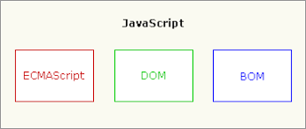
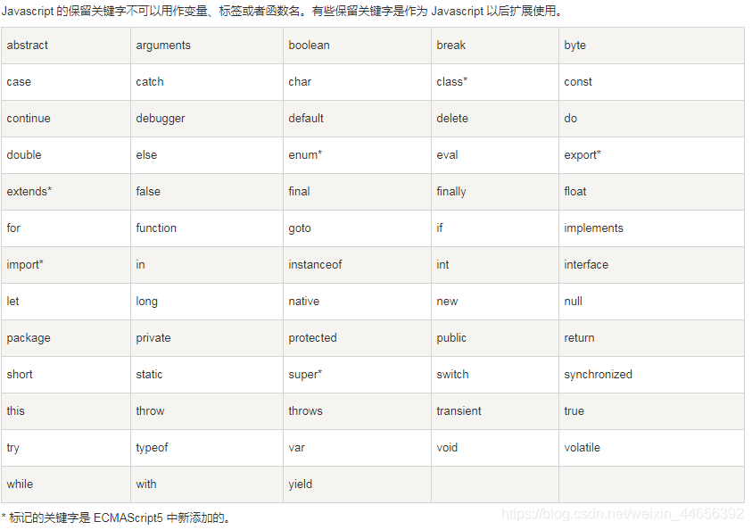
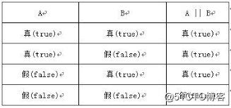
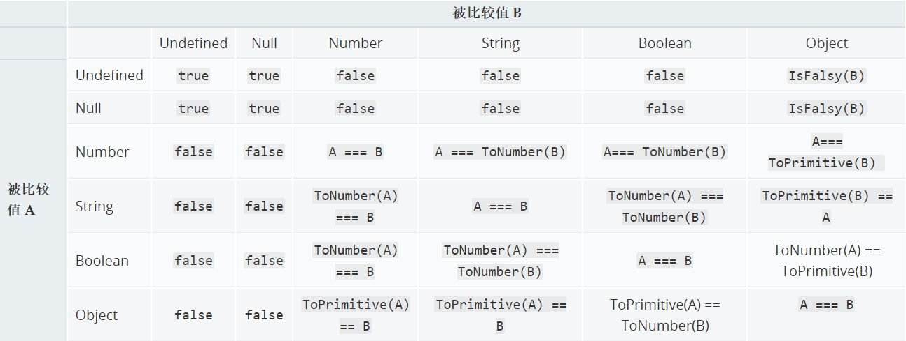

[TOC]

---


完整的 JavaScript 包含:
1. 核心(ECMAScript)
2. 文档对象模型(DOM)
3. 浏览器对象模型(BOM)



---

### 2.1 < script>元素

-  < script>是以脚本的方式插入到 HTML 中，其常用属性:

   1. async: 可选。表示应该立即开始下载脚本，但不能阻碍其他页面动作，比如下载资源或等待其他脚本加载。只对外部脚本文件有效。
   1. defer: 可选。 表示脚本可以延迟到文档完全被解析和显示之后再执行。只对外部脚本有效。
   1. src: 可选。 表示包含要执行的代码的外部文件。
   1. type: 可选。 表示代码块中的脚本语言内容类型

-  使用< script>有两种:
   <br>

   -  直接嵌入网页中:

      ```javascript
      <script>
         function sayHi(){
            console.log('Hi!');
            }
      </script>
      ```

      -  **< script> 中的代码会被从上到下的解释。在< script>元素中代码被计算完成之前，页面的其余内容不会被加载，也不会被显示。**

      -  内部代码不能有< /script>标签，浏览器解析行内脚本的方式决定它在看到< /script>时，会将其当成结束。避免这问题，使用转义字符 **\\**,即<\\/script> .
         <br>

   -  用包含外部文件的 js,就必须使用**src**属性:

      ```javascript
      <script src="example.js"></script>
      ```

      -  在解释外部 JavaScript 文件时，页面也会阻塞(阻塞时间也包含下载文件时间。)

      -  使用**src**属性的< script>元素不应该在包含内置代码。如果有，浏览器只会下载并执行脚本文件，从而忽略行内代码。

**\*注意: 1.不管包含的是什么代码，浏览器都会按照< script>在页面中出现的顺序依次解析它们。前提是它们没有使用 defer 和 async 属性。\*\***

**_注意: 2.所以在需求多的 JavaScript 中，一般放在 body 最下方，这样一来页面会在处理 JavaScript 代码之前完成渲染页面。_**
<br>

-  推荐使用外部文件:
   <br>
   1. 可维护性: JavaScript 分散到多个 HTML 中，会导致维护困难。
      <br>
   2. 缓存: 浏览器会根据特定的设置缓存所有外部链接的 JavaScript 文件，这意味着如果两个页面都使用同一个文件，则该文件只需下载一次。最终意味着页面加载更快。
      <br>
   3. 适应未来: 不必考虑 XHTML 或其他黑科技。

---

### 语法

-  区分大小写，无论是变量，函数，操作符，都区分大小写
   <br>
-  标识符: 就是变量，函数，属性， 函数参数的名称。
   <br>
-  注释: // 单行注释; /_ 内容_/ 多行注释
   <br>
-  严格模式: (strict mode) 严格模式下 ECMAScript 的一些不规范写法不被处理，对不安全的活动将抛出错误,开启严格模式:

   ```JavaScript
         "use strict"
   ```

   -  也可以在函数体中执行:

   ```JavaScript
         function doSomething(){
            "use strict"
         }
   ```

   <br>

-  **语句: ECMAScript 中的语句以分号结尾。省略分号意味着有解析器确定语句在哪里结尾，如：**

   ```JavaScript
      let sum = a + b // 没有分号也有效，但不推荐
      let diff = a - b; // 加分号有效， 推荐
   ```

   -  加分号 有助于防止省略造成的问题; 也有助于开发者通过删除空行来压缩代码; 也有助于在某些情况下提升性能。
      <br>

-  关键字: 关键字有特使用途，比如表示控制语句的开始和结束，或执行特定的操作。按照规定，保留的关键字不能用做标识符或属性名。
   
   <br>

-  **变量: ECMAScript 变量是松散类型的，意思是变量可以用于保存任何类型的数据。每个变量只不过是一个用于保存任意值的命名占位符。有三个关键字可以声明变量:var, const, let.**

<br>

#### 1. var 关键字

> ```javascript
> var message;
> ```
>
> 定义了一个名为 **message** 的变量，可以用它保存任何类型的值。(**不初始化的的情况下，变量会保存一个特殊值 undefined**)
>
> ```javascript
> var message = 'h1';
> message = 100; // 合法，但不推荐
> ```
>
> message 被定义为一个保存字符串值 hi 的变量。**像这样初始化变量不会将它标识为字符串类型，只是一个简单的赋值唯一。随后重写为保存了数值 100**

-  01.var 声明作用域
   -  使用 var 操作符定义的变量会成为包含它的函数的局部变量。
   ```javascript
   function test() {
      var message = 'hi'; // 局部变量
   }
   test();
   console.log(message); // 报错
   ```
   message 变量是在函数内部使用的 var 定义的。调用函数 test(),会创建这个变量并给它赋值。调用之后变量随即被销毁，因此示例中最后一行会报错。
   **不过，在函数内定义变量时省略 var 操作符，可以创建一个全局变量**
   ```javascript
   function test() {
      message = 'hi'; // 局部变量
   }
   test();
   console.log(message); // hi
   ```
   <br>
-  02.可以多个变量

   ```javascript
   var message = 'hi',
      found = false,
      age = 29;
   ```

   因为 ECMAScript 是松散类型的，所以可以用一条语句开声明不同的数据类型
   <br>

-  03.var 的声明提升

   ```javascript
   function foo() {
      console.log(age);
      var age = 26;
   }

   foo(); // undefined
   ```

   此处不会报错，是因为 ECMAScript 运行时把它看成等价于如下代码

   ```javascript
   function foo() {
      var age;
      console.log(age);
      age = 26;
   }

   foo(); // undefined
   ```

   这就是所谓的“提升”，也就是把所有变量声明都拉到函数作用域的顶部。

<br>

#### 2.let 声明

> let 跟 var 的作用差不多，但有着非常重要的区别:**let 声明的范围时快作用域，而 var 声明的范围时函数作用域。**

```javascript
if (true) {
   var name = 'Matt';
   console.log(name); // Matt
}
console.log(name); // Matt

if (true) {
   let age = 26;
   console.log(age); // 26
}
console.log(age); // ReferenceError: age没有定义
```

> **这里 age 变量之所以不能在 if 快外部被引用，是因为它的作用域仅限于该块内部。_块作用域是函数作用域的子集，因此适用于 var 的作用域限制同样也适用于 let._**

> let 也不允许同一个块作用域中出现多余声明

```JavaScript
   var name;
   var name;

   let age;
   let age; // SyntaxError; 标识符age已经声明过了
```

-  01.暂时性死区
   let 与 var 的另一个重要区别，就是 let 声明的变量不会再作用域中被提升。

```JavaScript
   // name 会被提升
   console.log(name); // undefined
   var name = "Matt"

   // age不会被提升
   console.log(age); // ReferenceError : age 未被定义
   let age = 26;
```

javascript 引擎解析代码时，会注意快后面 let 的声明，任何后面才声明的变量都会报错

   <br>
   - 02.全局声明
   
   **与var不同，使用let在全局作用域中声明的变量不会成为window对象的属性**

```JavaScript
   var name = "Matt";
   console.log(window.name); // Matt

   let age = 26;
   console.log(window.age); // undefined
```

   <br>
   - 03.for循环中let声明
   
   在let出现之前，for循环定义的迭代变量会参透到循环体的外部

```JavaScript
   for(var i = 0, i < 5; i ++){
      // 循环逻辑
   }
   console.log(i); // 5

   for(let i = 0; i <5; i ++){
      // 循环逻辑
   }
   console.log(i); //ReferenceError: i 没有定义
```

**var 变量会渗透到外部**
<br>

var 会对迭代变量的奇特声明和修改

```JavaScript
   for(var i = 0, i < 5; i ++){
      setTimeout(() => console.log(i), 0)
   }
   // 你可能以为会输出 0,1,2,3,4
   // 实际上会输出 5,5,5,5,5
```

**之所以会这样，是因为在退出循环时，迭代变量保存的是导致循环退出的值: 5。在之后执行超时逻辑时，所有的 i 都是同一个变量，因此输出的都是同一个最终值。**

   <br>

```JavaScript
   for(let i = 0, i < 5; i ++){
      setTimeout(() => console.log(i), 0)
   }
   // 会输出 0,1,2,3,4
```

let 声明迭代变量时，JavaScript 引擎在后台会为每个迭代循环声明一个新的迭代变量。每个 setTimeout 引用的都是不同的变量实例

<br>

#### 3. const 声明

> const 的行为与 let 基本相同，唯一一个重要的区别是**_它声明的变量时必须同时初始化变量，且尝试修改 const 声明的变量会导致运行错误。_**

```javascript
const age = 26;
age = 36; // TypeError ：给常量赋值

// const也不允许重复声明
const name = 'Matt';
const name = 'Nicholas'; // SyntaxError

// const 声明的作用域也是块级作用域
const name = 'Matt';
if (true) {
   const name = 'Nicholas';
}
console.log(name); // Matt
```

> **const 声明的限制只适用于它指向的变量的引用。换句话说，如果 const 变量引用的是一个对象，那么修改这个对象内部的属性并不违反 const 的限制。**

```javascript
const person = {};
person.name = 'Matt'; // OK
```

所以 const 不能再 for 循环中声明迭代变量

```javascript
for(const i =0; i < 10, i++){} // TypeError : 给常量赋值
```

##### summary： 不使用 var， const 优先，let 次之

---

<br>

### 数据类型

> ECMAScript 有 6 种简单数据类型(也称为**原始类型**): **undefined, null, boolean, number, string ,symbol**.和一种复杂的数据类型**Object(对象)**

-  因为 ECMAScript 的类型是松散的，所以需要一种手段来确定任意变量的数据类型.typeof 操作符就是为此而生，对一个值使用 typeof 会返回下列**字符串**：
   -  undefined，未定义
   -  boolean, 布尔值
   -  string， 字符串
   -  number， 数值
   -  object， 对象 或 null
   -  function，函数
   -  symbol， 符号
      **函数在 ECMAScript 中被认为是对象，但函数有自己的特殊属性，为此，就有必要通过 typeof 来区分函数和其他对象。**
      <br>

##### 1.Undefined 类型

-  Undefined 类型只有一个值，就是特殊值 undefined。当使用 var 或 let 声明变量但没有初始化时，就相当于给变量赋予了 undefined 值

   ```javascript
   let message;
   console.log(message == undefined); // true
   ```

   和下列相同

   ```javascript
   let message = undefined;
   console.log(message == undefined); // true
   ```

   **一般来说，永远不用显式地给摸个变量赋值 undefined。增加这个特殊值的目的就是为了正式明确对象指针(null)和未初始化变量的区别。**

   -  undfined 有很多假值

   ```javascript
   let message; // 声明了变量，只是值为undefined

   // 确保没有声明变量let age;

   console.log(message); // undefined
   console.log(age); // 报错

   //但是typeof 都显示 undefined
   console.log(typeof message); // undefined
   console.log(typeof age); // undefined
   ```

   此处 age 没有被定义 但 typeof 任然显示为 undefined

<br>

##### 2. Null 类型

-  Null 类型只有一个值，就是特殊的 null。逻辑上讲，null 值表示一个空对象指针，也就是给 typeof 传一个 null 会返回"object"的原因

```javascript
let car = null;
console.log(typeof car); // object
```

-  在定义将来要保存的变量时，建议使用 null 来初始化。这样检查该变量是不是 null 就可以知道这个变量是否在后来是否被引用。

- undefined 值是由 null 值派生而来的，因此 ECMA-262 将他们定义为表面上相等

```javascript
   console.log(null = undefined); // true
```

<br>

##### 3. Boolean 类型

-  Boolean 类型是 ECMAScript 中使用最频繁的类型之一，有两个字面意思 **true** 和 **false**。两个布尔值不等同于数值，因此 true 不等于 1， false 不等于 0.
   **注意：布尔值是区分大小写的，因此 True 和 False 是有效标识符，但不是布尔值。**
   <br>

   -  将其他类型转化为 Boolean，可以调用 Boolean()转型函数：

   ```javascript
   let message = 'Hello World';
   let messageAsBoolean = Boolean(message);
   ```

   **任何类型都可以转换为 true 或 false，规则如下：**
   

   **在 if 等流控制语句中会自动执行其他类型值到布尔值的转换，如：**

   ```javascript
   let message = 'Hello World';
   if (message) {
      console.log('Value is true');
   }
   ```

   if 中的条件判断会自动转化 字符串 message 为 true。

<br>

##### 4. Number 类型

-  Number 类型使用 IEEE-754 格式表示 整数和浮点数(在某些语言中也叫双精度值)。

   1. 最基础的数值字面量格式为十进制整数

      ```javascript
      let intNum = 55;
      // 整数;
      ```

      -  整数也可以用八进制(第一个数字必须为 0)或十六进制表示(必须让真正的数值前缀 0x[区分大小写])。

      ```javascript
      let octalNum1 = 070; // 八进制的56
      let octalNum2 = 079; // 无效的八进制，当成79处理
      let octalNum3 = 08; // 无效的八进制， 当成8处理

      let hexNum1 = 0xa; // 十六进制10
      let hexNum2 = 0x1f; // 十六进制31
      ```

      **八进制字面量在严格模式下是无效的**
      **使用八进制和十六进制格式穿件的数值在所有数学操作中都被视为十进制数值**

<br>

1. float 浮点值

   -  浮点值，数值中必须包含小数点，而且小数点后面必须至少有一个数字。

   ```javascript
   let floatNum1 = 1.1;
   let floatNum2 = 0.1;
   let floatNum3 = 0.1; // 有效，但不推荐
   ```

   **储存 float 值使用的内存空间是整数的两倍，所以 ECMAScript 总是想方设法把值转换为整数。在小数点后没有数值时或只有 0 时，会变成整数**

   ```javascript
   let floatNum1 = 1; // 小数点后没有数字，当成整数处理

   let floatNum2 = 10.0; // 小数点后面为零，当成整数处理
   let floatNum3 = 0.1; // 有效，但不推荐
   ```

   **在默认情况下小数点后至少包含 6 个零的 float 会转为科学记数法，如：
   3.125e7 相当于 3.125 乘以 10 的 7 次幂**

   -  所以在算数计算中，不如整数精确，列如 0.1 + 0.2 不等于 0.3,而是 0.300 000 000 000 000 04.

   ```javascript
   function sum(a, b) {
      if (a + b == 0.3) {
         console.log('you got 0.3');
      }
      console.log(a + b);
   }
   ```

   a,b 为 0.05,0.25 则没有问题; a,b 为 0.1 和 0.2 则失败。

<br>

2. NaN

   -  NaN 为一个特殊的数值，意思是“不是数值(Not a Number)”,用于表示本来要返回数值的操作失败(而不是抛出错误)

   ```javascript
   console.log(0 / 0); // NaN
   console.log(-0 / +0); // NaN
   ```

   在其他语言中，用 0 除任何数值会报错，而 ECMAScript 中会返回 NaN.

   -  NaN 属性:
      1. **任何涉及 NaN 的操作始终返回 NaN**
      1. **NaN 不等于包括 NaN 在内的任何值**

   ```javascript
   console.log(NaN == NaN); // flase
   ```

   为此 ECMAScript 提供了函数 isNaN().

   ```javascript
   console.log(isNaN(NaN)); // true
   console.log(isNaN(10)); // false
   ```

3. 数值转换
   **有 3 个函数可以将非数值转换为数值:**

   1. Number()

      -  布尔值, **true**转为 1， **false**转为 0
      -  数值， 直接返回
      -  null， 返回 0
      -  undefined， 返回 NaN
      -  字符串，应用一下规则：

         -  string 中包含数值，包括数值字符串前面带加，减号的情况，则转化为一个十进制数值，如：
            Number("1")返回 1，
            Number("123")返回 123，
            Number("011")返回 11，

         -  如果 string 中包含有效的 float 值，会转换为相应的 float 值(同样会忽略前面的 0)

         -  如果 string 包含有效的十六进制格式"0xf"，则会转化为为与该值对应的十进制整数值

         -  空 string，返回 0

         -  string 中包含其他情况返回 NaN

      -  对象， 调用 valueOf()方法，并按照上述规则转化返回值，如果未 NaN(),则调用 toString()方法
         <br>

   1. parseInt()

      -  在通常需要得到整数时，可以优先考虑用 parseInt()。
      -  string 最前面的空格会被忽略
      -  从第一个非空字符开始转换，如果第一个字符不是数值字符，加号， 或减号，parseInt()**立即返回**NaN
      -  第一个值为数值或加减后，则继续依次检测每一个字符，或碰到非数值字符如：
         "1234blue"会转化为"1234";
         "22.5"会转化为 22;
      -  parseInt()可以识别不同的整数格式，因此可以添加第二参数

      ```javascript
      let num = parseInt('0xAF', 16); // 175

      // 在提供进制参数后，可以省略"0x"
      let num2 = parseInt('AF', 16); // 175
      ```

      <br>

   1. parseFloat()
      -  和 parseInt()相似，但只能出现一次小数点
         "23.34.5"将转换为"23.34"
      -  **始终忽略字符串开头的零**

<br>

##### 5. string 类型
-  string 表示0或多个16位Unicode字符序列。可以使用双引号(""),单引号(''),或反引号(``)表示。
```javascript
   let firstName = "John";
   let lastName = 'Jacob';
   let lastName = `Jingle`;
```  
**注意：以某种引号开头，必须任然以该引号结尾**
1. 字符字面量

**注意: 转义序列只表示一个字符**
1. 字符串可以用length获取长度
   ```javascript
      let text = "This is the letter sigma: \u03a3.";
      console.log(text.length); // 28
   ```

<br>

-  字符串特点
   -  ECMAScript中字符串是不可变的。要修改某个变量的值，必须先摧毁原始的字符串，然后将新的值保存到该变量中
   ```javascript
      let lang = "Java";
      lang = lang + "Scrript";
   ```

<br>

- 转化为字符串
  - toString()方法。可以返回几乎所有值为字符串，可用于number，Boolean，object，string(string只是简单的返回一个自身的副本) null和undefined值没有toString()方法。
    - toString()可以接受一个底数为参数，底数为多少进制
      ```javascript
         let num = 10;
         console.log(num.toString());  // "10"
         console.log(num.toString(2)); // "1010"
         console.log(num.toString(8));  // "12"
         console.log(num.toString(16));   // "a"
      ```
   -  如果没有toString()方法直接返回该字面量
       ```javascript
         let value1 = null;
         let value2 = undefined;

         console.log(value1.toString());  // "null"
         console.log(value2.toString());   // "undefined"
      ```
<br>

- 模板字面量
  - ECMAScript新增的能力，模板字面量保留换行字符，可以跨行定义字符串；
   ```javascript
      let string = `
      first line

      second line
      `;
   ```
   在定义模板时特别好用
   ```javascript
      let pageHTML = `
      <div>
         <a href="#">
            <span>Jake</span>
         </a>
      </div>
      `;
   ```  
   <br>

- 字符串插值
  - 就是可以在连续定义中插入一个或多个值；技术上讲模板字面量是一种特殊的JavaScript句法表达式，只不过求值后得到的时字符串。
  - 模板字符串在定义时立即求值并转换为字符串实例，**任何插入的变量也会从它们最接近的作用域中取值**
   ```javascript
      let value = 5;
      let exponent = 'second';

      // 以前插值
      let interpolatedString = 
         value + ' to the ' + exponent + 'power is ' + (value * value);
      
      // 模板字面量插值
      let interpolatedTemplateLiteral = 
      `${value} to he ${exponent} power is ${value * value}`;
   ```
   - 所有插值都可以使用toString()强制转为字符串，**其任何表达式都可以用于插值**。  

<br>

- 标签函数
  - 通过tag function可以自定义插值行为。 标签函数会接收被插值记号分隔后的模板和对每个表达式求值的结果。
  - 标签函数本身是一个常规函数，通过前缀到模板字面量来应用自定义行为。
  - 标签函数接收到的每一个参数依次是原始字符串数组和对每个表达式求值的结果。这个函数的返回值是对模板紫米那里求值的字符串。
  ```javascript
      let a = 6;
      let b = 9;

      function simpleTag(strings, aValExpression, bValExpression, sumValExpression){
         console.log(strings);
         console.log(aValExpression);
         console.log(bValExpression);
         console.log(sumValExpression);

         return 'foobar';
      }

      let untaggedResult = `${a} + ${b} = ${a + b}`; // 6 + 9 = 15
      let taggedResult = simpleTag`${a} + ${b} = ${a + b}`;
      // ["", " + ", " = ", "", raw: Array(4)]
      // 6
      // 9
      // 15
      console.log(taggedResult); // foobar
   ```
   **标签函数的第一个参数是被嵌入表达式分隔的文本的数组。第二个参数开始是嵌入表达式的内容。**
   ```javascript
      // 表达式参数是可变的，所以通常应该使用剩余操作符，将它们收集到一个数组中
      let a = 6;
      let b = 9;

      function simpleTag(strings, ...expressions){
         console.log(strings);
         for(const expression of expressions){
            console.log(expression)
         }

         return 'foobar';
      }      
            
      let taggedResult = simpleTag`${a} + ${b} = ${a + b}`;
      // ["", " + ", " = ", "", raw: Array(4)]
      // 6
      // 9
      // 15
      console.log(taggedResult); // foobar
   ```
<br>

- 原始字符串
  - 使用模板字面量也可以直接获取原始的模板字面量内容(如换行符或Unicode字符)搬去，而不是被转换后的内容。可以使用String.raw标签函数：
  ```javascript
      //Unicode示例
      //u00A9是版权符号
      console.log(`\u00A9`) // `&copy;`;
      console.log(String.raw`u00A9`); // \u00A9
   ```  
<br>
##### 6. symbol 类型
- symbol(符号)是ECMAScript新增的数据类型。符号是原始值，**且符号实例是唯一，不可变的**。
- 符号的用途是确保对象使用唯一标识符，不会发生属性冲突的危险
   1. 符号基本用法
      - 符号需要使用Symbol()函数初始化。，因为符号本身是原始类型，所以typeof操作符对符号返回symbol。
   
      ```javascript
         let sym = Symbol();
         console.log(typeof sym); // symbol
      ``` 

      - 调用Symbol()函数时，也可以传入一个字符串参数作为对符号的描述(description),将来可以通过这个字符串来调用代码。

      ```javascript
         let genericSymbol = Symbol();
         let otherGenericSymbol = Symbol();

         let fooSymol = Symbol('foo');
         let otherFooSymbol = Symbol('foo');
         console.log(genericSymbol == otherFooSymbol); // false
         console.log(fooSymol == otherFooSymbol); // false
      ``` 

   1. Symbol函数不能作为构造函数，与new关键字一起使用。

<br>

##### 7. Object 类型
-  Object其实就是一组数据和功能的集合。对象通过new操作符根对象类型的名称来创建。开发者可以通过创建Object类型的实例来创建自己的对象，然后再给对象添加属性和方法
```javascript
   let o = new Object();
```
- 每个Object实例都有如下的属性和方法；
  - constructor: 用于创建当前对象的函数
  - hasOwnProperty: 用于判断当前对象实例上是否存在给定的属性。如o.hasOwnProperty("name")
  - isPrototypeOf(object):用于判断当前对象是否为另一个对象的原型
  - propertyIsEnumerable:用于判断给定的属性是否可以使用for-in语句枚举
  - toLocalEsTRING()
  - ToString()
  - valueOf()

---

<br>

### 操作符
- 一元操作符(只操作一个值的操作符)
  - 递增，递减操作符
    - 有前缀版和后缀版
      - 前缀版位于要操作的变量前头,后缀就是位于要操作的变量后面
      ```javascript
         let age = 29;
         ++age; // 30
         --age;

         // 和下列一样
         age = age + 1;
         age = age - 1;
      ```
      - 无论是使用前缀的递增或递减，**变量的值都会在语句被求值之前改变**
      ```javascript
         let age = 29;
         let anotherAge = --age + 2;

         console.log(age); // 28
         console.log(anotherAge); // 30
      ```
      - 后缀效果和前缀版一样，只不过**后缀版的递增或递减在语句被求值后才发生**
      ```javascript
         let a = 2;
         let b = 20;
         let sum1 = a-- + b;
         let sum2 = a + b;
         console.log(sum1); // 22
         console.log(sum2); // 21
      ```
   
   - 前后缀递增和递减可以用于任何值
     - string:
       - 有效的数值，将其转化为数值在应用改变，变量类型从string变成number
       - 不是有效的数值，则将变量的值设置为NaN,变量类型从string变成number
     - Boolean：
       - 如果是false，则转换为0在改变，变量类型从boolean变成number
       - 如果是true， 则转换为1在改变，变量类型从boolean变成number
     - float；
       - 加1或减1
     - 如果是对象，则调用valueOf()取得可以操作的值。对应上述的规则
      ```javascript
         let s1 = "2";
         let s2 = "z";
         let b = false;
         let f = 1.1;
         let o = {
            valueOf(){
               return -1;
            }
         };

         s1++; // 值变成数值3
         s2++; // 值变成NaN;
         b++;  // 值变成数值1
         f--;  // 值变成0.10000000000000009(因为float点数不精确)
         o--;  // 值变成-2
      ```
<br>

-  一元加和减
   -  一元加与数学中的用途一样，放在变量开头对数值没有任何影响
   ```javascript
      let num = 25;
      num = +num;
      console.log(num) // 25
   ```
   -  一元加在非数值中，会执行与Number()转型函数一样的类型转换，false、true 会转为0,1
   ```javascript
      let s1 = "01";
      let s2 = "1.1";
      let s3 = "z";
      let b = false;
      let f = 1.1;
      let o = {
         valueOf(){
            return -1;
         }
      };

      s1 = +s1; // 值变成数值1
      s2 = +s2; // 值变成1.1;
      s3 = +s3; // 值变成NaN;
      b = +b;  // 值变成数值0
      f = +f;  // 不变，还是1.1
      o = + o;  // 值变成数值-1
   ```

      -  一元减，主要用于把数值变成负值，如把1 转化为 -1.，同理一元减会遵循一元加相同的规则，先转换然后再取负值
   ```javascript
      let s1 = "01";
      let s2 = "1.1";
      let s3 = "z";
      let b = false;
      let f = 1.1;
      let o = {
         valueOf(){
            return -1;
         }
      };

      s1 = -s1; // 值变成数值-1
      s2 = -s2; // 值变成-1.1;
      s3 = -s3; // 值变成NaN;
      b = -b;  // 值变成数值0
      f = -f;  // 不变，还是-1.1
      o = -o;  // 值变成数值1
   ```

<br>

- 布尔操作符
  - 布尔操作符一共有3个: **逻辑非，逻辑与， 逻辑或**
  - 逻辑非由叹号(!)表示，***这操作符始终返回布尔值***
     - 逻辑非首先先将**操作数转化为布尔值**,然后再对其取反
       - object:false
       - 空字符串: true
       - 非空字符串: false
       - 数值0: true
       - 非0数值(include infinity): false
       - null: true
       - NaN: true
       - undefined: true
     - 逻辑非也可以将任何数值转化为Boolean。同时使用两个叹号(!!)
     ```javascript
       console.log(!!'blue'); // true
       console.log(!!0); //false
       console.log(!!NaN);  // false
       console.log(!!'');   //false
       console.log(!!122345);  //true
     ```
  
  - 逻辑与由两个和号(&&)表示，==**"全真为真，有假为假"**==
      

     - 逻辑与可以用于任何操作类型的，不限于布尔值。当不是布尔值时，规则如下
       - 第一个操作数为对象，则返回第二个操作数
       - 如果第二个操作数是对象，则只有第一个操作数求值为true时，才会返回对象
       - 如果两个操作数都是对象，则返回第二个操作数
       - 如果有一个操作数为null，则返回null
       - 如果有一个操作数为NaN，则返回NaN
       - 如果有一个操作数为undefined，则返回undefined
      **注意:逻辑与操作符是一种短路操作符，意思是如果第一个操作数决定了结果，那永远不会对第二个操作数求值**
      ```javascript
         let found = true;
         let result = (found && someUndeclareVariable);
         // 上述情况会报错，found为true，求值第二个操作数，且其未定义，报错
         
         console.log(result);

         let found = false;
         let result = (found && someUndeclareVariable);
         // 上述情况不会报错，found为false，不在执行
         
         console.log(result); // 会执行
      ```

   - 逻辑或由两个管道符(||)表示, ==**"有真为真，全假为假"**==
       
     - 逻辑或和逻辑与规则类似，如果有一个操作数不是布尔值，规则如下
       - 如果第一个操作数为对象，则返回第一个操作数
       - 如果第一个操作数为false，则返回第二个操作数
       - 如果两个操作数都是对象，则返回第一个操作数
       - 如果有两个操作数都为null，则返回null
       - 如果有两个操作数都为NaN，则返回NaN
       - 如果有两个操作数都为undefined，则返回undefined 
      **注意:与逻辑与类似，逻辑或操作符也是具有短路特性。当第一个值为true时，不会再对第二个操作数求值了**
      ```javascript
         let found = true;
         let result = (found || someUndeclareVariable);
         // 上述情况不会报错，found为true，不在执行         
         
         console.log(result);

         let found = false;
         let result = (found || someUndeclareVariable);
         // 上述情况会报错，found为false，求值第二个操作数，且其未定义，报错   
         
         console.log(result); // 不会执行
      ```
<br>

- 乘性操作符
  - 乘法， 除法，取余 
  - 乘法由(*)表示，与高数相同
    ```javascript
      let result = 34 * 56;
    ``` 
    - 正负运算也与高数相同
    - 如果有操作数为NaN,则返回NaN
    - 如果是infinity * 0， 返回NaN.
    - infinity * 其他数得，infinity或-infinity
  - 除法由(/)表示 
    ```javascript
      let result = 66 / 11;
    ```
    - 正负运算也与高数相同
    - 如果有操作数为NaN,则返回NaN
    - 如果是infinity / infinity， 返回NaN.
    - 若果是0 / 0，则返回NaN
    - infinity / 其他数得，infinity或-infinity
    - 如果有不是数值的操作数，先在后台用Number()转为数值，在用以上规则
  - 取余由(%)表示
    ```javascript
      let result = 26 % 5; // 1
    ```
    - 操作数是数值，则执行常规运算
    - 被除数为无限值，除数为有限值，则返回NaN
    - 被除数为有限值，除数为0，则返回NaN
    - infinity % infinity , 则返回NaN
    - 被除数为有限值，除数为无限值，则返回被除数
    - 被除数为0， 除数不为0， 则返回0
    - 如果有不是数值的操作数，先在后台用Number()转为数值，在用以上规则

<br>

- 指数操作符
  - ECMAScript 新增的操作符，Math.pow()现在有了自己的操作符(**),两者结果一样
    ```javascript
      console.log(Math.pow(3,2)); // 9
      console.log(3 ** 2); // 9

      console.log(Math.pow(16, 0.5)); // 4
      console.log(16 ** 0.5); // 4      
    ```  

<br>

- 加性操作符
  - 加法和减法
  - 加法由(+)表示
    ```javascript
      let result = 1 + 2; 
    ```
    - 如果有任意数为NaN,则返回NaN
    - infinity + infinity ,返回infinity
    - -infinity + -infinity = - infinity
    - infinity + -infinity ,返回NaN
    - +0 + +0 = +0
    - -0 + -0 = -0
    - -0 + +0 = +0
    - **当有一个操作数为string时:**
      - **当两个都为字符串时，则第二个字符串拼接到第一个字符串后面** 
      - **只有一个操作数为字符串时，则将另一个操作数转为字符串，在拼接**
      - 如果有操作数为对象，数值或布尔值，则调用toString()方法获取字符串
    ```javascript
      let result = 5 + 5;  // 两个数值
      console.log(result); // 10
      let result2 = 5 + "5";  // 一个数值
      console.log(result2); // "55"
    ```
    加法操作涉及数据类型是易错类型，
    ```javascript
      let a = 5;
      let b = 10;
      let message = 'the sum of 5 and 10 is ' + a + b;
      console.log(message); // the sum of 5 and 10 is 510

      // message 中保存的是string，实际上两次加法是独立完成的，会将5 和 10 先转换为string类型
    ```

   - 减法由(-)表示  
      ```javascript
         let result = 2 - 1; 
      ```
      - 如果有任意数为NaN,则返回NaN
      - infinity - infinity , 返回NaN
      - -infinity - -infinity = NaN
      - infinity - -infinity = infinity
      - -infinity - infinity = -infinity
      - +0 - +0 = +0
      - +0 - -0 = -0
      - -0 - -0 = +0 
      - 如果有操作数是string，Boolean， null， undefined，先用Number()转换为数值
      - 如果任意操作数是对象，则调用valueOf()方法
      ```javascript
         let result1 = 5 -true; // true 转化为1，所以结果是4
         let result2 = NaN - 1; // NaN
         let result3 = 5 - 3; // 2
         let result4 = 5 - ""; // ""转化为0，所以结果是5
         let result5 = 5 - "2"; // "2"转化为2， 所以结果是3
         let result6 = 5 - null; // null 转为0， 所以结果是5 
      ```

<br>

- 关系操作符
  - 包括小于(<),大于(>),小于等于(<=),大于等于(>=)，**用法跟数学一样，返回布尔值**
   ```javascript
      let result1 = 5 > 3; // true
      let result2 = 5 < 3; // false
   ```
  - 在用于不同数据类型时，也有类型转换和其他行为
    - 操作数都是数值，则执行数值比较
    - 操作数都是字符串，则逐个比较字符串中对应字符的编码
    - **如果有任一个操作数是数值，则将另一个操作数转化为数值，执行数值比较**
    - 如果有任一操作数是对象免责调用valueOf(), toString()方法比较
    - 如果有任一操作数是布尔值，则将其转化为数值在比较
    **在比较字符串时，是根据编码的大小比较，大写字母编码都小于小写字母编码**  
   ```javascript
      let result = "Brick" < "alphabet"; true
      // 字母B的编码是66，字母a的编码是97.

      // 要得到实际结果要转为相同的大小写形式
      let result1 = "Brick".toLowerCase() < "alphabet".toLowerCase(); //false
   ```
   **另外注意,字符串形式数值比较**
   ```javascript
      let result = "23" < "3"; // true
      // 2的编码是50，,的编码是51

      // 但在有一数值情况下就会得到实际结果
      let result1 = "23" < 3; // false
   ```
   **当字符串无法转换为数值时，会显示 NaN**
   ```javascript
      let result = "a" < 3; // "a" 转为NaN, 所以结果是false
   ``` 
   **规则: 当NaN和任何操作符比较时，都返回false**  

<br>

- 相等操作符
  - 判断两个变量是否相等。在数值，字符串，布尔值时，过程都很直观。但是比较两个对象时会很复杂。ECMAScript提供了
    - 等于(==)和不等于(!=)
    - 全等(===)和不全等( ==)
  - 等于(==)和不等于(!=)这两个会进行强制类型转换，再确定操作数是否相等，在转换类型时规则如下
    - 任一操作数是布尔值，则将其转化为数值再比较是否相等。false为0，true为1
    - 如果一个操作数是字符串，另一个操作数是数值，则尝试将字符串转为数值再比较
    - 如果一个操作数是对象，另一个不是，则调用valueOf()
  - 在比较时
    - **null 和 undefined相等**
    - **null 和 undefined不能转化为其他类型的值再进行比较**
    - **如果有任一操作数是NaN,则相等操作符(==)返回false，即使为两个NaN**
    - 如果操作数是两个对象，则比较它们是不是同一个对象。如果两个操作数都指向同一个对象，则相等操作符(==)返回true
     

   - 全等(===)和不全等( ==),与相等操作符类型，不过在比较时 **不转化操作数**
   ```javascript
      let result1 = ("55" == 55;) // true 
      let result1 = ("55" === 55;) // false
   ```
   - 不全相等(!==),两个操作数在不转换的前提下不相等，才返回true
   ```javascript
      let result1 = ("55" != 55;) // false 
      // 转化后相等
       
      let result1 = ("55" === 55;) // true
      // 不相等，数据类型不同
   ```     
   - 另外
   ```javascript
      let result1 = (null == undefined;) // true 
      
      let result1 = (null === undefined;) // false
      // 数据类型不同
   ``` 

<br>

- ==条件操作符==
  - 语法和Java一样
    - **variable = Boolean_expression ? true_value : false_value**
    - **上述代码执行了条件赋值操作，根据表达式 Boolean_expression的值决定将哪个值赋给变量variable; true 给 true_value, false 给 false_value**
    ```javascript
      let max = (num1 > num2) ？ num1 : num2 
    ```

<br>

- 赋值操作符
  - 简单赋值用等于号(=)表示，将右手边的值赋给左手边的变量，
    ```javascript
      let num = 10;
    ```  
   - 复合赋值使用乘性，加性或位操作符后跟等于号(=) 表示。
    ```javascript
      let num = 10;
      num = num + 10;

      // 复合赋值
      let num2 = 10;
      num2 += 10;
    ```   
   - 除此之外
     - (*=)
     - (/=) 
     - (%=)
     - (+=)
     - (-=)
     - (<<=)
     - (>>=)
     - (>>>=)

<br>

- 逗号操作符
  - 逗号操作符可以用来在一条语句中执行多个操作
   ```javascript
      let num1 = 1, num2 = 2, num3 = 3;
    ``` 
 

