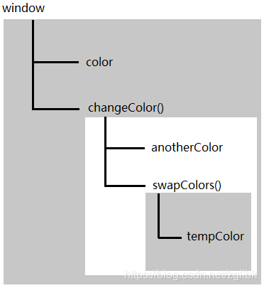

# 变量
> javaScript中的变量时松散类型的，==变量就是特定时间点一个特定值的名称而已==
> 由于没有规则定义变量必须包含什么数据类型，==变量的值和数据类型在脚本生命周期可以改变==

- **变量可以包含两种不同类型的数据: 原始值(就是最简单的数据)和引用值(由多个值构成的对象)**

- **在赋值一个变量时javaScript引擎必须确定其值是原始值还是引用值**

---

- #### 原始值
  - > 6种原始值: undefined, Null, Boolean, Number, String, Symbol
    > 保存原始值的变量是**按值**(by value)访问的,因此我们操作的就是存储在变量中的实际值

- #### 引用值
   - > 引用值是保存在内存中的对象。 JavaScript不允许直接访问内存位置，因此也就不能直接操作对象所在的内存空间
     > 在操作对象时，实际上操作的是对该对象的**引用**而非实际对象本身。因此，保存引用值的变量是**按引用**访问的     


<br>

### 动态属性
> 原始值和引用值定义方式很类型，都是创建一个变量
> 不过，对于引用值来说，可以随时添加，删除其属性和方法
```javascript
   let person = new Object();
   person.name = "Nicholas";
   console.log(person.name); // "Nicholas"

   // 创建一个对象，并将其保存在变量person中。后添加一个name属性，属性值为"Nicholas" .之后可以一直访问这属性直到对象被销毁

   // 而原始值不能有属性，给其添加属性会显示undefined
   let name1 = "Mike";
   name1.age = 20;
   console.log(name1.age); // undefined
```   
<font color=#DC143C size=4>注意:只有引用值可以动态添加后面可以使用的属性</font>

> 原始值可以使用new关键字，创建一个Object实例，但其行为类似原始值
```javascript
   let name1 = "Nicholas";
   let name2 = new String("Matt");
   name1.age = 25;
   name2.age = 28;
   console.log(name1.age); // undefined
   console.log(name2.age); // 28
   // 用new创建的是一个String 对象实例

   console.log(typeof name1); // string
   console.log(typeof name2); // object
``` 

<br>

### 复制值

|          | 原始值                                                                   | 引用值                                                                                         |
| -------- | ------------------------------------------------------------------------ | ---------------------------------------------------------------------------------------------- |
| 在赋值时 | 在通过变量把一个原始值赋值到另一个变量时，原始值会被复制到新的变量的位置 | 把引用值赋值给另一个变量时，储存的值也会被复制到新的变量，不过，这里的复制的值实际上是一个指针 |
| 区别     | 复制后两者独立，改变其中一值后，另一个值不受影响                         | 这里的复制的值，与原来的值都指向同一个对象，因此一个对象上的变化两边都受影响                   |

```javascript
   let obj1 = new Object();
   let obj2 = obj1;
   obj1.name = "Nicholas";
   console.log(obj2.name); // Nicholas
```
 **两个变量可以独立使用**

<br>
<br>


<br>

### 传递参数

> ECMAScript中所有函数的参数都是==按值传递==的。
> 这意味着函数外的值会被复制到函数内部参数中，就像从一个变量复制到另一个变量一样。
> 如果是原始值，就跟原始值复制一样。如果是引用值，那跟引用值复制一样
```javascript
   function addTen(num){
      num += 10;
      return num;
   }

   let count = 20;
   let result = addTen(count);
   console.log(count); // 20,没有变化
   console.log(result); // 30

   // count 为原始值，复制的值互不影响 
```

```javascript
   function setName(obj){
      obj.name = "Mike";
   }

   let person = new Object();
   setName(person);
   console.log(person.name); // "Mike"
```
- 过程：
  1. 在函数内部，obj 和 person都指向同一个对象。
  2. 所以，即使对象是按值传递进函数的，obj也会通过引用访问对象。
  3. 当函数内部obj设置了name属性时，
  4.  函数外部的对象也会反映这个变化。
  5.  因为obj指向的对象保存在全局作用域的堆内存上

```javascript
   function setName(obj){
      obj.name = "Mike";
      
      obj = new Object();
      obj.name = 'Max';
   }

   let person = new Object();
   setName(person);
   console.log(person.name); // "Mike"
```
- 区别：
  1. 在函数内部obj被设置为一个新的对象，且name值不同
  2. 但 person.name 的值没有改变
  3. 表明函数中参数的值改变之后，原始的引用没有改变。
  4. 当obj在函数内部被重写时，它变成了一个指向本地对象的指针。
  5. 本地指针在函数执行完时就会被销毁 

<br>

### 确定类型
> typeof操作符最适用来判断一个变量是否为=原始类型(String, Numebr, Boolean 或undefined)==
> 如果值是null或对象，那么typeof返回 "object"
> 但typeof虽然对原始值很有用，但对引用值用处不大

**为此ECMAScript提供了instanceof操作符**
**语法: result = variable instanceof constructor**
**如果变量时给定引用类型(由其原型链决定)**

```javascript
   console.log(person instanceof Object);
   // 变量person 是 Object吗
   console.log(colors instanceof Array);
   // 变量colors 是 Array吗
   console.log(pattern instanceof RegExp);
   // 变量pattern 是 RegExp吗   
```

<br>
<br>
<br>

---
# 执行上下文和作用域

> 执行上下文(简称"上下文")在JavaScript中颇为重要。
> 变量和函数的上下文决定了它们可以访问哪些数据，以及它们的行为。
> 每一个上下文都有一个关联的**变量对象(variable object)**
> 而这个上下文中定义的所有变量和函数都存在于这个对象上。
> 虽然无法通过代码访问变量对象，但后台处理数据会用到它。
> 全局上下文是最外层的上下文。根据ECMAScript实现的宿主环境，表示全局上下文的对象可能不一样。在浏览器中，全局上下文就是window。
> 因此所以通过var定义的全局变量和函数都会成为window对象的属性和方法，使用let和const的顶级声明不会定义在全局上下文中，但在作用域链解析上效果一样。
> ==上下文在其所有代码都执行完后会销毁，包括定义在它上面的所有变量和函数(全局上下文在应用程序退出前才会被销毁，比如关闭网页或退出浏览器)==

> 每一个函数都有自己的上下文，当代码执行流进入函数时函数上下文会被推到上下文执行栈上。结束后会弹出上下文。
> 上下文在执行代码时，会创建变量对象的一个==作用域链==。这个作用域链决定了各级上下文中代码在访问变量和函数时的顺序。
> 代码正在执行的上下文的变量对象始终位于作用域链最前端(最小)。如果上下文是函数，则其==活动对象==(activation object)用作变量对象。
> **活动对象最初只有一个定义变量：arguments。**
> 作用域链中的下一个变量对象来自包含上下文(父级上下文)，再下一个对象来自再下一个包含上下文。以此类推直到全局上下文;全局对象始终是作用域链的最后一个变量对象。


- **代码执行时的标识符解析时通过沿作用域链逐级搜索标识符名称完成的。搜索过程始终是从作用域链的最前端开始，然后逐级往后，直到找到标识符。**

   ```javascript
      var color = "blue";

      function changeColor(){
         if (color === "blue"){
            color = "red";
         } else{
            color = "blue";
         }
      }

      changeColor();
   ```
  - > changeColor()的作用域链包含两个对象: 一个是它自己的变量对象(定义arguments的对象)，另一个是全局上下文对象。这个函数内部之所以可以访问变量color，是因为可以在作用域链中找到它。

- **此外，局部作用域中定义的变量可用于在局部上下文中替换全局变量。**

   ```javascript
      var color = "blue";

      function changeColor(){
         let anotherColor = "red";

         function swapColors(){
            let tempColor = anotherColor;
            anotherColoer = color;
            color = tempColor;
         // 这里可以访问color，anotherColor和tempColor
         }

         // 这里可以访问color，anotherColor, 但访问不到tempColor
         swapColors();
      }

      // 这里只能访问color
      changeColor();
   ```
  - > 以上代码涉及3个上下文: 全局上下文，changeColor()的局部上下文和swapColor()的局部上下文。全局上下文中有一个变量color 和一个函数changeColor()。changeColor()的局部上下文中有一个变量anotherColor 和一个函数swapColors()，但在这里可以访问全局上下文中的变量color。
  - > swapColors()的局部上下文中有一个变量tempColor，只能在这个上下文中访问到。全局上下文和changeColor()的局部上下文都无法访问到tempColor。而在swapColors()中则可以访问另外两个上下文中的变量，因为它们都是父上下文。

   

**注意：内部上下文可以通过作用域链访问外部上下文中的一切，但外部上下文无法访问内部上下文中的任何东西。**

### 1. 什么是执行上下文
> 执行上下文(Execution Context)就是当前被解析和执行时所在环境的抽象概念。JavaScript中任何代码都在执行上下文中运行

### 2. 执行上下文的类型
- 执行上下文有三种类型：
  - 全局上下文：这是默认，最基础的执行上下文。不在任何函数上的代码都在全局上下文中执行。它做了两件事：
     1. 创建一个全局对象，在浏览器中这个对象默认是window对象。
     2. 将this指针指向这个全局对象
     3. 一个程序中只能存在一个全局执行上下文   
  - 函数执行上下文：每次调用函数时，都会为该函数创建一个新的执行上下文。每个函数都拥有自己的执行上下文，但是只有在函数被调用的时候才会被创建。一个程序中可以存在任意数量的函数执行上下文。
  - Eval 函数执行上下文： 运行在 eval 函数中的代码也获得了自己的执行上下文，不常用


#### 执行栈
> 执行栈也就是其他语言中的“调用栈”，是一种拥有LIFO(后进先出)数据结构的栈，被用来存储代码运行时创建的所有上下文

> 当JavaScript引擎第一次遇见脚本时，它会创建一个全局执行上下文并压入当前的栈。每当引擎遇见一个函数调用，它会为该函数创建一个新的栈执行上下文并压入栈的顶部。

> 引擎会执行那些执行上下文位于栈顶的函数。当该函数执行结束时，执行上下文会从顶部弹出，控制流程到达当前当前的栈中的下一个上下文。

```javascript
   let a = 'Hello World!';

   function first() {
   console.log('Inside first function');
   second();
   console.log('Again inside first function');
   }

   function second() {
   console.log('Inside second function');
   }

   first();
   console.log('Inside Global Execution Context');

```


> 上述代码的执行上下文栈。当上述代码在浏览器加载时，JavaScript 引擎创建了一个全局执行上下文并把它压入当前执行栈。当遇到 first() 函数调用时，JavaScript 引擎为该函数创建一个新的执行上下文并把它压入当前执行栈的顶部。
> 当从 first() 函数内部调用 second() 函数时，JavaScript 引擎为 second() 函数创建了一个新的执行上下文并把它压入当前执行栈的顶部。当 second() 函数执行完毕，它的执行上下文会从当前栈弹出，并且控制流程到达下一个执行上下文，即 first() 函数的执行上下文。
> 当 first() 执行完毕，它的执行上下文从栈弹出，控制流程到达全局执行上下文。一旦所有代码执行完毕，JavaScript 引擎从当前栈中移除全局执行上下文

<br>
<br>

### 3. 执行上下文的生命周期
> 执行上下文的生命周期包括三个阶段：**==创建阶段→执行阶段→回收阶段==**。 

- #### 1.创建阶段
  - 当函数被调用时，但未执行任何其内部代码之前，会做下三件事：
    - 创建变量对象。首先初始化函数的参数arguments，提升函数声明和变量声明 
    - 创建作用域链(Scope Chain): 在执行期间上下文的创建阶段，作用域链是在变量对象之后创建的。作用域链本身包含变量对象。当被要求解析变量时，JavaScript 始终从代码嵌套的最内层开始，如果最内层没有找到变量，就会跳转到上一层父作用域中查找，直到找到该变量。
    - 确定this指向：包括多种情况。

      > **在一段JS脚本运行前，要先解析代码(所以说JavaScript是解释型的脚本语言)，解析时会先创建一个全局执行上下文环境，先把代码中即将执行的变量，函数声明都拿出来。变量先暂时赋值为undefined，函数先声明好可以使用。这步做完，表示可以**

      > **另外，函数在执行前，也会创建一个函数执行上下文环境，跟全局上下文差不多，不过 函数执行上下文中会多出this arguments和函数的参数。**

- #### 2. 执行阶段
  - 执行变量赋值、代码执行

- #### 3. .回收阶段
  - 执行上下文出栈等待虚拟机回收执行上下文


<br>
<br>


#### 变量提升
```javascript
   var a; //声明 默认值是undefined “准备工作”
   console.log(a);
   a= 10; //赋值
```
> 在脚本运行前先将变量提到执行栈的顶部，a 没有值，为undefined

#### 函数声明提升
> 创建函数有两种方式，一种是通过函数声明function foo(){}另一种是通过函数表达式var foo = function(){} ,那这两种在函数提升有什么区别呢？
```javascript
   console.log(f1) // function f1(){}
   function f1() {} // 函数声明
   console.log(f2) // undefined
   var f2 = function() {} // 函数表达式
```  
```javascript
   function test() {
      foo(); // Uncaught TypeError "foo is not a function"
      bar(); // "this will run!"
      var foo = function () { // function expression assigned to local variable 'foo'
         alert("this won't run!");
      }
      function bar() { // function declaration, given the name 'bar'
         alert("this will run!");
      }
   }
   test();
```
> var foo会先提升到顶部，此时 foo指向undefined，对于函数bar(),则是提升了整个函数。所以bar()会顺利执行

<br>

**==注意：当遇到函数和变量同名且都会被提升的情况，函数声明优先级更高==**

```javascript
   function a(){alert('我是函数')} 
   var a;    // hoisting
   alert(a);    // 输出：function a(){ alert('我是函数') }
   a = '我是变量';//赋值
   alert(a);   // 输出：'我是变量'
```

<br>

#### 确定this指向
> **==重要概念： this值是在执行的时候才能确认，定义的时候不能确认！==**
> **因为： this是执行上下文环境一部分，而执行上下文需要在代码执行前确认。而不是定义的时候**

- 在全局执行上下文中，this 的值指向全局对象。(在浏览器中，this引用 Window 对象)。
- 在函数执行上下文中，this 的值取决于该函数是如何被调用的。如果它被一个引用对象调用，那么 this 会被设置成那个对象，否则 this 的值被设置为全局对象或者 undefined（在严格模式下）。例如：

```javascript
   let foo = {
   baz: function() {
   console.log(this);
   }
   }

   foo.baz();   // 'this' 引用 'foo', 因为 'baz' 被
               // 对象 'foo' 调用

   let bar = foo.baz;

   bar();       // 'this' 指向全局 window 对象，因为
               // 没有指定引用对象

```

<br>
<br>

#### 作用域链增强
> 虽然执行上下文主要为全局上下文和函数上下文两种（eval()调用内部存在第三种上下文），但有其他方式来增强作用域链。某些语句会导致在作用域链前端临时添加一个上下文，这个上下文在代码执行后会被删除。
   - <font color= red>try/catch语句的catch块</font>
   - <font color= red>with语句</font>

这两种情况下，都会在作用域链前端添加一个变量对象。对with语句来说，会向作用域链前端添加指定的对象；对catch语句而言，则会创建一个新的变量对象。

```javascript
   function buildUrl() {
      let qs = "?debug=true";
      with(location){
         let url = href + qs;
      }
      return url;
   }  
```
【释义】这里，with 语句将 location 对象作为上下文，因此 location 会被添加到作用域链前端。buildUrl()函数中定义了一个变量qs。当with 语句中的代码引用变量 href 时，实际上引用的是location.href，也就是自己变量对象的属性。在引用 qs 时，引用的则是定义在buildUrl()中的那个变量，它定义在函数上下文的变量对象上。而在with 语句中使用 var 声明的变量 url 会成为函数上下文的一部分，可以作为函数的值被返回；但像这里使用 let 声明的变量 url，因为被限制在块级作用域（稍后介绍），所以在with 块之外没有定义
————————————————

<br>

#### 变量声明
> 直到ECMAScript5.1，var是声明变量的唯一关键字。在ES6后增加了let和const，且两者有压倒性的优势成为首选。

###### 01. 使用var的函数作用域声明
> ==在使用var声明变量时，变量会被自动添加到最近的上下文==。
> 在函数中，最接近的上下文就是函数的局部上下文。在with语句中，最接近的上下文也是函数上下文。如果变量未经声明就被初始化，则会自动添加到全局上下文
```javascript
   function add(num1 + num2){
      var sum = num1 + num2
      return sum;
   }

   let result = add(10, 20); // 30
   console.log(sum); // 报错 sum不是有效变量
```  
**如果省略关键字var**
```javascript
   function add(num1 + num2){
      sum = num1 + num2
      return sum;
   }

   let result = add(10, 20); // 30
   console.log(sum); // 30
```  
<font color=red>var声明会被拿到函数或全局作用域的顶部，为与作用域中所有代码之前。这种现象叫做“提升”(hoisting).
提升让同一作用域中的代码不必考虑变量是佛已经声明就可以直接使用。也会导致合法却奇怪的现象
<font>

如：
```javascript
   var name = "Jake";

   // 等价于：

   name = 'Jake;
   var name
```
通在声明之前打印变量，可以验证变量会被提升。声明的提升意味着输出undefined而不是Reference Error

```javascript
   console.log(name); // undefined
   var name = "Jake";

   function(){
   console.log(name); // undefined
   var name = "Jake";
   }
```
<br>

###### 02. 使用let的函数作用域声明
> let关键字跟var很相似，但其作用域是块级的，这是JavaScript的新概念。
<font color= blue>块级作用域由最近的一对包含花括号{}界定。换句话说，if块，while块， function块，甚至连单独的块也是let声明变量的作用域。<font>

```javascript
   if (true) {
      let a;
   }
   console.log(a); // ReferenceError: a 没有定义

   while (true) {
      let b;
   }
   console.log(b); // ReferenceError: b 没有定义

   function foo() {
      let c;
   }
   console.log(c); // ReferenceError: c 没有定义
   // 这没什么可奇怪的
   // var 声明也会导致报错
   // 这不是对象字面量，而是一个独立的块
   // JavaScript 解释器会根据其中内容识别出它来
   {
      let d;
   }
   console.log(d); // ReferenceError: d 没有定义

```

let 与var 的另一个不同之处是在同一作用域内不能声明两次。重复的var 声明会被忽略，而重复的let 声明会抛出SyntaxError.

```javascript
   var a;
   var a;
   // 不会报错

   {
      let b;
      let b;
   }

   // SyntaxError: 标识符b已经声明过了
```

所以let的行为非常适合在循环中声明迭代变量

```javascript
   for(var i = 0; i< 10; ++1){}
   console.log(i); // 10


   for(let j = 0; j< 10; ++1){}
   console.log(j); // ReferenceError: j 没有被定义
```
**严格来讲，let在JavaScript运行时中也会被提升，但由于“暂时性死区(temporal dead zone)的缘故，实际上不能再声明之前使用let变量。”**

<br>

###### 03. 使用const的函数作用域声明
<font color=green>使用const声明的变量必须同时初始化为某个值。一经声明，在其生命周期的任何时候都不能重新赋予新值。<font>

```javascript
   const a; // SyntaxError: 常量声明时没有初始化

   const b = 3;
   console.log(b); // 3
   b = 4; // TypeError: 给常量赋值
```
**const除了要遵循赋值，其他方面与let声明一样**
const声明只应用到顶级原语或者对象。换句话说，赋值为对象的const变量不能再被重新赋值为其他引用值，但对象的键值对则不受限制。

```javascript
   const o1{};
   o1 = {}; // TypeError: 给常量赋值

   const o2 = {};
   o2.name = 'Jake';
   console.log(o2.name); // 'Jake'
```
如果想让整个对象都不能修改，可以使用Object.freeze(),这样再给属性赋值时虽然不会报错，但会静默失败

```javascript
   const o3 = Object.freeze({});
   o3.name = 'Jake';
   console.log(o3.name); // undefined
```

<br>
<br>

### 垃圾回收
> JavaScript是使用垃圾回收的语言，也就是说执行环境负责在代码执行时管理内存。
> 在C和C++等语言中，跟踪内存使用对开发者来说是个很大的负担，也是很多问题的来源。JavaScript卸下这个负担，**通过自动内存管理实现内存分配和闲置资源回收。**
> 基本思路：确定哪个部落不会再使用，然后释放它占用的内存。这个过程是周期性的，即垃圾回收程序没给一段时间(或者说在代码执行到某一个预定的收集时间)就会自动执行。

> 以函数中局部变量的正常生命周期为例。函数中的局部变量会在函数执行时存在。此时，栈(或堆)内存会分配空间以保存相应的值。函数在内部使用了变量，然后退出。
> 此时，就不需要那个局部变量了，它占用的内存可以释放，供后面使用。
> 但不是所有时候，都不需要使用了，所有垃圾回收程序必须跟踪记录哪个变量还会使用，以及哪一个变量不会再使用，以便回收。
> 如何标记
> - 标记清理
> - 引用计数 

###### 标记清理(mark-and-sweep)
<font color=#8e44ad>JavaScript最常用的垃圾回收策略。<font>
当变量进入上下文，比如在函数内部声明一个变量时，这个变量会被加上存在于上下文中的标记。当变量离开上下文是，也会被加上离开上下文的标记。

> 垃圾回收程序运行的时候，会标记内存中储存的所有变量。然后，将所有上下文中的变量，以及被在上下文中的变量引用的变量的标记去掉。在此之后再被加上标记的变量就是呆删除的了，随后垃圾回收程序做一次内存清理。

###### 引用计数(reference counting)
> 其思路就是对每一个值都记录它被引用的次数。
> 声明变量并给它赋一个引用值时，这个值的引用数为1.如果同一个值又被赋给另一个变量，那么引用数加1.如果保存对该值引用的变量被其他值覆盖了，那么引用数减1.
> 当引用数为0时，可以安全地回收了。

**缺点：在循环引用时有严重问题**

```javascript
   function problem() {
      let objectA = new Object();
      let objectB = new Object();
      objectA.someOtherObject = objectB;
      objectB.anotherObject = objectA;
   }

```

objectA 和 objectB 通过各自的属性相互引用，意味着它们的引用数都是2。它们在函数结束后还会存在，因为它们的引用数永远不会变成0。如果该函数被多次调用，则会导致大量内存永远不会被释放。为此，Netscape 在4.0 版放弃了引用计数，转而采用标记清理。
<br>

### 内存管理
> 在使用垃圾回收的编程环境中，开发者通常无须关心内存管理。不过，JavaScript 运行在一个内存管理与垃圾回收都很特殊的环境。

> 🔔【建议】：尽可能将内存占用量保持在一个较小的值可以让页面性能更好。优化内存占用的最佳手段就是保证在执行代码时只保存必要的数据。如果数据不再必要，那么把它设置为null，从而释放其引用（或者叫解除引用）。


此建议最适合全局变量和全局对象的属性。局部变量在超出作用域后会被自动解除引用，如下所示：

```javascript
   function createPerson(name){
      let localPerson = new Object();
      localPerson.name = name;
      return localPerson;
   }
   let globalPerson = createPerson("Nicholas");
   globalPerson = null;  // 手动解除globalPerson 对值的引用

```
localPerson 在createPerson()执行完成超出上下文后会自动被解除引用，无需显式处理。但 globalPerson 是一个全局变量，在不再需要时手动解除其引用。

**解除对一个值的引用，并不会自动导致相关内存被回收。解除引用的关键在于确保相关的值不再存在于上下文中，以使它在下次垃圾回收时被回收**

1. 通过const 和let 声明提升性能
   - ES6 增加这两个关键字不仅有助于改善代码风格，而且同样有助于改进垃圾回收的过程。因为const和let 都以块（而非函数）为作用域，所以相比于使用var，在块作用域比函数作用域更早终止的情况下，使用这两个新关键字可能会更早地让垃圾回收程序介入，尽早回收应该回收的内存
2. 隐藏类和删除操作
   - 运行期间，V8 会将创建的对象与隐藏类


