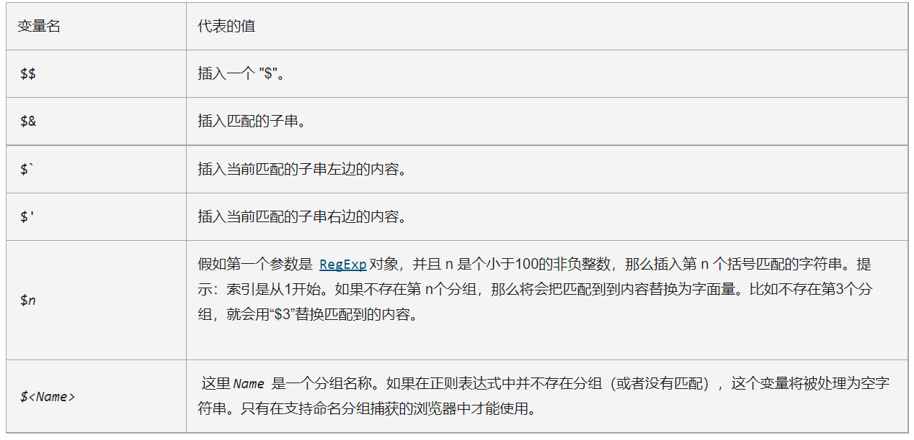
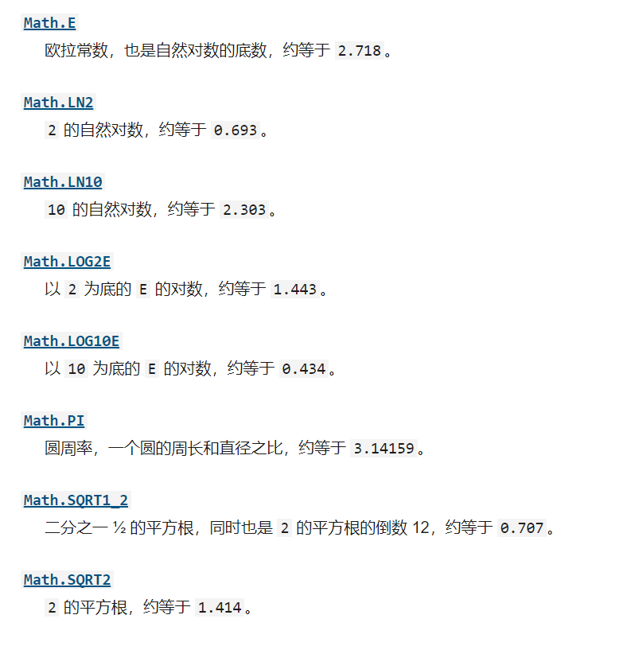

# 基本引用类型
> 引用值(或对象)是某个特定引用累心的实例。在ECMAScript中，引用类型是把数据和功能组织到一起的结构，经常被人错误的称作“类”。虽然ECMAscript是一门面向对象语言，但缺少传统的面向对象程序语言所具备的某些基本结构，包括类和接口.
> 引用类型有时候也被称为==对象定义==，因为它们描述了自己的对象应有的属性和方法。
> (引用类型虽然和类很像，但跟类并不是一个概念。)

<font color=blue>对象被认为是某个特定引用类型的**实例**。<font>
新对象通过使用new操作符后跟一个**构造函数（constructor）** 来创建。构造函数就用来创建新对象的函数，如

```javascript
   let now = new Date();
```
- 这行代码创建了引用类型Date的一个新实例，并将它保存在变量now中。
- Date()这里就是构造函数，它负责创建一个只有默认属性和方法的简单对象
- **注意：函数也是一种引用类型** 
  
---

<br>

## Date
> Date类型将日期保存为自协调世界时间（UTC, Universal Time Coordinated）

<font color=#34495e><font>
要创建日期对象，要使用new操作符来调用Date构造函数

```javascript
   let now = new Date();
```
在不给Date构造函数传参数的情况下，创建的对象将保存当前日期和时间。
要基于其他日期和时间创建日期对象，必须传入毫秒表示(UNIX纪元1970年1月1日午夜后的毫秒数)
ECMAScript提供了两个辅助方法：
   - Date.parse()
     - 接受一个表示日期的字符参数，尝试将这个字符串转换为表示该日期的毫秒数，支持的格式：
       - “月/日/年” , 如 “5/23/2019”       
       - "月名 日，年" , 如 “May 23, 2019”
       - "  Tue May 23 2019 00:00:00 GMT-0700"
       - "YYYY-MM-DDTHH:mm:ss.sssZ", 如 2019-05023T00:00:00
       ```javascript
         let someDate = new Date(Date.parse("May 23, 2019"));
       ``` 
       如果传给Date.parse()的字符串不是日期，会返回NaN.
       如果直接把表示日期的字符串传给Date构造函数，那么Date会在后台调用Date.parse()。换句话说，下面代码和上着等价
       ```javascript
         let someDate = new Date("May 23, 2019");
       ```        

   - Date.UTC()
     - 与Date.parse()一样，Date.UTC()也会被Date构造函数隐式调用，但有个区别：这种情况下创建的是本地日期，不是GMT日期。
     - 不过Date构造函数跟Date.UTC()接受的参数是一样的。


<br>

ECMAScript还提供了Date.now()方法，返回表示方法执行时日期和时间的毫秒数。这个方法可以方便地用在代码分析中:
```javascript
   // 起始时间
   let start = Date.now();

   // 调用函数
   doSomething();

   // 结束时间
   let stop = Date.now();
   result = stop - start;
``` 

<br>

#### 日期格式化方法
```javascript
   now.toString() //"Tue Mar 02 2021 06:10:48 GMT+0800 (中国标准时间)"
   now.toDateString() //"Tue Mar 02 2021"
   now.toTimeString() //"06:10:48 GMT+0800 (中国标准时间)"

   //Local带有本地习惯的意思
   now.toLocaleString() //"2021/3/2上午6:10:48"
   now.toLocaleTimeString() //"上午6:10:48"
   now.toLocaleDateString() //"2021/3/2"

   now.toUTCString() //"Mon, 01 Mar 2021 22:10:48 GMT"

``` 
Data对象属性


<br>

## RegExp

<font color=#d35400>ECMAScript通过RexExp类型支持正则表达式。<font>
正则表达式使用类似Perl的简洁语法来创建:
let expression = /pattern/flags;
pattern（模式）可以以任何形式。简单，复杂的正则表达式，包括**字符类，限定类，分组，向前查找和反向引用。**
每个正则表达式可有**零个或多个**flags（标记），用于控制正则表达式行为。

> flags的样式：
> - g: 全局模式，表示查找字符串的全部内容，而不是找到第一个匹配的内容就结束
> - i: 不区分大小写，表达在查找匹配时忽略pattern和字符串的大小写
> - m: 多行模式，表示查找到一行文本末尾时会继续查找
> - y: 粘贴模式，执行“粘性(sticky)”搜索,匹配从目标字符串的当前位置开始。
> - u: Unicode模式，启用Unicode匹配
> - s: dotAll模式，表示元字符，匹配任何字符(包括\n或\r)

不同模式和标记可以创建出各种正则表达式

```javascript
   // 匹配字符串中所有的"at"
   let pattern1 = /at/g;

   // 匹配第一个"bat"或"cat"，忽略大小写
   let pattern2 = /[bc]at/i;

   // 匹配所有以"at"结尾的三字符组合，忽略大小写
   let pattern3 = /.at/i;
``` 

**当然，所有元字符在模式中也必须转义包括 () [] {} \ ^ $ | ? * + .**

因为元字符在正则表达式中有特殊的含义，所以要匹配这些字符本身，就必须==使用反斜杠来转义==

```javascript
   // 匹配第一个"bat"或"cat"，忽略大小写
   let pattern1 = /[bc]at/i;

   // 匹配第一个"[bc]at",忽略大小写
   let pattern2 = /\[bc\]at/i;

   // 匹配所有以"at"结尾的三字符组合，忽略大小写
   let pattern3 = /.at/i;

   // 匹配所有以". at"结尾的三字符组合，忽略大小写
   let pattern4 = /\.at/gi;
``` 
要匹配"[bc]at",需要使用反斜杠转义.

<br>

> 前面例子中正则表达式都是使用字面量形式定义的。但也可以用RegExp构造函数来创建
> 它接受两个参数：
> - 模式字符串
> - (可选的)标记字符串

```javascript
   // 匹配第一个"bat"或"cat"，忽略大小写
   let pattern1 = /[bc]at/i;

   // 跟pattern1 一样，只不过是用构造函数创建的
   let pattern2 = new RegExp("[bc]at", "i");
```
pattern1 和 pattern2 是等效的正则表达式，**注意：RegExp构造函数的两个参数是字符串，所以所有的元字符都需要二次转义，如\n(转义后的字符串时、、[英式的斜杠],在正则表达式字符串中要写成、、、、)**

此外，使用RegExp也可以基于已有的正则表达式实例，并可选择性地修改它们的标记
```javascript
   const re1 = /cat/g;
   console.log(re1); // "/cat/g"
   
   const re2 = new RegExp(re1);
   console.log(re2); // "/cat/g"

   const re3 = new RegExp(re1, "i");
   console.log(re3); // "/cat/i"
```

<br>

#### RegExp实例属性
> 每个RegExp实例都有下列属性，提供有关模式的各方面信息
- global ：布尔值，表示是否设置了 g 标记 
- ignoreCase ：布尔值，表示是否设置了 i 标记 
- unicode ：布尔值，表示是否设置了 u 标记 
- sticky ：布尔值，表示是否设置了 y 标记 
- lastIndex ：整数，表示在源字符串中下一次搜索开始位置，始终从0开始 
- multiline ：布尔值，表示是否设置了 m 标记 
- dotAll：布尔值，表示是否设置了 s 标记 
- source：正则表达式的字面量字符串 
- flags： 正则表达式的标记字符串

```javascript
   let pattern1 = \/[bc\]at/i;

   console.log(pattern1.global); // false

   console.log(pattern1.ignoreCase); // true

   console.log(pattern1.multiline); // false

   console.log(pattern1.lastIndex); // 0

   console.log(pattern1.source); // "\/[bc\]at"

   console.log(pattern1.flags); // "i"

   let pattern2 = new RegExp("\\[bc\\]at", "i");

   console.log(pattern2.global); // false

   console.log(pattern2.ignoreCase); // true

   console.log(pattern2.multiline); // false

   console.log(pattern2.lastIndex); // 0

   console.log(pattern2.source); // "\/[bc\]at"

   console.log(pattern2.flags); // "i"

   // 字面量和构造函数两个模式相同
```

<br>

#### RegExp实例方法


**当你想要知道一个字符串的一个匹配是否被找到，可以使用test或search; 想要知道更多信息(但是比较慢)，则可以使用exec或match.**
**当使用exec或match成功，则返回一个数组并更新相关的正则表达式对象的属性和预定的正则表达式对象。**
**如果匹配失败，那么exec返回 null**


<br>

## 原始值包装类型
<font color=#130f40>

> 为了方便操作原始值，ECMAScript提供了三种特殊的引用类型:Boolean,Number,String. 这些类型具有其他引用类型一样的特点，但也具有各自原始类型对应的特殊行为。
> 每当用到某个原始值的方法或属性时，后台都会创建一个相应原始包装类型的对象

```javascript
   let s1 = "some text";
   let s2 = s1.substring(2);
```
在这里，s1是包含字符串的变量，是一个原始值。但第二行紧接着在s1上调用了substring()方法，并将结果保存在s2中。我们知道原始值本身不是对象，因此逻辑上不应该有方法。
这是==因为当第二行访问s1时，是以读写模式访问的，也就是要从内存中读取变量保存的值。在以读写模式访问字符串值的任何时候，后台都会执行以下3步：==

1. 创建一个String类型的实例
2. 调用实例上的特定方法
3. 销毁实例 

可以想象成执行了如下代码：

```javascript
   let s1 = new String("some text");
   let s2 = s1.substring(2);
   s1 = null;
```
这样可以让原始值拥有对象的行为。对布尔值和数值而言，以上3步也会在后台发生，只不过使用的是Boolean和Number包装类型而已

<br>

**引用类型和原始值包装类型的主要区别在与对象的生命周期。在通过new实例化引用类型后，得到的实例会在离开作用域时被销毁，而自动创建的原始值包装对象则只存在于访问它的那行代码执行期间。**

**这意味着不能再运行时给原始值添加属性和方法**

```javascript
   let s1 = "some text";
   s1.color = "red";
   console.log(s1.color); //undefined
```
第二行代码运行时会临时创建一个Stirng对象，当第三行代码执行时，这个对象已经被销毁了。第三行代码自己创建了一个String对象，但这个对象没有color属性。

**注意：虽然可以显式的使用Boolean,Number和String构造函数创建原始值包装对象。不过应该在必要的时候这么做。在原始包装类型的实例上调用typeof会返回"object",所有原始值包装对象都会转换为布尔值true**


**另外，object构造函数作为一个工厂方法，能够根据传入值的类型返回相应原始值包装类型的实例**

```javascript
   let obj = new Object("some text");
   console.log(obj instanceof String); // true
```

**注意: 使用new调用原始值包装类型的构造函数，与调用同名的转型函数并不一样**

```javascript
   let value = "25";
   let number = Number(value);
   console.log(typeof number); // "number"

   let obj = new Number(value);
   console.log(typeof obj); // "object"
```

<br>

### Boolean
>Boolean 是对应布尔值的引用类型。要创建一个Boolean对象，就Boolean构造函数并传入true或false

```javascript
   let booleanObject = new Boolean(true);
```
Boolean的实例会重写valueOf()方法，返回一个原始值true或false。
toString()方法被调用时也会被覆盖，返回"true"或"false"。

Boolean对象在ECMAScript中用的很少。不仅如此，容易引起误会

```javascript
   let falseObject = new Boolean(false);
   let result = falseObject && true;
   console.log(result); // true

   let falseValue = false;
   result = falseValue && true;
   console.log(result); // false
```

> 在布尔算数中，false && true 等于 false。可是，这个表达式是对FalseObject对象而不是对它表示的值(false)求值。**所有对象在布尔表达式中都会自动转换为true**
 
<br>

### Number

> Number 是对数值引用类型。要创建一个Number对象，就使用Number构造函数并传入一个值

```javascript
   let numberObject = new Number(10);
```

> 与Boolean类型一样，重写了valueOf(),toLacalString()和toString()方法。
> valueOf()方法饭后Number对象表示的原始数值，另外两个方法返回数值字符串。

除了继承的方法，Number类型还提供了几个用于将数值格式化字符串的方法。
- toFixed()方法返回包含指定小数点位数的数值字符串
```javascript
   let number = 10;
   consloe.log(num.toFixed(2)); // "10.00"
```
**这里的toFixed()方法接收了参数2，表示返回的数值字符串要包含两位小数。结果返回值为“10.00.如果数值本身的小数位超过了参数指定的位数，则四舍五入到最接近的小数位”**
- toFixed()自动舍入的特点可以用于处理货币 

- 另一种格式化的数值的方法是toExponential(),返回科学记数法（也叫指数计数法）表示的数值字符串，其也接受一个参数，表示结果中小数的位数。

```javascript
   let number = 10;
   consloe.log(num.toExponential(1)); // "1.0e+1"
```
- toPrecision()方法会根据返回值最合理的输出结果。本质上会根据数值和精准度来决定调用toFixed()还是toExponential

**与Boolean对象类似，Number对象也不建议直接实例化Number对象。**


<br>

#### isInteger()方法与安全整数

ES6新增的Number.isInteger()方法，用于辨别一个数值是否保存为整数。有时候，小数位的0可能会让人误以为数值是一个浮点值:

```javascript
   consloe.log(Number.isInteger(1)); // true
   
   consloe.log(Number.isInteger(1.00)); // true

   consloe.log(Number.isInteger(1.01)); // false
```

<br>

### String

> String是对应字符串的引用类型。使用String构造函数并传入一个数值 
```javascript
   let stringObject = new String("hello world")
```

**==String对象的方法可以在所有字符串原始值上调用==**
3个继承的方法valueOf(),toLocalString(),和toString()都返回对象的原始字符串值。

每个String对象都有一个length属性，表示字符串中字符的数量。
```javascript
   let stringValue = "hello world";
   console.log(stringValue.length); // "11"
```
**注意：即使字符串中包含双字节字符（而不是单字节的ASCII字符），也任然会按但字符来计数**


#### 01 JavaScript字符
  - JavaScript字符串由16位码元(code unit)组成。对多数字符来说，每16位码元对应一个字符。换句话说，字符串的length属性表示字符串包含多少16位码元
  - 此外charAt()方法返回==给定索引位置的字符==，由传给方阿发的整数参订指定
   
   ```javascript
      let message = "abcde";
      console.log(message.charAt(2)); // "c"
   ```
  - charCodeAt()方法可以产看指定码元的字符编码

   ```javascript
      let message = "abcde";
      
      // Unicode "Latin small letter C"的编码是U+0063
      console.log(message.charAt(2)); // 、、99
   ```
   - formCharCode()方法用于根据给定的UTF-161源码穿件字符串中的字符

<br>

#### 02. normalize()方法
   - Unicode 提供了4种规范化形式，NFD,NFC,NFKD,NFKC.可以使用normalize()方法对字符串应用。


<br>

#### 03. 字符串操作方法
> 介绍几个操作字符串的方法

1. concat(),用于将一个或多个字符串拼接成一个新字符串。
   ```javascript
      let stringValue = "hello ";
      let result = stringValue.concat("world");

      console.log(result); // hello world

      console.log(stringValue); // "hello "
   ```
对stringValue调用concat()方法结果是“hello world”，但是stringValue的值保持不变。
**concat()方法可以接受任意多个参数，因此可以一次性拼接多个字符串**

   ```javascript
      let stringValue = "hello ";
      let result = stringValue.concat("world"， "!");

      console.log(result); // hello world!

      console.log(stringValue); // "hello "
   ```
2.  
| 方法                  | 参数                                                                          | 返回值                              |
| --------------------- | ----------------------------------------------------------------------------- | ----------------------------------- |
| slice(start, end)     | start(必需) -起始位置； end(可选)-结束位置，若未指定，则默认到末尾所有元素    | 返回 [start,end)之间的元素          |
| substring(start, end) | start(必需) -起始位置；end(可选)-结束位置，若未指定，则默认到末尾所有元素     | 返回 [start,end)之间的元素          |
| substr(start, length) | start(必需)-起始位置；length(可选)-所截取的元素的个数，若未指定，则默认到末尾 | 返回[start, start+length)之间的元素 |

> 当传的参数都为正数的时候，substring和slice没有区别。当参数为负数时，三个函数的行为不尽相同。

- slice() - 将传入的负参数与字符串长度相加；
- substring() - 把所有的负值置为0；
- substr() - 将负的第一个参数与字符串长度相加，负的第二个参数置为0。

<br>

1. 参数为正数

   ```javascript
      var str = 'hello world';
      console.log(str.slice(3)); // lo world
      console.log(str.substring(3));// lo world
      console.log(str.substr(3));// lo world

      console.log(str.slice(3, 7)); // lo w
      console.log(str.substring(3, 7)); // lo w
      console.log(str.substr(3, 7));//lo worl
   ```


2. 参数为负数 

   ```javascript
      var str = 'hello world';
      console.log(str.slice(-3)); // rld
      console.log(str.substring(-3));// hello world
      console.log(str.substr(-3));// rld

      console.log(str.slice(3, -4)); // lo w
      console.log(str.substring(3, -4)); // hel
      console.log(str.substr(3, -4));// ""(空字符串)
   ```
   **以上示例的元算过程如下：**
      - str.length = 11
      - slice(-3) => slice(8) 
      - substring(-3) => substring(0)
      - substr(-3) => substr(8)

      - slice(3, -4) => slice(3, 7)
      - substring(3, -4) => substring(3, 0) => substring(0,3)
      - substr(3, -4) => substr(3, 0) 

<br>


#### 04. 字符串位置方法

有两种方法用于在字符串中定位子字符串：indexOf(), lastIndexOf().这两个方法从字符串中搜索传入的字符串，并返回位置(如果没有找到，则返回 -1)

两者区别是:
- indexOf()方法从字符串开头开始查找子字符串
- lastIndexOf()方法从字符串末尾开始查找子字符串

   ```javascript
      let stringValue = "hello world";
      console.log(stringValue.indexOf('0')); // 4

      console.log(stringValue.lastIndexOf('0')); // 7

   ```

这两个方法都可以接受可选的第二个参数，表示开始搜索的位置。
这意味着，
- indexOf()会从这个参数指定的位置开始想字符串末尾搜索，忽略该位置之前的字符；
- lastIndexOf()则会从这个参数指定的位置开始想字符串开头搜索，忽略该位置之后的字符

   ```javascript
      let stringValue = "hello world";
      console.log(stringValue.indexOf('0'， 6)); // 7

      console.log(stringValue.lastIndexOf('0'， 6)); // 4

   ```

高阶使用：

   ```javascript
      let stringValue = 'Lorem inpsum dolor sit amet, consectetur adipisicing elit';
      let positions = new Array();
      let pos = stringValue.indexOf('e');

      while (pos > -1) {
         positions.push(pos);
         pos = stringValue.indexOf('e', pos + 1);
      }

      console.log(positions); //[3, 25, 33, 36, 53]

   ```
<br>

#### 05. 字符串包含方法
> ECMAScript增加了3个用于判断字符串中是否包含拎一个字符串的方法：startsWith(),endsWith(),includes(). 这些方法都会从字符串中搜索传入的字符串，并返回一个表示是否包含的布尔值。
区别在于:
- startsWith()检查开始于index0的匹配项
- endsWith()检查末端开始的(index.length) 的匹配项
- includes()检查整个字符串

    ```javascript
      let message = "foobarbaz";

      console.log(message.startsWith("foo")); // true
      console.log(message.startsWith("baz")); // false

      console.log(message.endsWith("baz")); // true
      console.log(message.endsWith("bar")); // false

      console.log(message.includes("bar")); // true
      console.log(message.includes("qux")); // false
   ```
**startsWith() 和 includes()方法接收可选的第二个参数，表示开始搜索的位置**

    ```javascript
      let message = "foobarbaz";

      console.log(message.startsWith("foo")); // true
      console.log(message.startsWith("foo", 1)); // false

      console.log(message.includes("bar")); // true
      console.log(message.includes("bar", 4)); // false
    ```


**endsWith()方法接收的第二个参数，表示应该当做字符串末尾的位置。如果不通过参数就是字符串长度。如果提供这个参数，那么久好像只有那么多字符一样**


   ```javascript
      let message = "foobarbaz";
      console.log(message.endsWith("bar")); // false
      console.log(message.endsWith("bar", 6)); // true

   ```

<br>

#### 06. trim()方法
> ECMAScript 在所有字符串上都提供了trim()方法。这个方法会==创建字符串的一个副本，删除前，后所有空格符，在返回结果==

```javascript
   let stringValue = "  hello world  ";

   let trimmedStringValue = stringValue.trim();

   console.log(stringValue); // "  hello world  "
   console.log(trimmedStringValue); // "hello world"
```

**由于trim（）返回的是字符串的副本，因此原始字符串不会受到影响，即原本的前后空格都会保留。**

- trimLeft() 字符串开始清理空格符
- trimRight() 字符串末尾清理空格符

<br>

#### 07. repeat()方法
> ECMAScript 在所有字符串上都提供了repeat()方法。这个方法接收一个整数参数，表示要将字符串辅助多少次，然后返回拼接所有副本后的结果

```javascript
   let stringValue = " na ";

   console.log(stringValue.repeat(16) + "batman"); 
   // "na  na  na  na  na  na  na  na  na  na  na  na  na  na  na  na batman"

```


<br>

#### 08. padStart() 和 padEnd()方法
> padStart()和padEnd()方法会赋值字符串，如果小于指定长度，则在相应一边填充字符，直到满足长度条件

```javascript
   let stringValue = 'foo';

   console.log(stringValue.padStart(6)); // "   foo"
   console.log(stringValue.padStart(9, '.')); // "......foo"

   console.log(stringValue.padEnd(6)); // "foo   "
   console.log(stringValue.padEnd(9, '.')); // "foo......"
```

>  可选的第二参数并不限于一个字符。如果提供了多个字符的字符串，则会将其拼接并截断以匹配指定长度。此外，如果长度小于或等于字符串长度，则会返回原始字符串

```javascript
   let stringValue = 'foo';

   console.log(stringValue.padStart(8, "bar")); // "barbafoo"
   
   console.log(stringValue.padStart(2)); // "foo"

   console.log(stringValue.padEnd(8, "bar")); // "foobarba"
   
   console.log(stringValue.padEnd(2)); // "foo"
```

<br>

#### 09. 字符串迭代与解构
> 字符串的原型上暴露了一个迭代方法，表示可以迭代字符串的每个字符。有了迭代器后，字符串可以通过解构操作符来解构了。

**解构赋值语法是一种JavaScript表达式。通过解构赋值，可以将属性/值 从对象/数组中取出，赋值給其他变量**

```javascript
   var a, b, rest;
   [a, b] = [10, 20];
   console.log(a); // 10
   console.log(b); // 20

   [a, b, ...rest] = [10, 20, 30, 40, 50];
   console.log(a); // 10
   console.log(b); // 20
   console.log(rest); // [30, 40, 50]

   ({ a, b } = { a: 10, b: 20 });
   console.log(a); // 10
   console.log(b); // 20


   // Stage 4（已完成）提案中的特性
   ({a, b, ...rest} = {a: 10, b: 20, c: 30, d: 40});
   console.log(a); // 10
   console.log(b); // 20
   console.log(rest); // {c: 30, d: 40}
```
**对象和数组逐个对应表达式，或称对象字面量和数组字面量**

<br>

#### 10.字符串大小写转换
- toLowerCase()
- toLocaleLowerCase()
- toUpperCase()
- toLocaleUpperCase()

```javascript
   let stringValue = "hello world";
   console.log(stringValue.toLocaleUpperCase()); // "HELLO WORLD"
   console.log(stringValue.toUpperCase()); // "HELLO WORLD"

   console.log(stringValue.toLocaleLowerCase()); // "hello world"
   console.log(stringValue.toLowerCase()); // "hello world"
```

<br>

#### 11.字符串模式匹配方法
> String类型专门为字符串中设计了几种模式匹配的方法。
- match(), 本质上跟RegExp对象的exec()方法相同。match()方法接收一个参数，可以是一个正则表达式字符串，也可以是一个RegExp对象。 

```javascript
   let text = "cat,bat,sat,fat";
   let pattern = /.at/;

   // 等价于pattern.exec(text) =>["cat", index: 0, input: "cat,bat,sat,fat", groups: undefined]

   let matches = text.match(pattern);
   console.log(matches.index); //0
   console.log(matches[0]); // "cat"
   console.log(pattern.lastIndex); // 0
```
match()方法返回的数值与RxgExp对象的exec()方法返回的数组是一样的，其余元素是表达式中的捕获组匹配的字符串

- search() 这个方法唯一的参数与match()方法一样：正则表达式或RegExp对象。这个方法返回模式==第一个匹配的位置索引==，如果没有找到则返回 -1.

```javascript
   let text = "cat,bat,sat,fat";
   let pos = text.search(/at/);

   console.log(pos); //1
```

<br>

> 为了简化字符串替换操作，ECMAScript提供了replace（）方法。这个方法可以接受两个参数
> - 第一个参数可以是RegExp对象或一个字符串（这个字符串不会转换为正则表达式）
> - 第二个参数可以是一个字符串或一个函数。
> **如果第一个参数是字符串。要想替换所有子字符串，第一个参数必须为正则表达式并带有全局标记**

**该方法并不改变调用它的字符串本身，而只是返回一个新的替换后的字符串。**

```javascript
   let text = 'cat,bat,sat,fat';
   let result = text.replace('at', 'ond');

   console.log(result); // cond,bat,sat,fat

   result = text.replace(/at/g, 'atman');
   console.log(result); // catman,batman,satman,fatman
```
当第一个参数为字符串时，只替换了第一个值。
<br>
- 第二个参数是字符串情况下，有几种特殊的字符序列，可以用来插入正则表达式操作的值。


```javascript
   let text = 'cat,bat,sat,fat';
   let result = text.replace(/(.at)/g, 'hi,($1)man ');

   console.log(result); // hi,(cat)man ,hi,(bat)man ,hi,(sat)man ,hi,(fat)man 
```
($1)为捕获组的1组

<br>

- 第二个参数可以是一个函数。
  - 在只有一个匹配项时，这个函数会受到3个参数：
    - 与整个模式匹配的字符串，
    - 匹配项在字符串中的开始位置，
    - 以及整个字符串
  - 在有多个匹配捕获组情况下
    - 每个匹配捕获组的字符串也会作为参数传给这个函数
    - 但最后两个参数还是与整个模式匹配的开始位置和原始字符串
  - 这个函数的返回值应该是一个字符串

```javascript
   function htmlEscape(text) {
      return text.replace(/<>"&/g, function (match, pos, originalText) {
         switch (match) {
            case "<":
               return '&lt;';
            case ">":
               return '&gt;';
            case "&":
               return '&amp;';
            case "\"":
               return '&quot;';
         }
      });
   }

   console.log(htmlEscape('<p class="greeting">Hello world!</p>'));

```

<br>

- split() 这个方法会根据==传入的分隔符将字符串拆分成数组==，也可以是RegExp对象。还可以传入第二次参数，即数组大小，确保返回的数组不会超过指定大小

```javascript
   let colorText = 'red,blue,green,yellow';
   let color1 = colorText.split(','); // ["red", "blue", "green", "yellow"]

   let color2 = colorText.split(',', 2); // ["red", "blue"]

   let color3 = colorText.split(/[^,]+/);
   console.log(color3); // ["", ",", ",", ",", ""]
```

<br>

#### 12. localeCompare()方法
> localeCompare（）比较两个字符串，返回3个值：
> - 如果按照字母表顺序，字符串应该排在字符串参数前头，返回负值(通常是 -1)
> - 如果字符串与字符串参数相等，则返回0
> - 如果按照字母表顺序，字符串应该排在字符串参数后面，返回正值(通常是 1)

```javascript
let stringValue = 'yellow';
   console.log(stringValue.localeCompare('brick'));  // 1
   console.log(stringValue.localeCompare('yellow')); // 0
   console.log(stringValue.localeCompare('zoo')); // -1
```

<br>

---

## 单例内置对象
<font color=#e84393>
> ECMAScript 对内置对象的定义是“任何由ECMAScript实现提供，与宿主环境无关，并在ECMAScript程序开始执行时就存在的对象”。
> 即开发者不用显式的实例化对象，因为它们已经实例化好了。
> 前面已经接触了大部分内置对象，包括**Object**, **Array** 和**String**.
> 然而还有另外两个单例内置对象：**Global** 和 **Math**.


### Global
> Global对象为最特别的对象，因为代码不会显式的访问它。
> **ECMAScript规定Global对象为一种兜底对象，它所针对的是不属于任何对象的属性和方法。**
> 事实上，不存在全局变量或全局函数这种东西。在全局作用域重病定义的变量和函数都会成为Global对象的属性。包括isNaN(), isFinite(),parseInt(),parseFloat().

#### URL编码方法
encodeURI()和encodeURIComponent()方法用于编码统一资源标识符

<br>

#### eval()方法
> ECMAScript()中最强大的方法
> **eval()是一个完整的ECMAScript解释器，它接受一个参数，即一个要执行的ECMAScript字符串**

```javascript
   eval("console.log('hi')");

   // 等价于

   console.log("hi");
```
当解释器发现eval()调用时，**会将参数解释为实际ECMAScript语句，然后将其插入到该位置**。
**通过eval()执行的代码属于该调用所在上下文，被执行的代码与该上下文拥有相同的作用域链。**
这意味着定义在包含上下文中的变量可以在eval（）调用内部被引用

```javascript
   let msg = "hello world";
   eval("console.log(msg)"); // "hello world"
```
变量**msg**是在eval()调用的外部上下文中定义的，而显示的文本是"hello world".这是因为第二行代码会被替换成一行真正的函数调用代码。类似的，可以在eval（）内部定义一个函数或变量，然后再外部代码中引用

```javascript
   eval("function sayHi(){console.log('hi');}");
   sayHi();
```
函数sayHi()是在eval（）内部定义的。因为该调用会被替换为真正的函数定义，所以可以在下一行调用sayHi（）。变量也是一样：

```javascript
   eval("let msg = 'hello world';");
   console.log(msg); // Reference Error 
```
**通过eval（）定义的任何变量和函数都不会被提升**，因为在解析代码时，它们是被包含在字符串中，只有eval()被调用时才会被创建。

在严格模式下eval()内部创建的变量和函数无法被外部访问。

<br>

#### window 对象
虽然无法直接访问Global对象的方式，但浏览器将window对象实现为Global对象的代理。因此，所有全局作用域申明的变量和函数等候变成window的属性。

```javascript
   var color = "red";

   function sayColor(){
      console.log(window.color);
   }

   window.sayColor(); // "red"

```
另一种获取Global对象的方式是使用：

```javascript
   let global - function(){
      return this
   }
```
虽然没有明确说明，但this的值等于Global对象。


<br>

### Math

> Math 对象作为保存数学公式，信息和计算的地方。Math对象提供了一些赋值计算的属性和方法
 


#### min() 和 max()方法
> min(),max() 用于确定一组数值中的最小值，最大值.
> 接受任意多参数

```javascript
   let max = Math.max(3,54,32,16);
   console.log(max); // 54

   let min = Math.max(3,54,32,16);
   console.log(min); // 3
```

<br>

#### 舍入方法
> 用于将小数舍入为整数的4方法：
> - Math.ceil() 向上取整
> - Math.floor() 向下取整
> - Math.round() 四舍五入
> - Math.fround() 返回数值最接近的单精度(32位)浮点值表示

```javascript
   console.log(Math.ceil(25.9)); // 26
   console.log(Math.ceil(25.5)); // 26
   console.log(Math.ceil(25.1)); // 26

   console.log(Math.round(25.9)); // 26
   console.log(Math.round(25.5)); // 26
   console.log(Math.round(25.1)); // 25

   console.log(Math.fround(25.9)); // 25.899999618530273
   console.log(Math.fround(25.5)); // 25.5
   console.log(Math.fround(25.1)); // 25.100000381469727

   console.log(Math.floor(25.1)); // 25
   console.log(Math.floor(25.1)); // 25
   console.log(Math.floor(25.1)); // 25
```

<br>


random方法

> **Math.random(方法返回一个 0~1 范围内的随机数)，其中包含0，不包含1**

在1~10中随机选择一个数
```javascript
   number = Math.floor(Math.random() * 10 + 1);
```
在2~10中范围中的值
```javascript
   number = Math.floor(Math.random() * 10 + 2);
```
