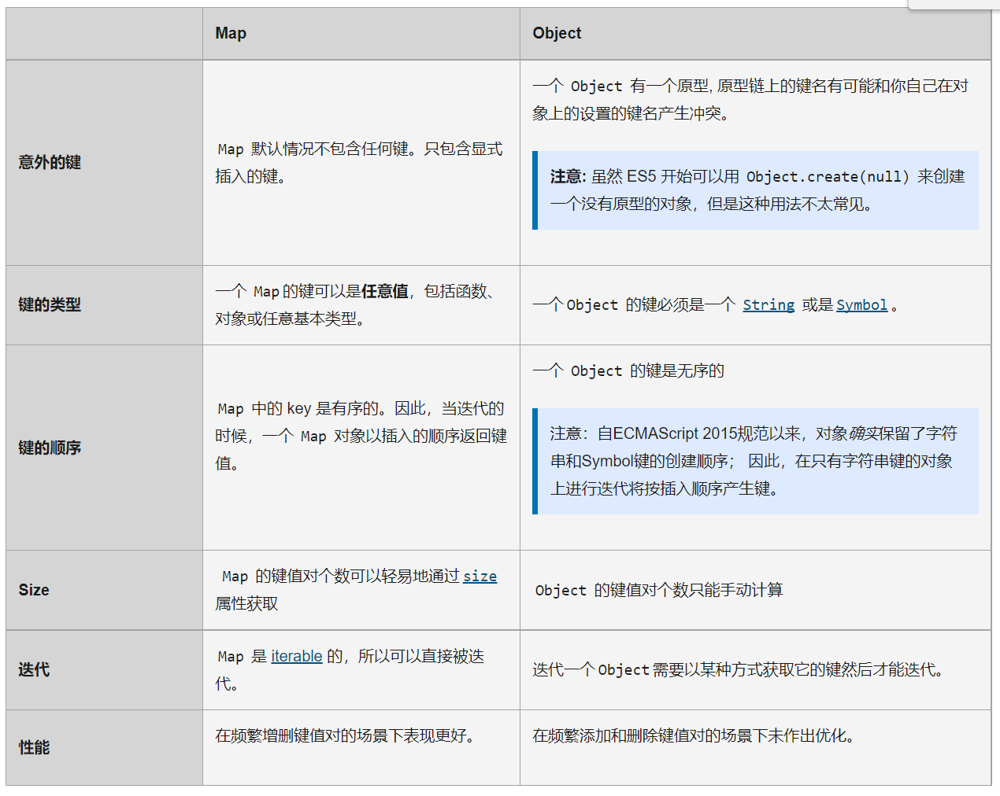

# 集合引用类型
- 对象
- 数组与定型数组
- Map. WeakMap.Set以及WeakSet类型

--- 

## 对象
<font color=#10ac84>

> 到目前为止，大多数引用值的实例使用的是Object类型。Object是ECMAScript中最常用的类型之一。虽然Object的实例没有多少功能，但很适合存储和在应用程序减交换数据。

显示的创建Object的实例有两种方式
- 第一种是使用new操作符和Object构造函数
   ```javascript
      let person = new Object();
      person.name = "Mike";
      person.age = 29;
   ```
- 另一种是使用**对象字面量**(object literal)表示法。
  - 目的是为了简化包含大量属性的对象创建
   ```javascript
      let person = {
         name:"Mike",
         age:29,
      }
   ```

- **左大括号（{）表示对象字面量开始，因为它出现在一个表达式上下文(expression context)中。**
- 在ECMASCript中，表达式上下文指的是期待返回值的上下文。赋值操作符表示后面要期待一个值，因此左大括号表示一个表达式的开始。
- 同样是左大括号，如果出现在语句上下文(statement context)中，比如if语句的条件后面，则表示一个语句块的开始。
- 接下来指定name属性，后跟一个冒号，然后是属性的值。逗号用于在对象字面量中分隔属性，因此最后一个属性值也有逗号，但没写的时候，在现代浏览器中都会自动补上。


在对象字面量表示法找那个，属性名可以是字符串或数值

   ```javascript
      let person = {
         name:"Mike",
         age:29,
         5:true,
      }
   ```
**注意：数值属性会自动转化为字符串**

当然也可以用对象字面量表示法来定义一个只有默认属性和方法的对象，只要使用一对大括号，中间留空就行

   ```javascript
      let person = {}; // 与new Object（）相同
      person.name = "Mike";
      person.age =29;

   ```

**注意：在使用对象字面量表示法定义对象时，并不会实际调用Object构造函数。**


实际上开发者更倾向于使用对象字面量表示法。因为对象字面量代码更少。事实上，对象字面量已经成为给函数传递大量可选参数的主要方式：


   ```javascript
      function displayInfo(args) {
         let output = '';
         if (typeof args.name == 'string') {
            output += 'Name: ' + args.name + '\n';
         }

         if (typeof args.age == 'number') {
            output += 'Age: ' + args.age + '\n';
         }

         alert(output);
      }

      displayInfo({
         name: 'Mike',
         age: 29,
      });

      displayInfo({
         name: 'Greg',
      });

   ```

**注意： 这种模式非常适合函数有大量可选参数的情况。一般来说，命名参数更直观，但在可选参数过多的时候就线得笨拙了。最好的方式是对必选参数使用命名参数，在通过一个对象字面量来封装多个可选参数**

虽然属性一般是通过**点语法**来存取的，这也是面向对象语言的惯例，但也可以使用中括号来存取属性。


   ```javascript
      let person = {};
      person.name = "Mike";
      person.age =29;

      console.log(person["name"]); // "Mike"
      console.log(person.name); // "Mike"
   ```   

从功能上来讲，这两种存取属性的方式没有区别。使用中括号的主要优势就是**可以通过变量访问属性**


   ```javascript
      let propertyName = "name";
      console.log(person[propertyName]); // "Mike"
   ```

另外，如果属性名中包含可能会导致语法错误的字符，或者包含关键字/保留字时，也可以使用中括号语法


   ```javascript
      person["first name"] = "Mike";
   ```
因为"first name" 中包含一个空格，所以不能用点语法来访问。不过属性名中是可以包含非字母数字符的，这时候只要用中括号语法来存取它们就行了。

通常，点语法是首选的属性存取方式，除非访问属性时必须使用变量。

---

## Array
<font color=#e17055>

> 除了Object,Array应该就是ECMAScript中最常用的类型了。
> ECMAScript跟其他编程语言的数组有很大区别。跟其他语言一样，ECMAScript数组也是一组有序的数据，但跟其他语言不通的是，数组中每个槽位可以储存任意类型的数据。
> 这意味着可以创建一个数组，它的第一个元素时字符串，第二个元素时数值，第三个是对象。
> ECMAScript数组也是动态大小的，会随着数据添加而自动增长。

<br>

### 创建数组

有几种基本方式可以创建数组。一种是使用Array构造函数

```javascript
   let color = new Array();
```

如果知道数组中元素数量，那么可以给构造函数传入一个数值，然后length属性就会被自动创建并设置为这个值。

```javascript
   let color = new Array(20);
```

也可以给Array构造函数传入要保存的元素。

```javascript
   let color = new Array("red", "blue", "green");
```

在使用Array构造函数时，也可以省略new操作符

```javascript
   let color = Array(3); // 创建一个包含3个元素的数组

   let names = Array("Greg"); // 创建一个包含“Greg”的数组
```

另一种创建数组的方式是使用**数组字面量**(array literal)表示法。
**数组字面量是在中括号中包含以逗号分隔的元素列表**

```javascript
   let color = ["red", "blue", "green"]; // 创建一个包含3个元素的数组

   let name = []; // 创建一个空数组

   let value = [1,2,]; // 创建一个包含2个元素的数组
```

**注意: 和对象一样，在使用数组字面量表达式创建数组不会调用Array构造函数**


<br>

Array构造函数还有两个ES6新增的用于创建数组的静态方法
- from（）用于将类数组结构转换为数组实例
  - Array.from()第一个参数是一个类数组对象，即任何可迭代的结构
  - 或有一个length属性和可索引元素的结构
   ```javascript
      // 字符串会被拆分为单字符数组
      console.log(Array.from("Matt"));
      // ["M","a","t","t"]

      // 可以使用from() 将集合和映射转换为一个新数组
      const m = new Map().set(1, 2)
                        .set(3, 4);
      console.log(Array.from(m));
      // [[1,2],[3,4]]

      // Array.from()对现有数组执行浅拷贝
      const a1 = [1,2,3,4];
      const a2 = Array.from(a1);

      console.log(a1);
      alert(a1 === a2); // false

      // 可以使用任何可迭代对象
      const iter = {
         *[Symbol.iterator](){
            yield 1;
            yield 2;
            yield 3;
            yield 4;
         }
      }

      console.log(Array.from(iter)) // [1,2,3,4]

      // arguments对象可以轻松的转换为数组
      function getArgsArray(){
         return Array.from(arguments);
      }

      console.log(getArgsArray(1,2,3,4)) 
      // [1,2,3,4]

      // from() 也能转换带有必要属性的自定义对象
      const arrayLikeObject ={
         0:1,
         1:2,
         2:3,
         3:4,
         length:4
      }

      console.log(Array.from(arrayLikeObject)); // [1,2,3,4]
   ```
   - Array.from()还可以接受第二个可选的映射函数参数。这个函数可以直接增强新数组的值
   - 还可以接受第三个可选参数。用于指定映射函数中this的值。但不适用于箭头函数

<br>
<br>

- of（）用于将一组参数转换为数组实例
  - 这个方法用于替代ES6之前常用的Array.prototype.slice.call(argument)
   ```javascript
      console.log(Array.of(1,2,3,4)); 
      // [1,2,3,4]

      consoloe.log(Array.of(undefined))
      // [undefined]
   ```


<br>

### 数组空位
> 使用数组字面量初始化数组时，可以使用一串逗号来创建空位(hole).
> ECMAScript会将逗号之间相应的索引位置的值当成空位

```javascript
   const options = [,,,,,]; // 包含5个元素的数组
   
   console.log(options.length); //5
```

**ES6新增方法普遍将这些空位当成存在的元素，只不过值为undefined**

```javascript
   const options = [1,,,,5];
   for( const option of options){
      console.log(option === undefined);
   }

   // false
   // true
   // true
   // true
   // false

   const a = Array.from([,,,]);
   // 使用ES6的Array.from() 创建3个空位的数组
   for(const val of a){
      alert(val === undefined);
   }

   // true
   // true
   // true

   alert(Array.of(...[,,,]));
   [undefined,undefined,undefined]

   for (const [index, value] of options.entries()){
      alert(value);
   }

   // 1
   // undefined
   // undefined
   // undefined
   // 5

```


<br>

### 数组索引
> 要取得或这是数组的值，需要使用中括号并提供相应的数字索引

```javascript
   let colors = ["red","blue","green"] //定义一个字符串数组

   alert(colors[0]); // 显示第一项

   colors[2] = "black"; // 修改第三项

   colors[3] = "brown"; // 添加第四项

```
在中括号中提供的索引表示要访问的值。如果索引小于数组包含的元素数，则返回储存在相应位置的元素。如果设置的值大于元素数，则数组长度会自动扩展到该索引值加1(且中间为empty)

<br>
数组中元素数量保存在length属性中，这个属性始终返回0或大于0的值

```javascript
   let colors = ["red","blue","green"] //定义一个字符串数组
   let names = [];

   console.log(colors.length); // 3
   console.log(names.length);  // 0
```

**数组length属性的独特之处在于它不是只读的。通过修改length属性，可以从数组末尾删除或添加元素**

```javascript
   let colors = ["red","blue","green"] //定义一个字符串数组
   colors.length = 2;

   alert(colors[2]); // undefined
```
这里colors数组有三个值，当length改为2后，colors[2]的值就不存在了。

如果将length设置为大于数组元素的值，则新添加的元素都将以undefined填充

```javascript
   let colors = ["red","blue","green"] //定义一个字符串数组
   colors.length = 4;

   alert(colors[3]); // undefined
```
这里将colors的length设置为4，虽然数组只包含3个元素。index3的在数组中不存在，因此访问器值会返回特殊值undefined。

<br>

**==使用length属性可以方便的向数组末尾添加元素==**

```javascript
   let colors = ["red","blue","green"] //定义一个字符串数组
   colors[colors.length] = "black";
   // 添加一种颜色{位置3}

   colors[colors.length] = "black"; 
   // 添加一种颜色{位置4}
```

**数组中最后一位元素的索引始终是length - 1，因此下一个新增槽位的索引就是length。**

**每一次在数组最后一位元素后面新增一项，数组的length属性都会自动更新**

**注意： 数组最多可以包含4 294 976 295个元素，这对大多数变成任务应该足够了。如果尝试添加更多项，则会抛出错误**

<br>

### 检测数组
> 一个经典的ECMAScript问题是判断一个对象是不是数组。
> 在只有一个网页(因而只有一个全局作用域)的情况下，使用instanceof操作符就足矣

```javascript
   if(value instanceof Array){
      // 操作数组
   }
```

使用instanceof的问题是假定只有一个全局执行上下文。如果网页里有多个框架，则可能涉及两个不同的全局执行上下文，因此就会有两个不同版本的Array构造函数。
如果要把数组从一个框架传给另一个框架，则这个数组的构造函数将有别于在第二个框架内本地创建的数组。

为解决这个问题，ECMAScript提供了Array.isArray()方法。
这个方法就是确定一个值是否为数组，而不用管它是在哪个全局执行上下文中创建的

```javascript
   if(Array.isArray(value)){
      // 操作数组
   }
```

<br>

### 迭代器方法

> 在ES6中，Array的原型上暴露了3个用于检索数组内容的方法:
> - key() 返回数组索引的迭代器
> - values() 返回数组元素的迭代器
> - eentries() 返回索引 \  值对的迭代器

```javascript
   
   const a = ["foo","bar","baz","qux"]
   
   // 因为这些方法都返回迭代器，所以可以将它们的内容
   // 通过Array.from() 直接转换为数组实例

   const aKeys = Array.from(a.keys());
   const aValues = Array.from(a.values());
   const aEntries = Array.from(a.entries());

   console.log(aKeys);
   // [0, 1, 2, 3]
   console.log(aValues);
   // ["foo", "bar", "baz", "qux"]
   console.log(aEntries);
   // [[0, "foo"],[1, "bar"],[2, "baz"],[3, "qux"]]
```
**使用ES6解构可以非常容易在循环中拆分键/值对**

```javascript
   
   const a = ["foo","bar","baz","qux"]
   
   for (const [idx,element] of a.entries()){
      alert(idx);
      alert(element)
   }

   // 0
   // foo
   // 1
   // bar
   // 2
   // baz
   // 3
   // qux
```

<br>

### 复制和填充方法
> ES6新增了两个方法：
> - 批量复制方法copyWithin()
> - 以及填充数组方法fill()
> - 这两个方法都需要制定既有数组实例上的一个范围，包含开始索引，不包含结束索引。
> - 使用这个方法不会改变数组的大小

使用fill()方法可以向一个已有的数组中插入全部或部分相同的值。
开始索引用于指定开始填充的位置，它是可选的。如果不提供结束索引，则一直填充到数组末尾。
负值索引从数组末尾开始计算。


```javascript
   const zeroes = [0, 0, 0, 0, 0];

   // 用5填充整个数组
   zeroes.fill(5);
   console.log(zeroes); // [5,5,5,5,5]
   zeroes.fill(0);

   // 用6填充索引大于等于3的元素
   zeroes.fill(6, 3);
   console.log(zeroes); // [0,0,0,6,6]
   zeroes.fill(0);

   // 用7填充索引大于等于1且小于3的元素   
   zeroes.fill(7, 1, 3);
   console.log(zeroes); // [0,7,7,0,0]
   zeroes.fill(0);

   // 用8填充索引大于等于1且小于4的元素
   // (-4 + zeroes.length = 1)
   // (-1 + zeroes.length = 4)
   zeroes.fill(8, -4, -1);
   console.log(zeroes); // [0,8,8,8,0]
```

**fill()静默忽略超出数组边界，零长度及方向相反的索引范围**

```javascript
   const zeroes = [0, 0, 0, 0, 0];

   // 索引过低，忽略
   zeroes.fill(1,-10,-6);
   console.log(zeroes); // [0,0,0,0,0]

   // 索引过高，忽略
   zeroes.fill(1, 10, 15);
   console.log(zeroes); // [0,0,0,0,0]

   // 索引反向，忽略 
   zeroes.fill(2, 4, 2);
   console.log(zeroes); // [0,0,0,0,0]


   // 索引部分可用，填充可用部分
   zeroes.fill(4, 3, 10);
   console.log(zeroes); // [0,0,0,4,4]
```
<br>

**与fill()不同，copyWIthin()会按照指定范围浅复制数组中的部分内容，然后将他们插入到指定索引开始的位置。**
开始索引和结束索引则与fill()使用同样的计算方法：

```javascript
   let ints,
       reset = () => ints [0,1,2,3,4,5,6,7,8,9];
   reset();

   // 从ints中复制索引0 开始的内容，插入到索引5开始的位置
   // 在源索引或目标索引到达数组边界时停止
   ints.copyWithin(5);
   console.log(ints); // [0, 1, 2, 3, 4, 0, 1, 2, 3, 4]
   reset();

   // 从ints复制索引5开始，插入索引0开始的位置
   ints.copyWithin(0, 5);
   console.log(ints); // [5, 6, 7, 8, 9, 5, 6, 7, 8, 9]
   reset(); 

   // 从ints中复制索引0开始到索引3结束
   // 插入到索引4开始的位置
   ints.copyWithin(4,0,3);
   console.log(ints); // [0, 1, 2, 3, 0, 1, 2, 7, 8, 9]
   reset();

   // JavaScript引擎在插值前会完整复制范围内的值
   // 因此复制期间不存在重写风险
   ints.copyWithin(2, 0, 6);
   alert(ints); // [0, 1, 0, 1, 2, 3, 4, 5, 8, 9]
   reset();

   // 支持负索引值，与fill()相对于数组末尾计算正向索引过程一样
   ints.copyWithin(-4, -7, -3);
   console.log(ints); // [0, 1, 2, 3, 4, 5, 3, 4, 5, 6]

```

**copyWithin()静默忽略超出数组边界，零长度及方向相反的索引范围**


```javascript
   let ints,
       reset = () => ints [0,1,2,3,4,5,6,7,8,9];
   reset();

   // 索引过低，忽略
   ints.copyWithin(1,-15,-12);
   alert(ints); // [0,1,2,3,4,5,6,7,8,9]
   reset();

   // 索引过高，忽略
   ints.copyWithin(1,12,15);
   alert(ints); // [0,1,2,3,4,5,6,7,8,9]
   reset();

   // 索引反向，忽略 
   ints.copyWithin(2,4,2);
   alert(ints); // [0,1,2,3,4,5,6,7,8,9]
   reset();


   // 索引部分可用，填充可用部分
   ints.copyWithin(4,7,10);
   alert(ints); // [0,1,2,3,7,8,9,7,8,9]

```

<br>

### 转换方法
> 前面提过，所有对象都有toLocaleString(), toString(),和valueOf()方法。
> 其中valueOf()返回的是数组本身
> toString()返回由数组中每个值的等效字符串拼接而成的一个逗号分隔的字符串。也就是说，对数组的每个值都会调用toString()方法，以得到最终的字符串


```javascript
   let colors = ['red', 'blue', 'green'];

   console.log(colors.toString()); //red,blue,green
   alert(colors.valueOf()); // red,blue,green
   console.log(colors); // [red,blue,green]
```
因为alert()期待的是字符串，所以会在后台调用toString()方法

toLocaleString()方法也可能返回跟toString()和valueOf()相同的结果，但也可能是其他情况。
在调用数组的toLocaleString()方法时，会得到一个逗号分隔的数组值字符串。
它与另外两个方法的唯一区别是，为了得到最终的字符串，会调用数组每个值的toLocaleString()方法，而不是toString（）方法。

```javascript
   let person1 = {
      toLocaleString() {
         return 'Mike';
      },

      toString() {
         return 'Mike';
      },
   };

   let person2 = {
      toLocaleString() {
         return 'Max';
      },

      toString() {
         return 'Jessica';
      },
   };

   let people = [person1, person2];
   alert(people); // "Mike Jessica"
   alert(people.toString()); // "Mike Jessica"
   alert(people.toLocaleString()); // "Mike Max"
```
"people.toLocaleString()" 的值为"Mike Max",是因为alert()调用数组每一项为toLocaleSting()方法


- **继承的方法toLocaleString()以及toString()方法都返回数组值的逗号分隔的字符串。**
- **如果想使用不同的分隔符，则可以使用join()方法。**
- **join()方法接收一个参数，即字符串分隔符，返回包含所有项的字符串**


```javascript
   let colors = ['red', 'blue', 'green'];

   console.log(colors.join(",")); // red,blue,green
   console.log(colors.join("||")); // red||blue||green

```
- **join()方法不传入任何参数或传入undefined，则任然使用逗号作为分隔符。**

<br>

**注意：如果数组中某一项是null或undefined，则在join(),toLocaleString(),toString()和valueOf()返回的结果中会以空字符表示。**

<br>

### 栈方法

> ECMAScript 给数组提供了几个方法，让它看起来像是另外一种数据结构。
> 数组对象可以像栈一样，也就是一种限制插入和删除项的数据结构。
> 栈是一种后进先出(LIFO, Last-In-First-Out)的结构，也就是最近添加的项先被删除。
> 数据项的插入(**称为推入，push**)和删除(**称为弹出，pop**)只在栈一个地方发生，即栈顶。
> ECMAScript数组提供了push()和pop()方法，以实现类似栈的行为。


push()方法接收任意数量的参数，并将它们添加到数组末尾，**返回数组的最新长度**。
pop()方法则用于删除数组的最后一项，同时减少数组的length值，返回被删除的项。

```javascript
   let colors = new Array();
   // 创建一个数组

   let count = colors.push("red", "green"); // 推入两项
   alert(count); // 2

   count = colors.push("black"); // 在推入一项
   alert(count); // 3

   let item = colors.pop(); // 取出一项
   alert(item); // black

   alert(colors.length) // 2

```

push()和pop()都是数组的默认方法。

栈方法可以与数组的其他任何方法一起使用，如：


```javascript
   let colors = ["red", "blue"];
   colors.push("brown");

   colors[3] = "black"; // 添加一项

   alert(colors.length) // 4

   let item = colors.pop(); // 取出一项
   alert(item); // black
```


<br>

### 队列方法

> 就像栈是以LIFO(LIFO, Last-In-First-Out,后进先出)的数据结构一样，队列以先进先出(FIFO, First-In-First-Out)形式限制访问。
> 队列在列表末尾添加数据，但从列表开头获取数据。因为有了在数据末尾添加数据push（）方法，所以要模拟队列就差一个从数组开头取得数据的方法了。

**这个数组方法叫shift(),它会删除数组的第一项==并返回它==，然后数组长度减 1**
使用shift(),push(),可以把数组当成队列来使用

```javascript
   let colors = new Array();
   let count = colors.push('red', 'green');

   alert(count); // 2

   count = colors.push('black');
   alert(count); // 3

   let item = colors.shift();
   alert(item); // red
   alert(colors); // green black

```

ECMAScript也为数组提供了unshift()方法。unshift()方法就是执行跟shift()相反的操作：**在数组开头添加任意多个值，然后返回新的数组长度。**

通过unshift()和pop(),可以在相反方向模拟队列，即在数组开头添加新数据

```javascript
   let colors = new Array();
   let count = colors.unshift('red', 'green');

   alert(count); // 2

   count = colors.unshift('black');
   alert(count); // 3

   let item = colors.pop();
   alert(item); // green
   alert(colors); // black red

```

<br>

### 排序方法

> 数组有两个方法可以用来对元素重新排序：
> - reverse（）
> - sort（）

reverse()方法就是将数组元素反向排序，如：

```javascript
   let values = [1, 2, 3, 4, 5];
   values.reverse();
   console.log(values); //[5, 4, 3, 2, 1]

```
reverse()方法很直观，但不够灵活，所以才有sort()方法。

默认情况下，sort()会按照升序重新排列数组元素，即最小的值再前面，最大的值再后面。
为此，sort()会在每一项上调用String()转型函数，然后比较字符串来决定顺序。即使数组的元素都是数值，也会先把数组转换为字符串再比较，排序。

```javascript
   let values = [0, 1, 5, 10, 15];
   values.sort();
   console.log(values); //[0, 1, 10, 15, 5]
```

一开始数组中数值的顺序是正确的，但调用sort()会按照这些数值的字符串形式重新排序。
因此字符串“10” 在字符串“5”的前头，所以10排在5前面。

**为此，sort()方法可以接受一个比较函数，用于判断哪个值应该排在前面**

> 比较函数接受两个参数，如果第一个参数应该排在第二个参数前面，就返回负值；如果两个参数相等，就返回0；如果第一个参数应该排在第二个参数后面，就返回正值。

```javascript
   function compare(value1, value2) {
      if (value1 < value2) {
         return -1;
      } else if (value1 > value2) {
         return 1;
      } else {
         return 0;
      }
   }

   // 可以将compare当做参数传给sort()方法

   let values = [12, 45, 32, 0, 18, 27, 97];
   values.sort(compare);
   console.log(values); //[0, 12, 18, 27, 32, 45, 97]

```
当然可以产生降序效果

```javascript
   function compare(value1, value2) {
      if (value1 < value2) {
         return 1;
      } else if (value1 > value2) {
         return -1;
      } else {
         return 0;
      }
   }

   // 可以将compare当做参数传给sort()方法

   let values = [12, 45, 32, 0, 18, 27, 97];
   values.sort(compare);
   console.log(values); //[97, 45, 32, 27, 18, 12, 0]

```

此外比较函数还可以简写为一个箭头函数

```javascript
   let values = [12, 45, 32, 0, 18, 27, 97];
   values.sort((a, b) => (a < b ? 1 : a > b ? -1 : 0));
   console.log(values); //[97, 45, 32, 27, 18, 12, 0]
```
**注意： reverse（）和 sort（）都返回调用它们的数组的引用**

如果数组的元素时数值，或者是其valueOf()方法返回数值的对象，这个比较函数还可以写得更简单，因为这时可以直接用第二个值减去第一个值

```javascript
   function compare (value1, value2){
      return value2 - value1
   }
```

总结sort()方法： 
> 如果没有指明 compareFunction ，那么元素会按照转换为的字符串的诸个字符的Unicode位点进行排序。例如 "Banana" 会被排列到 "cherry" 之前。当数字按由小到大排序时，9 出现在 80 之前，但因为（没有指明 compareFunction），比较的数字会先被转换为字符串，所以在Unicode顺序上 "80" 要比 "9" 要靠前。

> 如果指明了 compareFunction ，那么数组会按照调用该函数的返回值排序。即 a 和 b 是两个将要被比较的元素：
> - 如果 compareFunction(a, b) 小于 0 ，那么 a 会被排列到 b 之前；
> - 如果 compareFunction(a, b) 等于 0 ， a 和 b 的相对位置不变。
> - 如果 compareFunction(a, b) 大于 0 ， b 会被排列到 a 之前。
> - compareFunction(a, b) 必须总是对相同的输入返回相同的比较结果，否则排序的结果将是不确定的。

<br>

### 操作方法
对于数组中的元素，有很多操作方法

#### 1. concat()
concat() 方法用于合并两个或多个数组。此方法不会更改现有数组，而是返回一个新数组。
1. 首先会创建一个当前数组的副本
2. 然后再把它的参数添加到副本末尾
3. 最后返回这个新构建的数组。
4. 如果传入一个或多个数组，则concat（）会把这些数组的每一项都添加到结果数组。
5. 如果参数不是数组，则直接把它添加到结果数组末尾

<font size= 14 color=fff>描述</font>
concat方法创建一个新的数组，它由被调用的对象中的元素组成，每个参数的顺序依次是该参数的元素（如果参数是数组）或参数本身（如果参数不是数组）。它不会递归到嵌套数组参数中。
concat方法不会改变this或任何作为参数提供的数组，而是返回一个浅拷贝，它包含与原始数组相结合的相同元素的副本。 原始数组的元素将复制到新数组中，如下所示：

- 对象引用（而不是实际对象）：concat将对象引用复制到新数组中。 原始数组和新数组都引用相同的对象。 也就是说，如果引用的对象被修改，则更改对于新数组和原始数组都是可见的。 这包括也是数组的数组参数的元素。
- 数据类型如字符串，数字和布尔（不是String，Number 和 Boolean 对象）：concat将字符串和数字的值复制到新数组中。

```javascript
   var alpha = ['a', 'b', 'c'];
   var numeric = [1, 2, 3];

   alpha.concat(numeric);
   // result in ['a', 'b', 'c', 1, 2, 3]

   console.log(alpha); //['a', 'b', 'c'] 未改变原数组
```

连接三个数组


```javascript
   var num1 = [1, 2, 3],
       num2 = [4, 5, 6],
       num3 = [7, 8, 9];

   var nums = num1.concat(num2, num3);

   console.log(nums);
   // results in [1, 2, 3, 4, 5, 6, 7, 8, 9]
```

<br>

#### 2. slice()
slice()用于创建一个包含原有数组中一个或多个元素的新数组。
slice()方法可以接收一个或两个参数:返回元素的开始索引和结束索引。
- 如果只有一个参数，则slice()会返回该索引到数组末尾的所有元素
- 如果有两个参数，则slice()返回从开始索引到结束索引(其中不包括结束索引)对应的所有元素。
- 这操作不影响原始数组
 
```javascript
   let colors = ['red', 'green', 'blue', 'yellow', 'purple'];

   let colors2 = colors.slice(1);
   console.log(colors2); //["green", "blue", "yellow", "purple"]

   let colors3 = colors.slice(1, 4);
   console.log(colors3); // ["green", "blue", "yellow"]
```
**注意: 如果slice()的参数有负值（倒着数），那么就以数值长度加上这个负值的结果确定位置**

<br>

<font size= 14 color=fff>描述</font>
slice 不会修改原数组，只会返回一个浅复制了原数组中的元素的一个新数组。原数组的元素会按照下述规则拷贝：

- 如果该元素是个对象引用 （不是实际的对象），slice 会拷贝这个对象引用到新的数组里。两个对象引用都引用了同一个对象。如果被引用的对象发生改变，则新的和原来的数组中的这个元素也会发生改变。
- 对于字符串、数字及布尔值来说（不是 String、Number 或者 Boolean 对象），slice 会拷贝这些值到新的数组里。在别的数组里修改这些字符串或数字或是布尔值，将不会影响另一个数组。

<br>

#### 3.splice()

splice()方法非常强大，使用的方法有很多种，其主要目的是在数组中间插入元素，有3种不同的方式使用这个方法：
1. **删除**
   - 需要给splice（）传入两个参数:
   - 要删除的第一个元素的位置和要删除的元素的数量
   - 可以从数组中删除任意多个的元素
   - 比如splice(0,2)会删除前两个元素
2. **插入**
   - 需要给splice()传入3个参数：
   - 开始位置，要删除的元素数量，和要插入的元素
   - 可以在数组中指定位置插入元素
   - 第三个参数后还可以传第四个，第五个，乃至任意多个要插入的元素。
   - 比如splice(2,0,"red","green")
3. **替换**
   - splice()在删除元素的同事可以在指定为孩子插入新元素，同时要传入3个参数
   - 开始位置，要删除元素的数量，要插入的任意多个元素
   - 比如splice(2,1,"red","green")

<br>

<font size= 14 color=fff>描述</font>

splice() 方法通过删除或替换现有元素或者原地添加新的元素来修改数组,并以数组形式返回被修改的内容。此方法会改变原数组。

<br>

<font size= 14 color=fff>语法</font>
> array.splice(start[, deleteCount[, item1[, item2[, ...]]]])

**start​**
指定修改的开始位置（从0计数）。如果超出了数组的长度，则从数组末尾开始添加内容；如果是负值，则表示从数组末位开始的第几位（从-1计数，这意味着-n是倒数第n个元素并且等价于array.length-n）；如果负数的绝对值大于数组的长度，则表示开始位置为第0位。


**deleteCount 可选**
整数，表示要移除的数组元素的个数。
如果 deleteCount 大于 start 之后的元素的总数，则从 start 后面的元素都将被删除（含第 start 位）。
如果 deleteCount 被省略了，或者它的值大于等于array.length - start(也就是说，如果它大于或者等于start之后的所有元素的数量)，那么start之后数组的所有元素都会被删除。
如果 deleteCount 是 0 或者负数，则不移除元素。这种情况下，至少应添加一个新元素。


**item1, item2, ... 可选**
要添加进数组的元素,从start 位置开始。如果不指定，则 splice() 将只删除数组元素。

```javascript
   let colors = ['red', 'green', 'blue'];
   let removed = colors.splice(0, 1); // 删除第一项
   console.log(colors); //["green", "blue"]
   console.log(removed); // ["red"]

   removed = colors.splice(1, 0, 'yellow', 'orange');
   console.log(colors); //["green", "yellow", "orange", "blue"]
   console.log(removed); // []

   removed = colors.splice(1, 1, 'red', 'purple');
   console.log(colors); //["green", "red", "purple", "orange", "blue"]
   console.log(removed); // ["yellow"]

```

<br>

### 搜索和位置方法

> ECMAScript 提供两类搜索谁知道方法：
> - 按严格相等搜索
> - 按断言函数搜索

<br>

#### 01.严格相等
> ECMAScript 提供了3个严格相等的搜索方法：
> - indexOf()
> - lastIndexOf()
> - includes()

indexOf()方法返回在数组中可以找到一个给定元素的第一个索引，如果不存在，则返回-1。

**语法：arr.indexOf(searchElement[, fromIndex])**

**searchElement**
要查找的元素

**fromIndex 可选**
开始查找的位置。如果该索引值大于或等于数组长度，意味着不会在数组里查找，返回-1。如果参数中提供的索引值是一个负值，则将其作为数组末尾的一个抵消，即-1表示从最后一个元素开始查找，-2表示从倒数第二个元素开始查找 ，以此类推。 注意：如果参数中提供的索引值是一个负值，并不改变其查找顺序，查找顺序仍然是从前向后查询数组。如果抵消后的索引值仍小于0，则整个数组都将会被查询。其默认值为0.

**返回值**
首个被找到的元素在数组中的索引位置; 若没有找到则返回 -1

<br>

lastIndexOf() 方法返回指定元素（也即有效的 JavaScript 值或变量）在数组中的最后一个的索引，如果不存在则返回 -1。从数组的后面向前查找，从 fromIndex 处开始。

**语法：arr.lastIndexOf(searchElement[, fromIndex])**

**searchElement**
被查找的元素。

**fromIndex 可选**
从此位置开始逆向查找。默认为数组的长度减 1(arr.length - 1)，即整个数组都被查找。如果该值大于或等于数组的长度，则整个数组会被查找。如果为负值，将其视为从数组末尾向前的偏移。即使该值为负，数组仍然会被从后向前查找。如果该值为负时，其绝对值大于数组长度，则方法返回 -1，即数组不会被查找。

**返回值**
数组中该元素最后一次出现的索引，如未找到返回-1。

<br>

includes() 方法用来判断一个数组是否包含一个指定的值，根据情况，如果包含则返回 true，否则返回false。

**语法：arr.includes(valueToFind[, fromIndex])**

**valueToFind**
需要查找的元素值。

**Note:  使用 includes()比较字符串和字符时是区分大小写。**

**fromIndex 可选**
从fromIndex 索引处开始查找 valueToFind。如果为负值，则按升序从 array.length + fromIndex 的索引开始搜 （即使从末尾开始往前跳 fromIndex 的绝对值个索引，然后往后搜寻）。默认为 0。

**返回值**
返回一个布尔值 Boolean ，如果在数组中找到了（如果传入了 fromIndex ，表示在 fromIndex 指定的索引范围中找到了）则返回 true 。


**所找的的值为第一个匹配的值，比较时使用的是（===）全等比较**

```javascript
   let numbers = [1, 2, 3, 4, 6, 7, 4, 3, 2, 1];
   console.log(numbers.indexOf(4));
   // 3
   console.log(numbers.lastIndexOf(4));
   // 6
   console.log(numbers.includes(4));
   // true

   console.log(numbers.indexOf(4, 4));
   // 6
   console.log(numbers.lastIndexOf(4, 4));
   // 3
   console.log(numbers.includes(4, 9));
   // false

   let person = { name: 'Max' };
   let people = [{ name: 'Max' }];
   let morePeople = [person];
   console.log(people.indexOf(person));
   // -1
   console.log(morePeople.indexOf(person));
   // 0
   console.log(people.includes(person));
   // false
   console.log(morePeople.includes(person));
   // true

```

<br>

#### 02.断言函数
> ECMAScript也允许按照定义的断言函数搜索数组，每个索引都会调用这个函数，常见的的为：
> - find()
> - findIndex()
> 这两个方法都从最小索引开始。

find() 方法返回数组中满足提供的测试函数的第一个元素的值。否则返回 undefined。
findIndex()方法返回数组中满足提供的测试函数的第一个元素的索引。若没有找到对应元素则返回-1。

两者语法一样
**arr.find(callback[, thisArg])**
**arr.findIndex(callback[, thisArg])**

**callback**
针对数组中的每个元素, 都会执行该回调函数, 执行时会自动传入下面三个参数:
- element
当前元素。
- index
当前元素的索引。
- array
调用find / findIndex的数组。
- thisArg
可选。执行callback时作为this对象的值.

**返回值**
- find() 数组中第一个满足所提供测试函数的元素的值，否则返回 undefined。
- findIndex()   数组中通过提供测试函数的第一个元素的索引。否则，返回-1.

<font size= 14 color=fff>描述</font>
- find方法对数组中的每一项元素执行一次 callback 函数，直至有一个 callback 返回 true。当找到了这样一个元素后，该方法会立即返回这个元素的值，否则返回 undefined。注意 callback 函数会为数组中的每个索引调用即从 0 到 length - 1，而不仅仅是那些被赋值的索引，这意味着对于稀疏数组来说，该方法的效率要低于那些只遍历有值的索引的方法。

- findIndex方法对数组中的每个数组索引0..length-1（包括）执行一次callback函数，直到找到一个callback函数返回真实值（强制为true）的值。如果找到这样的元素，findIndex会立即返回该元素的索引。如果回调从不返回真值，或者数组的length为0，则findIndex返回-1。 与某些其他数组方法（如Array#some）不同，在稀疏数组中，即使对于数组中不存在的条目的索引也会调用回调函数。

- 如果提供了 thisArg参数，那么它将作为每次 callback函数执行时的this ，如果未提供，则使用 undefined。

- find()\findIndex()不会修改所调用的数组。
 
<br>

寻找数组中的质数
```javascript
   function isPrime(element, index, array) {
   var start = 2;
   while (start <= Math.sqrt(element)) {
      if (element % start++ < 1) {
         return false;
      }
   }
   return element > 1;
   }

   console.log([4, 6, 8, 12].find(isPrime)); // undefined, not found
   console.log([4, 5, 8, 12].find(isPrime)); // 5
```
<br>

### 迭代方法
> ECMAScript 为数组定义了5个迭代方法。每个方法接收两个参数： 
> - 以每一项为参数运行的函数
> - 以及可选的作为函数云翔上下文的作用域对象(影响函数中this的值)
> 传给每个方法的函数接收三个参数:
> - 数组元素
> - 元素索引
> - 数组本身

- every(): 对数组每一项都运行传入的函数，如果对每一项函数都返回true，则这个方法返回true
- filter(): 对数组每一项都运行传入函数，函数返回true的项会组成数组之后返回
- forEach(): 对数组每一项都运行传入的函数，没有返回值
- map(): 对数组每一项都运行传入的函数，返回由每次函数调用的结果构成数组
- some(): 对数组每一项都运行传入的函数，如果有一项函数返回true，则这个方法返回true

**这些方法都不会改变调用它们的数组**

<br>
这些方法中：

1. every（）和 some（）是最相似的，都是从数组中搜索符合某个条件的元素。
   - 对于every（）来说，传入的函数必须每一项都返回true，它才会返回true，否则返回false
   - 而some（）来说，只要有一项让传入的函数返回true，它就返回true
   ```javascript
      let numbers = [1, 23, 42, 2, 4, 64, 34, 8, 57, 9, 62, 38];

      let everyResult = numbers.every((item, index, array) => item > 2);
      console.log(everyResult);
      // false

      let someResult = numbers.some((item, index, array) => item > 2);
      console.log(someResult);
      // true
   ```

2. filter()方法，是基于给定的函数来决定某一项是否应该包含在它返回的数组中。
   ```javascript
      let numbers = [1, 23, 42, 2, 4, 64, 34, 8, 57, 9, 62, 38];

      let filterResult = numbers.filter((item, index, array) => item > 20);
      console.log(filterResult);
      // [23, 42, 64, 34, 57, 62, 38]
   ```
      - 这个方法非常适合从数组中筛选满足给定条件的元素

3. map()方法也会返回一个数组。这个数组的每一项都会对原始数组中同样位置的元素运行传入函数而返回的结果

   ```javascript
      let numbers = [1, 23, 42, 2, 4, 64, 34, 8, 57, 9, 62, 38];

      let mapResult = numbers.map((item, index, array) => item * 2);
      console.log(mapResult);
      // [2, 46, 84, 4, 8, 128, 68, 16, 114, 18, 124, 76]
   ```
      - 这个方法非常适合创建一个与元素数组元素一一对应的新数组

4. forEach()方法，这个方法只会对每一项运行传入的函数，没有返回值
   - 本质上forEach()方法相当于使用for循环遍历数组

   ```javascript
      let numbers = [1, 23, 42, 2, 4, 64, 34, 8, 57, 9, 62, 38];

      numbers.forEach((item, index, array) => {
         // 执行的操作
      });
   
   ```


<br>

### 归并方法
> ECMAScript 为数组提供了两个归并方法:reduce(), 和 reduceRight().
> 这两个方法都会迭代数组的所有项，并在此基础上构建一个最终返回值。
> reduce()方法从数组第一项开始遍历到最后一项
> reduceRight()从最后一项开始遍历至第一项。
> 这两个方法都接收两个参数：
> - 对每一项都会运行的归并函数
> - 作为第一次调用 callback函数时的第一个参数的值。 如果没有提供初始值，则将使用数组中的第一个元素。 在没有初始值的空数组上调用 reduce 将报错。

> 传给reduce() 和 reduceRight()的函数接收4个参数
> - 上一个归并值
> - 当前项
> - 当前的索引
> - 数组本身

**这个函数返回的任何值都会作为下一次调用同一个函数的第一个参数**
**如果没有给这两个方法传入可选的第二个参数(当前项， 作为归并起点值)，则第一次迭代将从数组的第二项开始，因此传给归并函数的第一个参数是数组的第一项，第二个参数是第二项**

可以使用reduce()函数执行累加数组中所有数值的操作，如：


```javascript
   let value = [1, 2, 4, 5, 6, 24, 83];

   let sum = value.reduce((perv, cur, index, array) => perv + cur);
   console.log(sum); //125
```
第一次执行归并函数时，prev是1，cur是2. 第二次执行时，prev是3(1 + 2)，cur是3(数组的第三项)。如此递进，直到把所有项都遍历一次，最后返回归并结果。

reduceRight()方法与之类似，只是方向相反。

```javascript
   let value = [1, 2, 4, 5, 6, 24, 83];

   let sum = value.reduceRight((perv, cur, index, array) => perv + cur);
   console.log(sum); //125
```
在这里，第一次调用归并函数时prev是5，而cur是4.当然最终结果相同，因为归并操作都是简单的加法

---

## 定型数组

<font color=#0652DD>

JavaScript 类型化数组
JavaScript类型化数组是一种类似数组的对象，并提供了一种用于访问原始二进制数据的机制。 正如你可能已经知道，Array 存储的对象能动态增多和减少，并且可以存储任何JavaScript值。JavaScript引擎会做一些内部优化，以便对数组的操作可以很快。然而，随着Web应用程序变得越来越强大，尤其一些新增加的功能例如：音频视频编辑，访问WebSockets的原始数据等，很明显有些时候如果使用JavaScript代码可以快速方便地通过类型化数组来操作原始的二进制数据将会非常有帮助。

但是，不要把类型化数组与正常数组混淆，因为在类型数组上调用  Array.isArray()  会返回false。此外，并不是所有可用于正常数组的方法都能被类型化数组所支持（如 push 和 pop）。

<br>

---

## Map
> 在ES6之前，JavaScript中实现“键 / 值” 式储存可以使用Object来方便高效的完成，但也有一些问题。
> 为此，ES6上新增了特性Map，Map是一种新的集合类型，为这门语言带来了真正的键/值存储机制。
> Map的大多数特性都可以通过Object来实现，但二者之间还是存在一些细微的差异。

<br>

<font size= 10 color=#000>Object 和 Map 的比较</font>
Objects 和 Maps 类似的是，它们都允许你按键存取一个值、删除键、检测一个键是否绑定了值。因此（并且也没有其他内建的替代方式了）过去我们一直都把对象当成 Maps 使用。不过 Maps 和 Objects 有一些重要的区别，在下列情况里使用 Map 会是更好的选择：




### 基本API
使用new关键字和Map构造函数可以创建一个空映射：

```javascript
   const m = new Map();
```

如果想在创建的同事初始化实例，可以给Map构造函数传入一个**可迭代对象**，需要包含键/值对数组。
可迭代对象中的每一个键/值对都会按照迭代顺序插入到新映射实例中

```javascript
   // 使用嵌套数组初始化映射
   const m1 = new Map([
      ['key1', 'val1'],
      ['key2', 'val2'],
      ['key3', 'val3'],
   ]);

   console.log(m);
   // Map(3) {"key1" => "val1", "key2" => "val2", "key3" => "val3"}

   // 使用自定义迭代器初始化映射
   const m2 = new Map({
      [Symbol.iterator]: function* () {
         yield [('key1', 'val1')];
         yield [('key2', 'val2')];
         yield [('key3', 'val3')];
      },
   });

   alert(m2.size); // 3

   // 映射期待的键/值对，无论是否提供
   const m3 = new Map([[]]);
   alert(m3.has(undefined)); // true
   alert(m3.get(undefined)); // undefined

```

<br>

**初始化之后，可以使用set()方法在添加键/值对。另外，可以使用get()和has()进行查询，可以通过size属性获取映射中的键/值对的数量，还可以使用delete()和clear()删除值**

```javascript
   const m = new Map();

   alert(m.has('firstName')); // false
   alert(m.get('firstName')); // undefined
   alert(m.size); // 0

   m.set('firstName', 'Matt').set('lastName', 'Frisbie');
   alert(m.has('firstName')); // true
   alert(m.get('firstName')); // Matt
   alert(m.size); // 2

   m.delete('firstName'); // 只删除这一关键/值对
   alert(m.has('firstName')); // false
   alert(m.has('lasttName')); // true
   alert(m.size); // 1

   m.clear(); // 清除这个映射实例中的所有键/值对
   alert(m.has('firstName')); // false
   alert(m.has('lasttName')); // false
   alert(m.size); // 0

```
**set()方法返回映射实例，因此可以把多个操作符连缀起来，包括初始化**

```javascript
   const m = new Map().set("key1","val1");

   m.set("key2","val2")
    .set("key3","val3");
   
   alert(m.size); // 3
```
**与Object只能用字符串或Symbol不同，Map可以使用任何JavaScript数据类型作为键。Map内部使用SameValueZero 比较操作，基本上相当于使用严格对象相等的标准来检查键的匹配性。**


<br>

**与严格相等一样，在映射中用做键和值的对象以及其他"集合"类型。在自己的内容或属性被修改时任然保持不变**

```javascript
   const m = new Map();

   const objKey = {},
      objVal = {},
      arrKey = [],
      arrVal = [];

   m.set(objKey, objVal);
   m.set(arrKey, arrVal);

   objKey.foo = 'foo';
   objVal.bar = 'bar';
   arrKey.push('foo');
   arrVal.push('bar');

   console.log(m.get(objKey)); // {bar: "bar"}
   console.log(m.get(arrKey)); // ["bar"]
```

<br>

### 顺序与迭代
> 与Object类型的一个主要差异是，Map实例会维护键值对的插入顺序，因此可以根据插入顺序执行迭代操作。

> 映射实例可以提供一个迭代器(Iterator), 能以插入顺序生成[key, value]形式的数组。可以通过entries()方法(或者Symbol.iterator属性，它引用entries())取得这个迭代器：

```javascript
   const m = new Map([
      ['key1', 'val1'],
      ['key2', 'val2'],
      ['key3', 'val3'],
   ]);

   alert(m.entries === m[Symbol.iterator]);
   // true

   for (let pair of m.entries()) {
      console.log(pair);
   }

   //["key1", "val1"]
   //["key2", "val2"]
   //["key3", "val3"]

   for (let pair of m[Symbol.iterator]()) {
      console.log(pair);
   }

   //["key1", "val1"]
   //["key2", "val2"]
   //["key3", "val3"]

```

因为entries()是默认迭代器，所以可以直接对映射实例使用扩展操作，把映射转换为数组


```javascript
   const m = new Map([
      ['key1', 'val1'],
      ['key2', 'val2'],
      ['key3', 'val3'],
   ]);

   console.log([...m]);
   //[["key1", "val1"],["key2", "val2"],["key3", "val3"]]
```
如果不使用迭代器，而是使用回调方式，则可以调用映射的forEach(callback, opt_thisArg)方法并传入回调，一次迭代每个键/值对。


```javascript
   const m = new Map([
      ['key1', 'val1'],
      ['key2', 'val2'],
      ['key3', 'val3'],
   ]);

   m.forEach((val, key) => console.log(`${key} ->${val}`));
   // key1 ->val1
   // key2 ->val2
   // key3 ->val3
```

key()和values()分别返回以插入顺序生成键和值的迭代器：

```javascript
   const m = new Map([
      ['key1', 'val1'],
      ['key2', 'val2'],
      ['key3', 'val3'],
   ]);

   for (let pair of m.keys()) {
      console.log(pair);
   }

   // key1
   // key2
   // key3

   for (let pair of m.values()) {
      console.log(pair);
   }

   // val1
   // val2
   // val3

```

键和值再迭代器遍历时是可以修改的，但映射内部的引用则无法修改。
当然，这并不妨碍修改键或值的对象内部属性，因为这不影响它们在映射实例中的身份：

```javascript
   const m1 = new Map([['key1', 'val1']]);

   // 作为键的字符串原始值是不能被修改的
   for (let key of m1.keys()) {
      key = 'newKey';
      console.log(key); // newKey
      console.log(m1.get('key1')); //  val1
   }

   const keyObj = { id: 1 };

   const m = new Map([[keyObj, 'val1']]);

   // 修改了作为键的对象的属性，但对象在映射内部仍然引用相同的值
   for (let key of m.keys()) {
      key.id = 'newKey';
      console.log(key); // {id: "newKey"}
      console.log(m1.get('key1')); //  val1
   }

   console.log(keyObj); // {id: "newKey"}

```

<br>

### 选择Object 还是 Map
对于多数开发任务来说，影响不大。不过对于在乎内存和性能的开发者来说，两者自检确实存在显著的差别

1. 内存占用
   - Map大约可以比Object多存储50%键值对
2. 插入性能
   - 如果代码涉及大量插入操作，那么显然Map性能更佳
3. 查找速度
   - Oject更好
4. 删除性能
   - Map的delete()操作都比插入和查找更快。如果涉及大量删除操作，显然选Map   

---

<br>

## WeakMap

> ES6新增的"若映射(WeakMap)"是一种新的集合类型，为这门语言带来了增强的键 / 值对存储机制。WeakMap是Map的兄弟类型，其API也是Map的子集。WeakMap中的 "weak"，描述的是JavaScript垃圾回收程序对待"弱映射"中键的方式。

**弱映射中的键只能是Object或者继承自Object的类型。**

如果想在初始化时填充弱映射，则构造函数可以接收一个可迭代对象，其中需要包含键/值对数组。可迭代对象中的每一个键/值都会按照迭代顺序插入新实例中：

```javascript
   const key1 = { id: 1 },
      key2 = { id: 2 },
      key3 = { id: 3 };

   // 使用嵌套数组初始化弱映射

   const wm1 = new WeakMap([
      [key1, 'val1'],
      [key2, 'val2'],
      [key3, 'val3'],
   ]);

   console.log(wm1.get(key1));
   console.log(wm1.get(key2));
   console.log(wm1.get(key3));

   // 初始化全有或全无的操作
   // 只要有一个键无效就会抛出错误，导致整个初始化失败

   const wm2 = new WeakMap([
      [key1, 'val1'],
      ['BADKEY', 'val2'],
      [key3, 'val3'],
   ]); 

   // Uncaught TypeError: Invalid value used as weak map key

   // 原始值可以先包装成对象再用作键

   const stringKey = new String('key1');

   const wm3 = new WeakMap([stringKey, 'val1']);

   console.log(wm3.get(stringKey));

```
初始化后可以使用set()再添加键/值对,可以使用get()和has()查询，还可以用delete()删除

<br>

### 弱键
> WeakMap中"weak"表示映射的键是"弱弱的拿着"的。意思是，这些键不属于正式的引用，不会阻止垃圾回收。但要注意的是，弱映射中值的引用可不是"弱弱的拿着"的。只要键存在，并被当做对值的引用，因此就不会被当做垃圾回收。


```javascript
   const wm = new WeakMap();

   wm.set({}, 'val1');
   console.log(wm.get({})); // undefined
```
**set()方法初始化一个新对象并将它作用一个字符串的键。因为没有指向这个对象的其他引用，所以当这行代码执行完成后，这个对象就会被当做垃圾回收。然后这个键值对就从弱映射中消失了，使其成为一个空映射。**
**在上述例子中，值也没有被引用，所以这对键值对被破坏以后，值本身也会成为垃圾回收的目标**


```javascript
   const wm = new WeakMap();

   const container = {
      key: {}
   }

   wm.set(container.key, 'val1');

   function removeReference() {
      container.key = null;
   }
```
这一次，container对象维护一个队弱映射的引用，因此这个对象键不会成为垃圾回收的目标。不过，如果调用removeReference(),就会摧毁键对象最后一个引用，垃圾回收执行。

<br>

### 不可迭代键
> 因为WeakMap中键值对任何时候都有可能被销毁，所以没有必要提供迭代能力。当然也不需要clear()这样一次性销毁所有键值对的方法。因为无法迭代，所以也不可能在不知道对象引用的情况下从弱映射中取值。即便访问WeakMap实例，也没有办法看到其中的内容

> WeakMap 实例之所以限制只能用对象作为键，是为了保证只有通过键对象的引用才能取得值。

<br>

### 使用弱映射
1. 私有变量
   - 私有变量储存在弱映射中，以对象实例为键，以私有成员的字典为值。
2. DOM节点元数据
   - WeakMap不妨碍垃圾回收，非常适合保存关联元数据。

---

## Set
> ES6 新增的Set()是一种新集合类型，为这门语言带来集合数据结构。
> Set在很多方面都像是加强的Map,这是因为它们的大多数API和行为都是共有的。
 
<br>

### 基本API

使用new关键字和Set构造函数可以创建一个空集合

```javascript
   const m = new Set();
```
如果想在创建的同时初始化实例，则可以给Set()构造函数传入一个可迭代对象

```javascript
   // 使用数组初始化集合
   const m = new Set(['val1', 'val2', 'val3']);

   console.log(m.size); // 3

   // 使用自定义迭代器初始化集合
   const s2 = new Set({
      [Symbol.iterator]: function* () {
         yield 'val1';
         yield 'val2';
         yield 'val3';
      },
   });

   console.log(s2.size); // 3

```
初始化后可以使用add()增加值，使用has()查询，通过size取得元素数量，以及使用delete()和clear()删除元素

add()返回集合的实例，所以可以将多个添加操作连缀起来
```javascript
   const m = new Set().add("val1");
   s.add("val2")
    .add("val3");
   
   alert(s.size); // 3

```

与Map类似，Set可以包含任何JavaScript数据类型作为值。集合也使用SameValueZero操作，基本上相当于使用严格对象相等的标准来检查值的匹配性

### 顺序与迭代
> Set会维护值插入时的顺序，因此支持按顺序迭代。

> 集合实例可以提供一个迭代器(Iterator), 能以插入顺序生成集合内容。可以通过value()方法以及别名方法key() （或Symbol.iterator属性，它引用value()）取得这个迭代器

```javascript
   const s = new Set(['val1', 'val2', 'val3']);

   console.log(s.values === s[Symbol.iterator]); // true
   console.log(s.keys === s[Symbol.iterator]); // true

   for (let value of s.values()) {
      alert(value);
   }

   // val1
   // val2
   // val3

   for (let value of s[Symbol.iterator]()) {
      alert(value);
   }

   // val1
   // val2
   // val3

```
因为values()是默认迭代器，所以可以直接对集合实例使用扩展操作，把集合转化为数组

```javascript
   const s = new Set(['val1', 'val2', 'val3']);

   console.log([...s]);
   // ["val1", "val2", "val3"]
```
集合的entries()方法返回一个迭代器，可以按照插入顺序包含两个元素的数组，这两个元素是集合中每一个值的重复出现

```javascript
   const s = new Set(['val1', 'val2', 'val3']);

   for (let pair of s.entries()) {
      console.log(pair);
   }

   // ["val1", "val1"]
   // ["val2", "val2"]
   // ["val3", "val3"]

```

不使用迭代器，可以使用回调方式，可以调用集合的foreach()

### 定义正式集合操作
- 某些Set操作是有关联性的，因此最好让实现的方法支持处理任意多个集合实例
- Set保留插入顺序，所有方法返回的集合必须保证顺序
- 尽可能高效的使用内存
- 不要修改已有的集合实例

<br>

---

## WeakSet
> WeakSet是Set的“兄弟”类型，其API也是Set的子集。“weak”,描述的是JavaScript垃圾回收程序对待"弱集合"中值的方式

WeakSet中的值任何时候都可能被销毁，所以没有必要提供迭代能力

## 迭代与扩展操作
> ES6新增的迭代器和扩张操作符对集合引用类型特别有用

> 有4种原生集合类型定义了默认迭代器:
> - Array
> - 所有定型数组
> - Map
> - Set

**很简单，这意味着上述所有类型都支持顺序迭代，都可以传入for-of循环**
**所有这些类型都兼容扩展操作符。扩展操作符在对可迭代对象执行浅复制时特别有用**

```javascript
   let arr1 = [1, 2, 3];
   let arr2 = [...arr1];
   console.log(arr1); //[1, 2, 3]
   console.log(arr2); //[1, 2, 3]
   console.log(arr1 === arr2); // false   
```
对于可迭代对象的构造函数，只要传入一个可迭代对象就可以实现复制

```javascript
   let map1 = new Map([
      [1, 2],
      [3, 4],
   ]);
   let map2 = new Map(map1);
   console.log(map2); //Map(2) {1 => 2, 3 => 4}

```
当然可以构建部分数组

```javascript
   let arr1 = [1, 2, 3];
   let arr2 = [0,...arr1,4,5];
   console.log(arr2); //[ 0, 1, 2, 3, 4, 5]
   console.log(arr1 === arr2); // false   
```

浅复制只会复制对象的引用
```javascript
   let arr1 = [{}];
   let arr2 = [...arr1];

   arr1[0].foo = 'bar';

   console.log(arr2[0]); //{foo: "bar"}
```

<br>
<br>
<br>
<br>