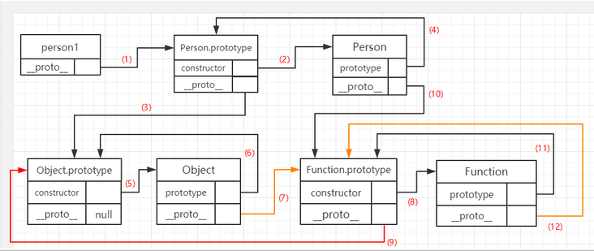
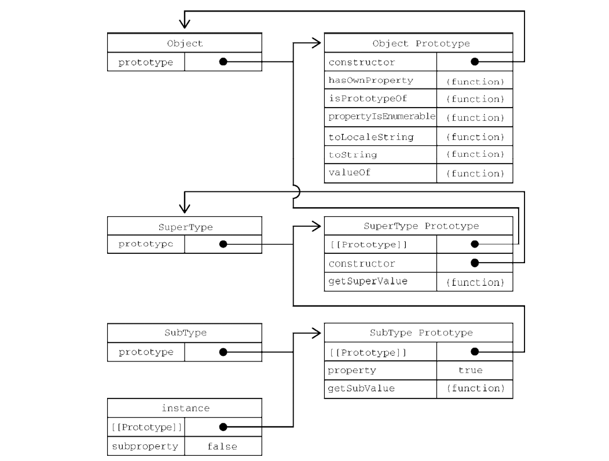

[TOC]

# 面向对象
> 对象被定义为一组属性的无序集合。严格来说，这意味着对象就是一组没有特定顺序的值。
> 对象的每个属性或方法都由一个名称来标识，这个名称映射到一个值。
> 可以把ECMAScript的对象想象成一张散列表，其中的内容就是一组名/值对，值可以是数据或者函数


## 1.理解对象

<font color=#16a085>
创建自定义对象的通常方式是创建Obejct的一个新实例，然后再给它添加属性和方法

```javascript
   let person = new Obejct();
   person.name = "Max";
   person.age = 29;
   person.job = "Software Enginer";
   person.sayName = function(){
      console.log(this.name)
   }
```

**更流行的方式：**

```javascript
   let person = {
      name: "Max",
      age: 29;
      job: "Software Enginer",
      sayName(){
         console.log(this.name); 
      }
   }
```

### 1.1属性的类型
ECMA-262使用一些内部特性来描述属性的特征。这些特性是由JavaScript实现引擎的规范定义的。因此，开发者不能再JavaScript中直接访问这些特性。为了将某个忒性标识为内部特性，规范会用两个中括号把特性的名称括起来，比如\[[Enumerable]]

属性分两种：数据属性和访问器属性
- 1.数据属性
  - 数据属性包含一个保存数据值的位置。值会从这个位置读取，也会写入到这个位置。数据属性有4个特性描述他们的位置
    - 【【Configurable】】: 表示属性是否可以通过delete删除并重新定义，是否可以修改它的特性，以及是否可以把它改为访问器属性。默认情况下，所有直接定义在对象上的属性的这个特性都是true。
    - 【【Enumerable】】: 表示属性是否可以通过for-in循环返回。默认情况下，所有直接定义在对象上的属性的这个特性都是true。
    - 【【Writable】】: 表示属性的值是否可以被修改。默认情况下，所有直接定义在对象上的属性的这个特性都是true
    - 【【value】】: 包含属性实际的值。这就是前面提到的那个读取和写入属性值的位置。这个特性的默认值为undefined

   ```javascript
      let person = {
         name: "Max"
      }
   ```
   这里，创建一个名文name的属性，并给它赋予了一个值"Max".这意味着【【Value】】特性会被设置为"Max",之后对这个值的任何修改都会保存这个位置。

<br>

   要修改属性的默认特性，就必须使用Object.defineProperty()方法。这个方法接收3个参数：
      1. 要给其添加属性的对象
      2. 属性的名称
      3. 和一个描述符对象(即上述4个特性)

   ```javascript
      let person = {};
      Object.defineProperty(person, 'name', {
         writable: false,
         value: 'Max',
      });

      console.log(person.name); // Max

      person.name = 'Charles';
      console.log(person.name); // Max
   ``` 
   这个例子创建一个名为name的属性并给它赋予一个只读的值"Max".这个属性的值就不能被修改了。在非严格模式下重新赋值会被忽略，在严格模式下重新赋值会报错。

<br>

   同样也适用于创建不可配置的属性
   ```javascript
      let person = {};
      Object.defineProperty(person, 'name', {
         Configurable: false,
         value: 'Max',
      });

      console.log(person.name); // Max

      delete person.name;
      console.log(person.name); // Max
   ``` 
   当configurable设置为false，意味着这个属性不能从对象上删除。**此外，一个属性被定义为不可配置之后，就不能再变回可配置了。再次调用任何非writable特性都回抛出错误。**

   **在调用Object.defineProperty()时，configurable,enumerable 和 writable的值如果不指定，则都默认为false。**

<br>

- 2. 访问器属性
  - 访问器属性不包含数据值。相反，它们包含一个获取函数（getter），和一个设置函数(setter).
  - 在读取访问器属性时，会调用获取函数（getter），这个函数的责任就是返回一个有效的值。
  - 在写入访问器属性时，会调用设置函数并传入新值，这个函数必须决定 对数据做出什么修改。
  - 访问器属性有4个特性：
    - 【【Configurable】】: 表示属性是否可以通过delete删除并重新定义，是否可以修改它的特性，以及是佛可以把它改为数据属性。默认情况下，所有直接定义在对象上的属性为true
    - 【【Enumerable】】: 表示属性是否可以通过for-in循环返回。默认情况下，所有直接定义在对象上的属性为true
    - 【【Get】】: 获取函数，在读取属性时调用。默认值为undefined
    - 【【Set】】: 设置函数，在写入属性时调用。默认值为undefined

   
   访问器属性不能直接定义，必须使用Object.defineProperty().
   
   ```javascript
      // 定义一个对象， 包含伪私有成员year_和公有成员edition
      let book = {
         year_: 2017,
         edition: 1,
      };

      Object.defineProperty(book, 'year', {
         get() {
            return this.year_;
         },

         set(newValue) {
            if (newValue > 2017) {
               this.year_ = newValue;
               this.edition += newValue - 2017;
            }
         },
      });

      book.year = 2019;
      console.log(book.edition);
   ```
   这个例子中，book对象有两个默认属性：year_ 和 edition。**year_中下划线常用来表示属性并不希望在对象反复外部被访问。**
   另一个属性year被定义为一个服务器属性，其中获取函数简单的返回year_值，而设置函数会做一些简单的计算以决定正确的edition。

   <br>

   获取函数和设置函数不一定都要定义。只定义获取函数意味着属性是只读的，尝试修改属性会被忽略。在严格模式下回报错。
   类似的，只有一个设置函数的属性时不能读取的。非严格模式下读取会返回undefined，严格模式下回抛出错误。


### 1.2定义多个属性
使用Object.defineProperties()方法。接收两个参数：
- 要为之添加或修改属性的对象
- 赢一个描述符对象

```javascript

   let book = {};

   Object.defineProperties(book, {
      year_: {
         value: 2017
      },
      edition:{
         value: 1
      },
      year:{
         get() {
            return this.year_;
         },

         set(newValue) {
            if (newValue > 2017) {
               this.year_ = newValue;
               this.edition += newValue - 2017;
            }
         },         
      }

   });

   book.year = 2019;
   console.log(book.edition);
```
在book上定义了两个数据属性year_和 edition，还有一个访问器属性year。唯一区别是所有属性都是同时定义的，并且数据属性的configurable,enumerable和writable特性值都是false


### 读取属性的特性
使用Object.getOwnPropertyDescriptor()方法可以取得指定属性的属性描述符。这个方法接收两个参数：
- 属性所在的对象
- 要取得其描述符的属性名。

```javascript
   let book = {};

   Object.defineProperties(book, {
      year_: {
         value: 2017,
      },
      edition: {
         value: 1,
      },
      year: {
         get() {
            return this.year_;
         },

         set(newValue) {
            if (newValue > 2017) {
               this.year_ = newValue;
               this.edition += newValue - 2017;
            }
         },
      },
   });

   let descriptor = Object.getOwnPropertyDescriptor(book, 'year_');
   console.log(descriptor.value); // 2017
   console.log(descriptor.configurable); // false
   console.log(descriptor.get); // undefined

   let descriptor1 = Object.getOwnPropertyDescriptor(book, 'year');
   console.log(descriptor1.value); // undefined
   console.log(descriptor1.enumerable); // false
   console.log(descriptor1.get); // "function"
```

还有Object.getOwnProertyDescriptors()静态方法。这个方法实际上会在每个自有属性上调用Obejct.getOwnProertyDescriptor()并在一个新对象中返回它们。


### 1.4合并对象
Object.assign() 方法用于将所有可枚举属性的值从一个或多个源对象分配到目标对象。它将返回目标对象。

```javascript
   const target = { a: 1, b: 2 };
   const source = { b: 4, c: 5 };

   const returnedTarget = Object.assign(target, source);

   console.log(target);
   // expected output: Object { a: 1, b: 4, c: 5 }

   console.log(returnedTarget);
   // expected output: Object { a: 1, b: 4, c: 5 }
```

语法：==Object.assign(target, ...sources)==

参数
target 目标对象

sources 源对象

返回值 目标对象

> 如果目标对象中的属性具有相同的键，则属性将被源对象中的属性覆盖。后面的源对象的属性将类似地覆盖前面的源对象的属性。

> Object.assign 方法只会拷贝源对象自身的并且可枚举的属性到目标对象。该方法使用源对象的[[Get]]和目标对象的[[Set]]，所以它会调用相关 getter 和 setter。因此，它分配属性，而不仅仅是复制或定义新的属性。如果合并源包含getter，这可能使其不适合将新属性合并到原型中。为了将属性定义（包括其可枚举性）复制到原型，应使用Object.getOwnPropertyDescriptor()和Object.defineProperty() 。


### 1.6 增强的对象语法

#### 1. 属性值简写
在给对象添加变量时候，会经常发现属性名和变量名是一样的。

```javascript
   let name = "Matt";
   let person = {
      name : name 
   };

   console.log(person); // {name: "Matt"} 

```
为此，简洁语法：

```javascript
   let name = "Matt";
   let person = {
      name
   };

   console.log(person); // {name: "Matt"} 

```

#### 2. 可计算属性
在引入计算属性之前，如果想使用变量作为属性，那么必须先声明对象，然后使用中括号语法来添加属性。换句话说，不能再对象字面量中直接动态命名属性

```javascript
   const nameKey = "name";
   const ageKey = "age";
   const jobKey = "job";

   let person = {};
   person[nameKey] = "Matt";
   person[ageKey] = 27;
   person[jobKey] = "Software engineer";

   console.log(person); 

   console.log(person); // {name: "Matt", age: 27, job: "Software engineer"}

```

有了可计算属性，就可以在对象字面量中完成动态属性赋值。中括号包围的对象属性键告诉运行时将其作为JavaScript表达式而不是字符串来求值：

```javascript
   const nameKey = "name";
   const ageKey = "age";
   const jobKey = "job";

   let person = {};
   [nameKey] = "Matt";
   [ageKey] = 27;
   [jobKey] = "Software engineer";

   console.log(person); 

   console.log(person); // {name: "Matt", age: 27, job: "Software engineer"}

```
因为被当作JavaScript表达式求值，所以可计算属性本身可以是复杂的表达式，在实例化时再求值：

```javascript
   const nameKey = 'name';
   const ageKey = 'age';
   const jobKey = 'job';
   let uniqueToken = 0;

   function getUniqueKey(key) {
      return `${key}_${uniqueToken++}`;
   }

   let person = {
      [getUniqueKey(nameKey)]: 'Matt',
      [getUniqueKey(ageKey)]: 27,
      [getUniqueKey(jobKey)]: 'Software engineer',
   };

   console.log(person);
   // {name_0: "Matt", age_1: 27, job_2: "Software engineer"}
```

#### 3. 简写方法名
在给对象定义方法时，通常都要写一个方法名，冒号，然后再引用一个匿名函数，如：

```javascript
   let person = {
      sayName: function (name) {
         console.log(`My name is ${name}`);
      },
   };

   person.sayName('Matt'); // My name is Matt
```

新的简写方法的语法遵循同样的模式，但开发者要放弃给函数表达式的命名（不过，通常命名也没啥用）。相应的，这样也可以明显缩短方法声明

```javascript
   let person = {
      sayName(name) {
         console.log(`My name is ${name}`);
      },
   };

   person.sayName('Matt'); // My name is Matt
```

<br>

简写方法名对获取函数和设置函数也使用

```javascript
   let person = {
      name_: '',
      get name() {
         return this.name_;
      },
      set name(name) {
         this.name_ = name;
      },
      sayName() {
         console.log(`My name is ${this.name_}`);
      },
   };

   person.name = 'Matt';
   person.sayName(); // My name is Matt
```

<br>

简写方法名可与计算属性键相互兼容

```javascript
   const methodKey = 'sayName';

   let person = {
      [methodKey](name) {
         console.log(`My name is ${name}`);
      },
   };

   person.sayName('Matt');
```

### 1.7对象解构
> ES6新增了对象解构语法，可以在一条语句中使用嵌套数据实现一个或多个赋值操作。简单地说，对象解构就是使用与对象匹配的结构来实现对象属性赋值。

等价代码：

```javascript
   let person = {
      name: 'Matt',
      age: 27,
   };

   let personName = person.name,
      personAge = person.age;

   console.log(personName); // Matt
   console.log(personAge); // 27
```
使用解构赋值

```javascript
   let person = {
      name: 'Matt',
      age: 27,
   };

   let {name :personName, age : personAge} = person; 

   console.log(personName); // Matt
   console.log(personAge); // 27
```
**使用解构，可以在一个类似对象字面量的结构中，声明多个变量，同时执行多个赋值操作。**

如果想让变量直接使用属性的名称

```javascript
   let person = {
      name: 'Matt',
      age: 27,
   };

   let {name , age } = person; 

   console.log(name); // Matt
   console.log(age); // 27
```
解构赋值不一定与对象的属性匹配，赋值的时候可以忽略某些属性，而如果引用的属性不存在，则该变量的值为undefined

```javascript
   let person = {
      name: 'Matt',
      age: 27,
   };

   let {name , job } = person; 

   console.log(name); // Matt
   console.log(job); // undefined
```

也可以在解构赋值的同时定义默认值，引用不存在时，会显示默认值

```javascript
   let person = {
      name: 'Matt',
      age: 27,
   };

   let {name , job="Software engineer" } = person; 

   console.log(name); // Matt
   console.log(job); // Software engineer
```

1. 嵌套解构
   - 解构对于引用嵌套的属性或赋值目标没有限制。
   ```javascript
      let person = {
         name: 'Matt',
         age: 27,
         job: {
            title: 'Software engineer',
         },
      };

      let personCopy = {};

      ({ name: personCopy.name, age: personCopy.age, job: personCopy.job } = person);

      // 因为一个对象的引用被复制给personCoy，所以修改person.job对象的属性也会影响personCopy

      person.job.title = 'Hacker';

      console.log(person);
      // {name: "Matt", age: 27, job: {title: "Hacker"}}
   ``` 
   解构赋值可以使用嵌套解构，以匹配嵌套的属性
   ```javascript
      let person = {
         name: 'Matt',
         age: 27,
         job: {
            title: 'Software engineer',
         },
      };

      // 声明title变量并将person.job.title的值赋给它
      let {job:{title}} = person

      console.log(title); // Software engineer
   ``` 
   在外层没有定义的情况下不能使用嵌套解构。无论源对象还是目标对象。

2. 部分解构
   - 如果一个解构表达式涉及多个复制，开始的复制成功而后面的复制出错，则整个解构赋值只会完成以部分


3. 参数上下文匹配
   - 在函数参数列表中也可以进行解构赋值。对参数的解构赋值不会影响arguments对象，但可以在函数签名中声明在函数体内使用局部变量  

<br> 

--- 

<br>

## 创建对象
虽然是以Object构造函数或对象字面量可以方便的创建对象，但这些方式也有明显不足：创建有同样接口的对象要重复编写很多代码

虽然有类和继承。但这些只是语法糖，巧妙地运用原型式继承可以成功地模拟。

<br>

### 2.2 工厂模式
> 工厂模式是一种众所周知的设计模式，广泛应用于软件工程领域，用于抽象创建特定对象的过程。

```javascript
   function createPerson(name, age, job) {
      let o = new Object();
      o.name = name;
      o.age = age;
      o.job = job;
      o.sayName = function () {
         console.log(this.name);
      };

      return o;
   }

   let person1 = createPerson('Max', 29, 'Software engineer');
   let person2 = createPerson('chales', 25, 'Doctor');

```
- 这里，函数createPerson()接收3个参数，根据这几个参数构建了一个包含person信息的对象。
- 可以多次调用这个函数，每次都会返回包含3个属性和1个方法的对象。
- 这种工厂模式虽然可以解决创建多个类似对象的问题，**但没有解决对象标识问题(即新创建的对象是什么类型)**


<br>

### 2.3 构造函数
> ECMAScript 中的构造函数时用于创建特定类型对象的。像Object和Array这样的原生构造函数，运行时可以直接在执行环境中使用。当热也可以自定义构造函数。以函数的形式为自己的对象类型定义属性和方法。


```javascript
   function Person(name, age, job) {
      this.name = name;
      this.age = age;
      this.job = job;
      this.sayName = function () {
         console.log(this.name);
      };
   }

   let person1 = new Person('Max', 29, 'Software engineer');
   let person2 = new Person('chales', 25, 'Doctor');

   person1.sayName(); // Max
   person2.sayName(); // chales

```
- Person()构造函数代替了createPerson()工厂函数。
- 实际上，Person()内部代码跟createPerson()基本一样，只是有如下区别：
  - 没有显式地创建对象
  - 属性和方法直接赋值給了this
  - 没有return
- **另外，要注意函数名Person的首字母大写**
- 按照惯例，构造函数名称首字母都是要大写的，非构造函数则以小写字母开头。

==这里是从面向对象编程语言那里借鉴的，有助于区分构造函数和普通函数。==
==毕竟，ECMAScript的构造函数就是能创建对象的函数。==

<br>

**要创建Person的实例，应使用new操作符。以这种方式调用构造函数会执行如下操作。**
1. 在内存中创建一个对象
2. 这个新对象内部的【【prototype】】特性被赋值为构造函数的prototype属性
3. 构造函数内部的this被赋值为这个新对象(即this指向新对象)。
4. 执行构造函数内部的代码(给新对象添加属性)
5. 如果构造函数返回非空对象，则返回该对象；否则，返回刚创建的新对象。

上述例子最后的person1和person2分别保存着Person的不同实例。这两个对象都有一个constructor属性指向Person：

```javascript
   console.log(person1.constructor === Person); // true
   console.log(person2.constructor === Person); // true
```
constructor本来是用于标识对象类型的。定义自定义构造函数可以确保实例被标识为特定类型，相比于工厂模式，这是一个很大的好处。在这个例子中，person1和person2之所以也被认为是Object的实例，是因为所有自定义对象都继自Object。

构造函数不一定要写成函数声明形式。赋值給变量的函数表达式也可以标识构造函数

```javascript
   let Person = function (name, age, job) {
      this.name = name;
      this.age = age;
      this.job = job;
      this.sayName = function () {
         console.log(this.name);
      };
   };

   let person1 = new Person('Max', 29, 'Software engineer');
   let person2 = new Person('chales', 25, 'Doctor');

   person1.sayName(); // Max
   person2.sayName(); // chales

   console.log(person1 instanceof Object); // true
   console.log(person1 instanceof Person); // true
   console.log(person2 instanceof Object); // true
   console.log(person2 instanceof Person); // true

```
在实例化时，可以不添加参数，只需要new操作符

```javascript
   let Person = function (name, age, job) {
      this.name = name;
      this.age = age;
      this.job = job;
      this.sayName = function () {
         console.log(this.name);
      };
   };

   let person1 = new Person();
   let person2 = new Person();

   person1.sayName(); // Max
   person2.sayName(); // chales

   console.log(person1 instanceof Object); // true
   console.log(person1 instanceof Person); // true
   console.log(person2 instanceof Object); // true
   console.log(person2 instanceof Person); // true

```

<br>

#### 01.构造函数也是函数
> 构造函数与普通函数唯一的区别就是调用方式不同。除此之外，构造函数也是函数。并没有把某个函数定义为构造函数的特殊语法。**任何函数只要使用new操作符调用就是构造函数，而不使用new操作符调用的函数就是普通函数。**比如Perosn（）

```javascript
   let Person = function (name, age, job) {
      this.name = name;
      this.age = age;
      this.job = job;
      this.sayName = function () {
         console.log(this.name);
      };
   };

   // 作为构造函数
   let person = new Person('Mike', 29, 'Software Engineer');
   person.sayName(); // Mike

   // 作为函数调用
   Person('Greg', 27, 'Doctor');
   // 添加到window对象
   window.sayName(); // Greg

   // 在另一个对象在作用域中调用
   let o = new Object();
   Person.call(o, 'Max', 19, 'Student');
   o.sayName(); // Max
```

这个例子一开始展示了典型的构造函数调用方式。然后是普通函数的调用方式，这时候没有使用new操作符调用Person()，结果会将属性和方法添加到window对象。**这里要记住，在调用一个函数而没有明确设置this值的情况下(即没有作为对象的调用方法，或者没有使用call()/apply()调用)。this始终指向Global对象(在浏览器中就是window对象)**。因此，在上面调用后，window对象可以使用sayName()方法。最后是用call(),指定特定对象

<br>

#### 02. 构造函数的问题
> 构造函数的问题在于，其定义的方法会在每个实例上都创建一遍。因此对前面的例子而言，person1和person2 都有sayName()方法，但这两个方法不是同一个Function实例。我们知道，函数也是对象，因此每次定义函数时，都会初始化一个对象。逻辑上讲，这个构造函数实际上是这样的：

```javascript
   function (name, age, job) {
      this.name = name;
      this.age = age;
      this.job = job;
      this.sayName =new Function () {
         console.log(this.name);
      }; // 逻辑等价
   };

```
所以每个Person实例都会有自己的Function实例用于显示name属性。因此不同实例上的函数虽然同名缺不相等

```javascript
   console.log(person1.sayName == person.sayName) // false
```
因为都是做同一件事，所以没有必要定义两个不同的Function实例。
要解决这个问题可以把函数定义转移到外部

```javascript
   function (name, age, job) {
      this.name = name;
      this.age = age;
      this.job = job;
      this.sayName = sayName;
   };

   function () {
      console.log(this.name);
   }; 

   let person1 = new Person('Max', 29, 'Software engineer');
   let person2 = new Person('chales', 25, 'Doctor');

   person1.sayName(); // Max
   person2.sayName(); // chales
```

这样虽然解决了函数重复的问题，但全局作用域也因此被搞乱了。

<br>

### 2.4 原型模式
> 每个函数都会创建一个prototype属性，这个属性时一个对象，包含应该由特定引用类型的实例共享的属性和方法。实际上，这个对象就是通过调用构造函数创建的对象的原型。
> 使用原型对象的好处是，在它上面定义的属性和方法可以被对象实例共享。原来在构造函数中直接赋给对象实例的值，可以直接赋值給它们的原型，如

```javascript
   function Person(){}

   Person.prototype.name = 'Max';
   Person.prototype.age = 29;
   Person.prototype.job = 'Software Engineer';
   Person.prototype.sayName = function () {
      console.log(this.name);
   };

   let person1 = new Person();
   person1.sayName(); // Max

   let person2 = new Person();
   person2.sayName(); // Max

   console.log(person1.sayName == person2.sayName); // true
```

**使用函数表达式也可以**

```javascript
   let Person = function(){}

   Person.prototype.name = 'Max';
   Person.prototype.age = 29;
   Person.prototype.job = 'Software Engineer';
   Person.prototype.sayName = function () {
      console.log(this.name);
   };

   let person1 = new Person();
   person1.sayName(); // Max

   let person2 = new Person();
   person2.sayName(); // Max

   console.log(person1.sayName == person2.sayName); // true
```
> 这里，所有属性和sayName()方法都直接添加到了Person的prototype属性上，构造函数体中什么也没有。
> 但这样定义之后，调用构造函数创建的新对象仍然拥有相应的属性和方法。与构造函数模式不同，使用这种原型模式定义的属性和方法是由所有势力共享的。因此person1和person2访问的都是相同的属性和方法。

<br>

#### 01.理解原型

> 无论何时，只要创建一个函数，就会按照特定的规则为这个函数创建一个prototype属性(指向原型对象)。默认情况下，所有原型对象自动获得一个名为constructor的属性，指回与之关联的构造函数。
> 对前面的例子而言，**Person.prototype.constructor指向Person.** 然后，因构造函数而异，可能会给原型对象添加其他属性和方法。

> 在自定义构造函数时，原型对象默认只会获得constructor属性，其他的所有方法都继承自Obejct。每次调用构造函数创建一些新实例，这个实例的内部【【prototype】】指针就会被赋值为构造函数的原型对象。

> 脚本中没有访问这个【【prototype】】特性的标准方式，但Firefox,Safari 和Chrome会在每个对象上暴露__proto__属性，通过这个属性可以访问对象的原型。在其他实现中，这个特性完全被隐藏了。 

**关键在于理解这一点：实例于构造函数原型之间有直接联系，但实例与构造函数之间没有。**

```javascript
   /*
   * 构造函数可以是函数表达式
   * 也可以是函数声明，因此以下两种形式都可以
   * function Person(){}
   * let Person = function(){}
   */

   function Person() {}

   /*
   * 声明之后，构造函数就有了一个
   * 与之关联的原型对象：
   */

   console.log(typeof Person.prototype); // object
   console.log(Person.prototype);
   // {
   //    constructor: f Person(),
   //    __proto__: Object
   // }

   /*
   *  如之前所述，构造函数有一个prototype属性引用其原型对象，
   *  而这个原型对象也有一个constructor属性，引用这个构造函数。
   *  换句话说，两者循环引用：
   */

   console.log(Person.prototype.constructor === Person); // true

   /*
   *  正常的原型链会终止于Object的原型对象
   *  Object原型的原型式null
   */

   console.log(Person.prototype.__proto__ === Object.prototype); // true
   console.log(Person.prototype.__proto__.constructor === Object); // true
   console.log(Person.prototype.__proto__.__proto__ === null); // true
   console.log(Person.prototype.__proto__);
   // {
   //    constructor: f Object(),
   //    toString:...
   //    hasOwnProperty:...
   //    isPrototypeOf:...
   //    ...
   // }

   let person1 = new Person();
   let person2 = new Person();

   /*
   *  构造函数，原型对象和实例
   *  是三个不同的对象：
   */

   console.log(person1 !== Person); // true
   console.log(person1 !== Person.prototype); // true
   console.log(Person.prototype !== Person); // true

   /*
   *  实例通过__proto__链接到原型对象，
   *  它实际上指向隐藏特性【【Prototype】】
   *
   *  构造函数通过prototype属性链接到原型对象
   *
   *  实例与构造函数没有直接联系，与原型对象有直接联系
   */

   console.log(person1.__proto__ === Person.prototype); // true
   console.log(person1.__proto__.constructor === Person); // true

   /*
   *  同一个构造函数创建两个实例
   *  共享一个原型对象
   */

   console.log(person1.__proto__ === person2.__proto__); // true

   /*
   *  instanceof检查实例的原型链中
   *  是否包含指定构造函数的原型：
   */

   console.log(person1 instanceof Person); // true
   console.log(person1 instanceof Object); // true
   console.log(Person.prototype instanceof Object); // true
```


<br>

#### 02.原型层级
> 在通过对象访问属性时，会按照这个属性的名称开始搜索。
> **1.搜索开始于对象实例本身。如果在这个实例上发现了给定的名称，则返回该名称对应的值。**
> **2.如果没有找到这个属性，则搜索会沿着指针进入原型对象，然后再原型对象上找到属性后，再返回对象的值。**
> 因此，在调用sayName()时，会发生两步搜索。首先，JavaScript引擎会问“person1实例有sayName属性吗？”答案是没有。然后，继续搜索并问“person1的原型有sayName属性吗？”答案是有。于是返回了保存在原型上的这个函数。在调用person2时过程相同。这就是原型用于在多个对象实例间共享属性方法的原理。

**注意：constructor属性只存在于原型对象，因此通过实例对象也可以访问到的**

虽然可以通过实例读取原型对象上的值，但不可能通过实例重写这些值。如果在实例上添加了一个与原型对象中同名的属性，那就会在实例上创建这个属性，这个属性会遮住原型对象上的属性。

```javascript
   function Person() {}

   Person.prototype.name = 'Max';
   Person.prototype.age = 27;
   Person.prototype.job = 'Software Engineer';
   Person.prototype.sayName = function () {
      console.log(this.name);
   };

   let person1 = new Person();
   let person2 = new Person();

   person1.name = 'Greg';
   console.log(person1.name); // Greg , 来自实例
   console.log(person2.name); // Max , 来自原型

```
person1的name属性遮蔽了原型对象上的同名属性。
当console.log()访问person1.name时，会先在实例上搜索属性。因为这个属性在实例上存在，所有不会再继续搜索了。而person2.name时，并没有在实例上找到这个属性，所以会继续搜索原型对象并使用定义在原型对象上的属性。

只要给对象实例上添加一个属性，这个属性会**遮蔽**原型对象上的同名属性。即使实例上这个属性设置为null，也不会恢复它和原型的联系。不过可以通过delete操作符删除实例上的属性，从而让标识符解析过程继续搜索原型对象。

```javascript
   function Person() {}

   Person.prototype.name = 'Max';
   Person.prototype.age = 27;
   Person.prototype.job = 'Software Engineer';
   Person.prototype.sayName = function () {
      console.log(this.name);
   };

   let person1 = new Person();
   let person2 = new Person();

   person1.name = 'Greg';
   console.log(person1.name); // Greg , 来自实例
   console.log(person2.name); // Max , 来自原型

   delete person1.name;
   console.log(person1.name); // Max , 来自原型
```

<br>

### 03.hasOwnProperty，Object.keys(),getOwnPropertyNames和in操作符
hasOwnProperty() 方法会返回一个布尔值，指示对象自身属性中是否具有指定的属性（也就是，是否有指定的键）。

```javascript
   const object1 = {};
   object1.property1 = 42;

   console.log(object1.hasOwnProperty('property1'));
   // expected output: true

   console.log(object1.hasOwnProperty('toString'));
   // expected output: false

   console.log(object1.hasOwnProperty('hasOwnProperty'));
   // expected output: false
```

<br>

<font size=12 color=000>in操作符</font>
如果指定的属性在指定的对象或其原型链中，则in 运算符返回true。

```javascript
   const car = { make: 'Honda', model: 'Accord', year: 1998 };

   console.log('make' in car);
   // expected output: true

   delete car.make;
   if ('make' in car === false) {
   car.make = 'Suzuki';
   }

   console.log(car.make);
   // expected output: "Suzuki"
```

<br>

<font size=12 color=000>for...in</font>
for...in语句以任意顺序遍历一个对象的除Symbol以外的可枚举属性。

```javascript
   var obj = {a:1, b:2, c:3};

   for (var prop in obj) {
   console.log("obj." + prop + " = " + obj[prop]);
   }

   // Output:
   // "obj.a = 1"
   // "obj.b = 2"
   // "obj.c = 3"
```

<br>

<font size=12 color=000>Object.getOwnPropertyNames()</font>
Object.getOwnPropertyNames()方法返回一个由指定对象的所有自身属性的属性名（**包括不可枚举属性但不包括Symbol值作为名称的属性**）组成的数组。

> Object.getOwnPropertyNames() 返回一个数组，该数组对元素是 obj自身拥有的枚举或不可枚举属性名称字符串。 数组中枚举属性的顺序与通过 for...in 循环（或 Object.keys）迭代该对象属性时一致。数组中不可枚举属性的顺序未定义。

```javascript
   var arr = ["a", "b", "c"];
   console.log(Object.getOwnPropertyNames(arr).sort()); // ["0", "1", "2", "length"]

   // 类数组对象
   var obj = { 0: "a", 1: "b", 2: "c"};
   console.log(Object.getOwnPropertyNames(obj).sort()); // ["0", "1", "2"]

   // 使用Array.forEach输出属性名和属性值
   Object.getOwnPropertyNames(obj).forEach(function(val, idx, array) {
   console.log(val + " -> " + obj[val]);
   });
   // 输出
   // 0 -> a
   // 1 -> b
   // 2 -> c

   //不可枚举属性
   var my_obj = Object.create({}, {
   getFoo: {
      value: function() { return this.foo; },
      enumerable: false
   }
   });
   my_obj.foo = 1;

   console.log(Object.getOwnPropertyNames(my_obj).sort()); // ["foo", "getFoo"]

```

<br>

<font size=12 color=000>Object.keys()</font>
Object.keys() 方法会返回一个由一个给定对象的自身可枚举属性组成的数组，数组中属性名的排列顺序和正常循环遍历该对象时返回的顺序一致 。

> Object.keys 返回一个所有元素为字符串的数组，其元素来自于从给定的object上面可直接枚举的属性。这些属性的顺序与手动遍历该对象属性时的一致。

```javascript
// simple array
   var arr = ['a', 'b', 'c'];
   console.log(Object.keys(arr)); // console: ['0', '1', '2']

   // array like object
   var obj = { 0: 'a', 1: 'b', 2: 'c' };
   console.log(Object.keys(obj)); // console: ['0', '1', '2']

   // array like object with random key ordering
   var anObj = { 100: 'a', 2: 'b', 7: 'c' };
   console.log(Object.keys(anObj)); // console: ['2', '7', '100']

   // getFoo is a property which isn't enumerable
   var myObj = Object.create({}, {
   getFoo: {
      value: function () { return this.foo; }
   }
   });
   myObj.foo = 1;
   console.log(Object.keys(myObj)); // console: ['foo']
```

<br>

#### 04.属性枚举顺序
- for-in循环和Oject.keys()的枚举顺序是不确定的，取决于JavaScript引擎，因浏览器而异。
- Object.getOwnPropertyName(),Object.getOwnPropertySymbols()和Object.assign()的枚举顺序是确定性的。
  - 1. 先以升序枚举数值键
  - 2. 然后以插入顺序枚举字符串和符号键
  - 3. 在对象字面量这种定义的键以他们逗号分隔的顺序插入

```javascript
   let k1 = Symbol('k1'),
      k2 = Symbol('k2');

   let o = {
      1: 1,
      first: 'first',
      [k1]: 'sym2',
      second: 'second',
      0: 0,
   };

   o[k2] = 'sym2';
   o[3] = 3;
   o.third = 'third';
   o[2] = 2;

   console.log(Object.getOwnPropertyNames(o));
   // ["0", "1", "2", "3", "first", "second", "third"]

   console.log(Object.getOwnPropertySymbols(o));
   // [Symbol(k1), Symbol(k2)]
```

<br>

### 2.5 对象迭代
> ECMAScript中迭代对象属性一直是个难题。后来新增两个静态方法，用于将对象内容转换为序列化的--- 更重要的是可迭代的---格式。
> 这两个方法：（这两个方法接收一个对象，返回它们内容的数组）
> - Object.values()
>     - 返回对象值的数组
> - Object.entries()
>     - 返回键/值对的数组

```javascript
   const o = {
      foo: 'bar',
      baz: 1,
      qux: {},
   };

   console.log(Object.values(o));
   // ["bar", 1, {…}]

   console.log(Object.entries(o));
   // [["foo", "bar"],["baz", 1],["qux", {…}]]
```

**注意：非字符串属性会被转换为字符串输出。另外这两个方法执行对象的浅复制**

```javascript
   const o = {
      qux: {},
   };

   console.log(Object.values(o)[0] === o.qux); // true

   console.log(Object.entries(o)[0][1] === o.qux); // true
```

**符号属性会被忽略**

```javascript
   const sym = Symbol();
   const o = {
      [sym]: 'foo';
   };

   console.log(Object.values(o)); // []

   console.log(Object.entries(o)); // []
```

<br>

#### 01.其他原型语法
> 在之前的例子中，每一次定义一个属性或方法都会把Person.prototype重写一遍。为了减少代码臃肿，也为了从视觉上更好的封装原型功能，直接通过一个包含所有属性和方法的对象字面量来重写原型成为一种常见的做法，如；

```javascript
   function Person() {}

   Person.prototype = {
      name: 'Max',
      age: 29,
      job: 'Software Engineer',
      sayName() {
         console.log(this.name);
      },
   };
```
在这个例子中，Person.prototype 被设置为等于一个通过字面量创建的新对象。最终结果是一样的，只有一个问题：**这样重写之后，Person.prototype 的 constructor属性就不指向Person了。** 在创建函数时，也会创建它的prototype对象，同时给这个原型的constructor属性赋值。而上面的写法重写了默认的prototype属性，因此其constructor属性也指向了完全不同的新对象（Object构造函数），不在指向原来的构造函数。

**如果constructor的值很重要，则可以在重写原型对象时专门设置一下它的值**

```javascript
   function Person() {}

   Person.prototype = {
      constructor: Person,
      name: 'Max',
      age: 29,
      job: 'Software Engineer',
      sayName() {
         console.log(this.name);
      },

   };
```
这次代码中特意包含了constructor属性，并将它设置为Person，保证了这个属性任然包含恰当的值。

但要注意：以这种方式恢复的constructor属性会创建一个【【Enumerable】】为true的属性。而原生constructor属性默认是不可枚举的。因此，可用Object.defineProoerty()方法来定义constructor属性：

```javascript
   function Person() {}

   Person.prototype = {
      name: 'Max',
      age: 29,
      job: 'Software Engineer',
      sayName() {
         console.log(this.name);
      },

   };

   // 恢复constructor属性
   Object.defineProperty(Person.prototype, "constructor",{
      enumerable: false,
      value: Person
   })
```

<br>

#### 02. 原型的动态性
> 因为从原型上搜索值的过程是动态的，所以即使实例在修改原型之前已经存在，任何时候对原型对象所做的修改也会在实例上反映出来。

```javascript
   function Person() {}

   let firend = new Person();

   Person.prototype.sayHi = function(){
      console.log("hi")
   }

   friend.sayHi(); // hi
```
- 以上代码先创建一个Person实例并保存在friend中。
- 然后一条语句在Person.prototype上添加了一个名为sayHi()的方法。
- 虽然friend实例是添加方法之前创建的，但它仍然可以访问这个方法。

**之所以会这样，主要原因是实例与原型之间松散的联系。在调用friend.sayHi()时，首先会从实例中搜索名为sayHi的属性。在没有找到的情况下，运行时会继续搜索原型对象。**
**因为实例和原型之间的链接就是简单的指针，而不是保存的副本，所以会在原型上找到sayHi属性并返回这个属性保存的函数。**

虽然随时能给原型添加属性和方法，并能够立即反映在所有对象实例上，但这跟重写整个原型式两回事。

实例的【【prototype】】指针是在调用构造函数时自动赋值的，这跟指针即使把原型修改为不同的对象也不会变。重写整个原型会切断最初原型与构造函数的联系，但实例引用的仍然是最初的原型。

<br>
**记住，实例只有指向原型的指针，没有指向构造函数的指针。**

```javascript
   function Person() {}

   let firend = new Person();

   Person.prototype = {
      constructor: Person,
      name: 'Max',
      age: 29,
      job: 'Software Engineer',
      sayName() {
         console.log(this.name);
      },
   };

   firend.sayName(); // 报错
```
这个例子中，Person的实例是在重写原型对象之前创建的。在调用friend.sayHi()的时候，会导致错误。这是因为friend指向的原型还是最初的原型，而这个原型上并没有sayHi属性。

<br>

#### 03.原生对象原型
> 原型模式子所以重要，不仅体现在自定义类型上，而且还因为它也实现所有元素引用类型的模式。所有元素引用类型的构造函数（包括Object,Array,String等）都在原型上定义了实例方法。比如，数组实例的sort()方法就是Array.prototype上定义的，而字符串包装对象的substring()方法也是在String.prototype上定义的。

```javascript
   console.log(typeof Array.prototype.sort) // function
   console.log(typeof String.prototype.substring) // function
```

通过原生对象的原型可以取得所有默认方法的引用，也可以给原生类型的实例定义新的方法。(不推荐)

<br> 

#### 04. 原型的问题
> 原型模式也不是没有问题，首先，它弱化了向构造函数传递初始化参数的能力，会导致所有实例默认都取得相同的属性值。
> 另一个问题源自于它的共享特性。这对函数来说比较合适，原始值的属性也还好。**主要在于引用值的属性**

```javascript
   function Person() {}

   let firend = new Person();

   Person.prototype = {
      constructor: Person,
      name: 'Max',
      age: 29,
      job: 'Software Engineer',
      firends: ['Shelby', 'Court'],
      sayName() {
         console.log(this.name);
      },
   };

   let person1 = new Person();
   let person2 = new Person();

   person1.firends.push('Van');
   console.log(person1.firends); // ["Shelby", "Court", "Van"]
   console.log(person2.firends); // ["Shelby", "Court", "Van"]
   console.log(person1.firends === person2.firends); // true
```
这里向person1.friends添加属性，但这个friends属性时再原型上，新添加的字符串也会在person2.friends上反映出来。**这会导致实例混乱，不同实例应该由属于自己的属性副本。**

---

<br>

## 继承
>  继承是面向对象非常热门的话题。很多面向对象语言支持两种继承:
> - 接口继承(只继承方法签名)
> - 实现继承(继承实际方法)
> 接口继承在ECMSAcript中是不可能的，因为函数没有签名。实现继承继承是ECMAScript唯一支持的继承方式，而这主要通过原型链实现的。

<br>

### 1.原型链
> ECMA-262把原型链定义为ECMAScript的主要继承方式。其基本思想就是通过原型继承多个引用类型的属性和方法。重温一个构造函数，原型和实例的关系: 每个构造函数都有一个原型对象，原型有一个属性指回构造函数，而实例有个内部指针指向原型。 如果原型式另一个类型的实例呢？那就意味着这个原型本身有一个内部指针指向另一个原型，相应地另一个原型也有一个指针指向另一个构造函数。这样在实例和原型之间构造了一条原型链。

实现原型链涉及一下：

```javascript
   function SuperType() {
      this.property = true;
   }

   SuperType.prototype.getSuperValue = function () {
      return this.property;
   };

   function SubType() {
      this.subproperty = false;
   }

   // 继承SuperType
   SubType.prototype = new SuperType();

   SuperType.prototype.getSubValue = function () {
      return this.subproperty;
   };

   let instance = new SubType();
   console.log(instance.getSuperValue()); // true

```
> 以上代码定义了两个类型:SuperType和SubType.这两个类型分别定义了一个属性和一个方法。这两个类型的主要区别是SuperType通过创建SuperType的实例并将其赋值給自己的原型SubType.prototype实现了对SuperType的继承。这个赋值重写了SubType最初的原型，将其替换为SuperType的实例。
> 这意味着SuperType实例可以访问所有属性和方法也会存在于SuperType.prototype.也就是这个SuperType的实例添加一个新方法。最后又创建SubType的实例并调用了它继承的getSuperValue()方法。

==这个例子中实现继承的关键，是SubType没有使用默认原型，而是将其替换成了一个新对象。这个新对象恰好是SuperType的实例。==

原型链扩展了前面描述的原型搜索机制。我们知道，在读取实例上的属性时，首先会在实例上搜索这个属性。如果没找到，则会继承搜索实例的原型。在通过原型链实现继承之后，搜索就可以继承向上，搜索原型的原型。


<br>

#### 01.默认原型
> 实际上，原型链中还有一环。默认情况下，所有引用类型都继承自Object,这也是通过原型链实现的。==任何函数的默认原型都是一个Object实例，==这意味着这个实例有一个内部指针指向Object.prototype.这也是为什么自定义类型能够继承包括toString().valueOf()在内的所有默认方法的原因。

**完整的原型链：**


<br>

#### 02.原型与继承关系
> 原型与实例的关系可以通过两种方式来确定。
- 第一种方式是使用instanceof操作符，如果一个实例的原型链中出现过相应的构造函数，则instanceof返回true。

```javascript
   console.log(instance instanceof Object); // true
   console.log(instance instanceof SuperType); // true
   console.log(instance instanceof SubType); // true
```
instance 是 Object,SuperType,SubType的实例，因为instance的原型链中包含这些构造函数的原型。结果就是instanceof对所有这些构造函数返回true。

- 第二种方式是使用isPrototypeOf()方法。原型链中的每个原型都可以调用这个方法，如下列所示，只要原型链中包含这个原型，这个方法返回true：
  
```javascript
   console.log(Object.prototype.isPrototypeOf(instance)); // true
   console.log(SuperType.prototype.isPrototypeOf(instance)); // true
   console.log(SubType.prototype.isPrototypeOf(instance)); // true
```

<br>

#### 03.关于方法
> 子类有时候需要覆盖父类的方法，或者增加父类没有的方法。为此这些方法必须在原型赋值之后再添加到原型上

```javascript
   function SuperType() {
      this.property = true;
   }

   SuperType.prototype.getSuperValue = function () {
      return this.property;
   };

   function SubType() {
      this.subproperty = false;
   }

   // 继承SuperType
   SubType.prototype = new SuperType();

   // 新方法
   SuperType.prototype.getSubValue = function () {
      return this.subproperty;
   };

   // 覆盖已有的方法
   SubType.prototype.getSuperValue = function () {
      return false;
   };

   let instance = new SubType();
   console.log(instance.getSuperValue()); // false 
```

instance 向上找，到最近的父级上getSuperValue()方法返回false

**另一个重要点是，以对象字面量方式创建原型方法会破坏之前的原型链，因为这相当于重写了原型链**

```javascript
   function SuperType() {
      this.property = true;
   }

   SuperType.prototype.getSuperValue = function () {
      return this.property;
   };

   function SubType() {
      this.subproperty = false;
   }

   // 继承SuperType
   SubType.prototype = new SuperType();

   // 通过对象字面量添加新方法，炸毁导致上一行无效

   SubType.prototype = {
      getSubValue() {
         return this.subproperty;
      },

      someOtherMethod() {
         return false;
      },
   };

   let instance = new SubType();
   console.log(instance.getSuperValue()); // 报错
```
子类的原型在被赋值为SuperType的实例后，又被一个对象字面量覆盖了。覆盖后的原型是一个Object的实例，而不再是SuperType的实例。

<br>

#### 04.原型链的问题
> 原型链虽然很强大，但也有问题。注意问题就是原型中包含引用值会在所有实例间共享，这也是为什么属性通常会在构造函数中定义而不是定义在原型上的原因。

**在使用原型实现继承时，原型实际上变成了另一个类型的实例。这意味着原先的实例属性摇身一变称为了原型属性。**

```javascript
   function SuperType() {
      this.colors = ['red', 'blue', 'green'];
   }

   function SubType() {}

   // 继承SuperType
   SubType.prototype = new SuperType();

   let instance1 = new SubType();
   instance1.colors.push('black');
   console.log(instance1.colors);
   // ["red", "blue", "green", "black"]

   let instance2 = new SubType();
   console.log(instance2.colors);
   // ["red", "blue", "green", "black"]
```

在这个例子中，SuperType构造函数定义了一个colors属性，包含自己的数组（引用值）。
每个SuperType的实例都会有自己的colors属性，包含自己的数组。
- 当SubType通过原型继承SuperType后，SubType.prototype变成了SuperType的一个实例
- 因而获得了自己的colors属性。
- 最终Subtype的所有实例都会共享这个colors属性。

<br>

> 原型链第二个问题是，子类在实例化时不能给父类的构造函数传参。事实上，无法在不影响所有对象实例的情况下把参数传进父类的构造函数。在加上引用值的问题，就导致原型链基本不会单独使用。

<br>

### 盗用构造函数
> 为了解决引用值的问题，一种"盗用构造函数(constructor stealing)"的技术，也称为“对象伪装”或“经典继承”开始流行。
> 基本思路是: 在子类构造函数中调用父类构造函数。毕竟函数就是在特定上下文中执行代码的简单对象。

```javascript
   function SuperType() {
      this.colors = ['red', 'blue', 'green'];
   }

   function SubType() {
      // 继承SuperType这一构造函数
      SuperType.call(this);
   }

   // instance1 创建时，构造函数SubType中的this 指向 instance1
   // instance1中执行了SuperTpe()中的所有代码
   let instance1 = new SubType();

   instance1.colors.push('black');
   console.log(instance1.colors);
   // ["red", "blue", "green", "black"]

   let instance2 = new SubType();
   console.log(instance2.colors);
   // ["red", "blue", "green"]
```
SuperType构造函数在instance中执行了。结果就是每个实例都会有自己的colors属性。

<br>

#### 01. 传递参数
> 相对于使用原型链，盗用构造函数的优点在于可以在子类构造函数中向父类构造函数传参

```javascript
   function SuperType(name) {
      this.name = name;
   }

   function SubType() {
      // 继承SuperType这一构造函数,并传参
      SuperType.call(this, 'Max');

      // 实例属性
      this.age = 29;
   }

   let instance1 = new SubType();

   console.log(instance1.name); // Max
   console.log(instance1.age); // 29

```

<br>

#### 02.盗用构造函数的问题
> 这也是使用构造函数自定义类型的问题: 
> - 必须在构造函数中定义方法，因此函数不能重用。
> - 子类也不能访问父类原型上定义的方法，因此所有类型只能适合构造函数模式。
> 所以构造函数基本上也不能单独使用

<br>
<br>
<br>
<br>
<br>
<br>
<br>
<br>
<br>
<br>
<br>
<br>
<br>
<br>
<br>
<br>
<br>
<br>
<br>
<br>
<br>
<br>
<br>
<br>
<br>
